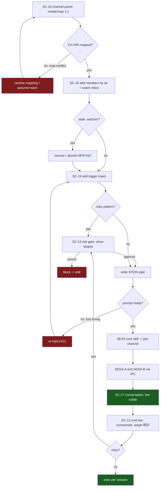

# 07. 인터페이스 설계 (IA · 화면 · 흐름 · UX)

> 담당: plan_interface_designer · 깊이: deep · 총 화면 SC 22 / FR 커버리지 43/43 (100%) · 고아 화면 0
> 본 문서는 Control Tower 단일 WPF 셸의 정보구조(IA)·화면 명세(SC)·사용자 흐름·UX 원칙을 정의한다. API·DTO 계약은 08, 데이터 모델(ENT)은 09 소관이며, 화면이 필요로 하는 데이터는 "무엇이 보인다" 수준으로만 기술한다.

---

## 0. 개요

### 0-1. 목적·범위

본 문서는 `04`(FR 43/NFR 22)·`05`(FN 53)가 정의한 "무엇을"과 `06`(BS 22/JM 5)의 "행동 흐름"을, 사용자가 실제로 만나는 **화면(SC)**으로 배치한다. `00_meeting_brief`의 제품 폼팩터(WPF 데스크톱 단일 셸 · Feature×Layer 하이브리드 · 단일 pane→탭)를 반영한다.

- **정의하는 것**: 앱 단일 셸의 영역(존) 구성(IA) / 각 화면의 목적·구성요소·상호작용·표시 데이터·연결 FN/FR·진입/이탈(SC) / 모드(UT)별 화면 전이 흐름 / 키보드 중심 UX 원칙·전환 가드.
- **정의하지 않는 것(경계)**: REST 엔드포인트·DTO 스키마=08 / 엔티티·프로파일 영속 스키마·ERD=09 / 터미널 엔진·아키텍처 검증=10. 본 문서는 "어떤 정보가 화면에 보이는가"까지만 적고 계약은 넘긴다.
- **RBAC 부재 반영(03 계승)**: 단일 파워유저·로컬·인증 없음(제약 C7)이므로 Public/Auth/Admin 화면군이 없다. 화면 분류의 "대상 UT"는 *권한 차단*이 아니라 *운영 모드(hat)의 주 사용 맥락*을 뜻한다. 모든 화면은 원칙상 UT-001(루트)이 접근 가능하며, 표기된 UT는 그 화면을 주로 행사하는 모드다.
- **06 핵심 요구의 화면화**: (a) **활성 세션 명시**·(b) **주입 대상 확인 게이트**·(c) **상태 배지**·(d) **경로 경계 시각화**를 SC 설계의 1급 제약으로 삼는다(03 §4-3 주의 분산 방지, BS-004/005/011/014).

### 0-2. 화면 ID(SC) 체계

- **SC-##**: 화면. 2자리 zero-pad. **본 문서가 자기 네임스페이스로 신규 발번**한다(SC-01~22).
- **참조 전용**: FR-###·NFR-###(04)·FN-{CAT}-##(05)·UT-###/P-###(03)·BS-###/JM-###(06)·8 카테고리는 레지스트리 frozen 값을 **인용만** 하고 재번호하지 않는다.
- **1 화면 : N FN/FR**: 하나의 SC는 복수 FN/FR을 실현할 수 있고(예: 터미널 뷰), 하나의 FR은 복수 SC에 걸칠 수 있다(예: 세션 종료 = 세션 목록 액션 + 탭 닫기 + 종료 확인).

### 0-3. 표기 규칙

- **분류(6종, 데스크톱 셸 적응)**: `Shell/System`(셸 크롬·설정·상태·에러·배포) · `Main`(상시 노출 핵심 존) · `Sub`(부가·다이얼로그·오버레이·인라인 바). *Public/Auth/Admin은 본 제품에 없음(C7)*.
- **존(Zone)**: `T`=중앙 터미널 존 · `L`=좌측 내비게이터 존(세션/프로파일/자산 전환 도크) · `R`=우측 오케스트레이션 존(채널/토큰) · `S`=셸 크롬·시스템 · `O`=오버레이/다이얼로그.
- **상태 3종**: 각 화면의 `로딩(loading)`·`빈(empty)`·`에러(error)` 상태를 명시(06 §6 엣지 E3/E4/E5 반영).
- **상태 배지(전역 약물)**: `[*]`starting(amber) · `[>]`running(green) · `[x]`exited(grey) · `[!]`error(red). 세션·채널·저장 상태에 공통 사용.
- **와이어프레임(deep)**: ASCII 박스. **박스 내부는 영문 식별자만**, 한글 설명은 박스 밖 캡션에 둔다(rule_visualization_guide). `[BTN]`버튼 · `{data}`동적 표시 데이터 · `< >`분기.

---

## 1. 한눈에 보기

### 1-1. 화면 한눈에 (SC × 분류 × 존 × UT × FR/FN)

| SC | 화면명 | 분류 | 존 | 주 대상 UT | 관련 FR | 관련 FN |
|---|---|---|---|---|---|---|
| SC-01 | 앱 메인 셸 (App Shell) | Shell/System | S | UT-001 | FR-040 | FN-SYS-01 |
| SC-02 | 설정 (Settings) | Shell/System | O | UT-004 | FR-042·038 | FN-SYS-03·SEC-02 |
| SC-03 | 시작 복원 프롬프트 (Startup Restore) | Shell/System | O | UT-001 | FR-043·018 | FN-SYS-04·SES-10 |
| SC-04 | 종료 확인 (Exit / Cleanup Confirm) | Shell/System | O | UT-001 | FR-001·015·039 | FN-TRM-02·SES-05·SEC-03 |
| SC-05 | 업데이트 알림 (Update Notice) | Shell/System | O | UT-001 | FR-041 | FN-SYS-02 |
| SC-06 | 진단 로그 뷰 (Diagnostics Log) | Shell/System | O | UT-005 | FR-016(NFR-022) | FN-SYS-05·SES-08 |
| SC-07 | 터미널 탭 바 (Terminal Tab Bar) | Main | T | UT-003·002 | FR-006 | FN-TRM-08 |
| SC-08 | 터미널 뷰 (Terminal View) | Main | T | UT-003·005 | FR-002·003·004·005·007·009 | FN-TRM-03·04·05·06·07·09·10·12 |
| SC-09 | 선택 컨텍스트 메뉴 (Selection Menu) | Sub | T·O | UT-003 | FR-010 | FN-TRM-13 |
| SC-10 | pane 분할 레이아웃 (Pane Split) [Could] | Sub | T | UT-003 | FR-008 | FN-TRM-11 |
| SC-11 | 세션 목록 패널 (Session Fleet List) | Main | L | UT-002·003·005 | FR-016·017·018·015·039·032 | FN-SES-07·08·09·10·05·06·OBS-03·SEC-03 |
| SC-12 | 커맨드 주입 바 (Command Bar) | Sub | T | UT-002·003 | FR-014 | FN-SES-04 |
| SC-13 | 위험 커맨드 확인 게이트 (Risk Confirm Gate) | Sub | O | UT-002 | FR-037 | FN-SEC-01 |
| SC-14 | 프로파일 목록·프리셋 (Profile / Preset List) | Main | L | UT-002·004 | FR-011·012·013·020·021·022 | FN-SES-01·02·03·PRF-03·04·05·06 |
| SC-15 | 프로파일 편집 다이얼로그 (Profile Editor) | Sub | O | UT-004 | FR-019·023·012·013 | FN-PRF-01·02·07·SES-02·03 |
| SC-16 | 채널 상태·멤버 패널 (Channel Panel) | Main | R | UT-002·005 | FR-024·026·029 | FN-IPC-01·02·04·07 |
| SC-17 | 채널 대화 뷰 (Channel Conversation) | Main | R | UT-005·002 | FR-028 | FN-IPC-06 |
| SC-18 | 채널 메시지 송신 바 (Channel Send Bar) | Sub | R | UT-002 | FR-025 | FN-IPC-03 |
| SC-19 | IPC 스킬 주입 (Skill Trigger Inject) | Sub | O | UT-002 | FR-027 | FN-IPC-05 |
| SC-20 | 토큰 대시보드 (Token Dashboard) | Main | R | UT-005·002 | FR-030·031·032 | FN-OBS-01·02·03 |
| SC-21 | 자산 트리 패널 (Asset Tree) | Main | L | UT-004 | FR-033·036 | FN-AST-01·04·SEC-04 |
| SC-22 | 자산 에디터 (Asset Editor) | Main | T | UT-004 | FR-034·035 | FN-AST-02·03·SEC-04 |

> 분포: Shell/System 6 · Main 10 · Sub 6 = **22 화면**. 존: T 5 · L 3 · R 4 · S 1 · O 9(오버레이는 존 겸속). Public/Auth/Admin 0(C7).

### 1-2. IA 조망 + 사용자 흐름 개요

**IA 존 조망(요약)** — 상세 트리는 §2.

```
[SHELL SC-01] = TOP chrome + L navigator + T terminal + R orchestration
   L(navigator): SESSIONS SC-11 | PROFILES SC-14 | ASSETS SC-21   (도크 전환)
   T(terminal) : TAB-BAR SC-07 > TERMINAL SC-08 (/SPLIT SC-10) > CMD-BAR SC-12
   R(orchestr) : CHANNEL SC-16 | CONVERSATION SC-17+SEND SC-18 | TOKENS SC-20
   O(overlay)  : SC-02 SC-03 SC-04 SC-05 SC-06 SC-09 SC-13 SC-15 SC-19 SC-22*
```
캡션: 좌측은 "재료·함대"(세션/프로파일/자산 전환 도크), 중앙은 "조작 substrate"(터미널 탭), 우측은 "협업·관측 맥락"(채널/토큰). 자산 에디터(SC-22)는 정비 국면에서 중앙 터미널 존을 대체 점유(에디터 모드).

**사용자 흐름 개요(§4 상세)** — 5개 대표 흐름 + 1 라이프사이클.

| Flow | 여정(JM) | 주 모드 | SC 전이 골자 |
|---|---|---|---|
| Flow A | JM-001 아침 함대 셋업 | UT-004→002 | SC-14→SC-15→SC-14(preset)→SC-07/08→SC-11→SC-16 |
| Flow B | JM-002 세션 협업 개시 | UT-002 | SC-11→SC-16→SC-19→**SC-13(게이트)**→SC-17 ; SC-12→SC-13 |
| Flow C | JM-003 개별 세션 세밀조작 | UT-003 | SC-07→SC-08→SC-09→SC-08(scroll/resize)→SC-11 |
| Flow D | JM-004 관측→개입 전환 | UT-005→003/002 | SC-20→SC-11(badge)→SC-17→[anomaly]→SC-08/SC-12→복귀 |
| Flow E | JM-005 프롬프트 자산 정비 | UT-004 | SC-21→SC-22→SC-21(CRUD)→SC-02 |
| Flow F | 앱 라이프사이클 | UT-001 | (start)SC-03→…→SC-05→(quit)SC-04 |

---

## 2. 정보 구조 (IA)

### 2-1. 메뉴·내비게이션 트리

```
[CONTROL TOWER SHELL]  (SC-01)
 |
 +-- TOP CHROME (S)
 |     +-- [BTN new-session]        -> SC-14 picker / spawn
 |     +-- [BTN settings]           -> SC-02
 |     +-- {update-badge}           -> SC-05
 |     +-- {global-status: owned N} (FN-SEC-03 소유 범위)
 |
 +-- LEFT NAVIGATOR DOCK (L)   (한 번에 1개 활성, 탭 전환)
 |     +-- SESSIONS   SC-11   [>][*][x][!] badges + token col
 |     +-- PROFILES   SC-14   preset groups / launch / clone / delete
 |     +-- ASSETS     SC-21   ~/.claude tree (boundary marked)
 |
 +-- CENTER TERMINAL ZONE (T)
 |     +-- TAB BAR         SC-07   (active tab = active session 明示)
 |     +-- TERMINAL VIEW   SC-08   (render1/2, scrollback, focus)
 |     |     +-- SELECTION MENU  SC-09
 |     |     +-- PANE SPLIT      SC-10  [Could/후속]
 |     +-- COMMAND BAR     SC-12   (target = active session, guarded)
 |     +-- (ASSET EDITOR MODE  SC-22  자산 정비 시 존 점유)
 |
 +-- RIGHT ORCHESTRATION ZONE (R)  (탭 전환)
 |     +-- CHANNELS     SC-16   watch/members/mapping/stale
 |     +-- CONVERSATION SC-17 + SEND BAR SC-18
 |     +-- TOKENS       SC-20   fleet token dashboard
 |
 +-- OVERLAYS / DIALOGS (O)
       +-- SC-03 restore  · SC-04 exit  · SC-05 update
       +-- SC-13 risk gate · SC-15 profile editor · SC-19 skill inject
       +-- SC-02 settings  · SC-06 diagnostics
```

### 2-2. 존(Zone) 다이어그램 — 관제탑 레이아웃

```
+==================================================================+
| [new-session][settings]        CONTROL TOWER      {upd} owned:3  |  S (top chrome)
+----------+-------------------------------------------+-----------+
|  L NAV   |  T  TAB-BAR SC-07                          |  R ORCH   |
| (dock)   | [tower2>][sangmin*][proj_N!][+]            | (dock)    |
|          +-------------------------------------------+           |
| o SESS   |                                           | o CHAN    |
|   SC-11  |     TERMINAL VIEW  SC-08                   |   SC-16   |
| o PROF   |     {cells / alt-screen TUI}              | o CONV    |
|   SC-14  |     {scrollback viewport}                 |   SC-17   |
| o ASSET  |                                           | o TOKEN   |
|   SC-21  |                                           |   SC-20   |
|          +-------------------------------------------+           |
|          | CMD-BAR SC-12  target:[tower2] > {cmd}___ |  SEND     |
|          +-------------------------------------------+  SC-18    |
+----------+-------------------------------------------+-----------+
| status: session running · render stage 1 · port:0(local-only)   |  S (status bar)
+==================================================================+
```
캡션: WPF 데스크톱 관제탑 3-존 레이아웃. 좌(재료·함대) / 중앙(터미널 substrate) / 우(협업·관측). 하단 상태바에 렌더 단계·로컬 전용(포트 0, FN-SEC-02) 정책을 상시 표기. 좌/우 도크는 각각 1개 뷰만 활성(공간 절약), 중앙 탭 바의 활성 탭이 곧 **활성 세션**임을 색·굵기로 명시.

### 2-3. 운영 모드(UT)별 화면 맥락 차이

> 단일 유저·인증 없음(C7)이므로 "권한별 노출 차단"이 아니라 **모드별 주 초점 존/화면**을 표기한다. 모든 화면은 UT-001이 접근 가능(⊇). `●`주 초점 · `○`보조 참조 · `—`비관여.

| 존/화면군 | UT-002 오케 | UT-003 운영 | UT-004 자산 | UT-005 관측 |
|---|:---:|:---:|:---:|:---:|
| L·SESSIONS (SC-11) | ● | ● | — | ○(상태 read) |
| L·PROFILES (SC-14·15) | ●(기동) | — | ●(CRUD) | — |
| L·ASSETS (SC-21·22) | — | — | ● | — |
| T·TERMINAL (SC-07·08·09·10) | ○ | ● | — | ○(화면 read) |
| T·CMD-BAR (SC-12) + 게이트(SC-13) | ● | ●(단일) | — | — |
| R·CHANNELS (SC-16) + 주입(SC-19) | ● | — | — | ○(뷰) |
| R·CONVERSATION (SC-17·18) | ●(송신) | — | — | ●(관망) |
| R·TOKENS (SC-20) | ○ | ○(단일) | — | ● |
| S·SETTINGS (SC-02) | ○ | — | ● | — |
| S·DIAG (SC-06) | ○ | ○ | — | ● |

> 화면 커버리지: 8 카테고리 존 전부 ≥1 모드가 `●`. 관측자(UT-005)는 전 존을 read/watch로 관통하되 송신·주입·편집 액션은 비노출(관망 UX, BS-017/018).

---

## 3. 화면 명세

> 각 SC: 분류/존·대상 UT·관련 FR/FN·목적·핵심 구성요소·표시 데이터·주요 상호작용·상태(로딩/빈/에러)·진입/이탈·와이어프레임(deep). 표시 데이터의 계약(필드·타입)은 08/09 소관.

### 3-1. Shell / System 존

#### [SC-01] 앱 메인 셸 (App Shell)
- 분류/존: Shell/System · S · 대상 UT-001(전 모드 컨테이너)
- FR/FN: FR-040 / FN-SYS-01 (관련 품질 NFR-016 Feature×Layer)
- 목적: 터미널/세션/프로파일/채널/관측/자산 View를 3-존으로 배치·조합하는 얇은 셸. 비즈니스 로직 없음, Feature 모듈 호스팅만.
- 핵심 구성요소: 상단 크롬(new-session·settings·업데이트 배지·소유 세션 카운터) / 좌 내비 도크 / 중앙 터미널 존 / 우 오케스트레이션 도크 / 하단 상태바(렌더 단계·포트 0 정책).
- 표시 데이터: {owned session 수}, {render stage 1|2}, {local-only port:0}, {update available?}.
- 상호작용: 존 도크 전환(좌 SESS/PROF/ASSET, 우 CHAN/CONV/TOKEN), 존 리사이즈(그립 드래그, 반응형), 전역 단축키 라우팅(§5-2).
- 상태: 로딩=스플래시+"restoring layout"(SC-03 연계) / 빈=세션 0 시 중앙에 "Spawn your first session" CTA / 에러=Feature 모듈 로드 실패 시 해당 존만 오류 카드(격리, 타 존 정상).
- 진입: 앱 기동(Flow F) / 이탈: 종료 요청→SC-04.
```
+------------------------------------------------------------+
| [+new] [gear]            CONTROL TOWER        {upd} owned:{N}|
+--------+------------------------------------------+---------+
| LNAV   |            T  ZONE (terminal)            | R ZONE  |
| dock   |                                          | dock    |
+--------+------------------------------------------+---------+
| status: render:{stage} | port:0 local-only | {msg}          |
+------------------------------------------------------------+
```
캡션: 상단·좌·중앙·우·하단 5분할. 좌우 도크는 접기 가능(반응형). 존 로드 실패는 해당 존 카드만 오류로 격리.

#### [SC-02] 설정 (Settings)
- 분류/존: Shell/System · O(모달/전체 오버레이) · 대상 UT-004
- FR/FN: FR-042·038 / FN-SYS-03·SEC-02 (관련 NFR-006 포트 0)
- 목적: 핵심 경로(~/.claude·channels 루트)·기본 프로파일·렌더 단계·정책 표기를 관리·영속.
- 핵심 구성요소: 경로 입력(검증 배지) / 기본 프로파일 선택 / 보안 정책 표기(포트 0·로컬 전용, read-only) / 저장·취소.
- 표시 데이터: {claudeRoot}, {channelsRoot}, {defaultProfile}, {listeningPorts:0 고정 표기}.
- 상호작용: 경로 편집→유효성 검사(FN-PRF-02 계열 경로 검사), 설정 변경→저장→영속(원자적).
- 상태: 로딩=현재 설정 fetch / 빈=최초 실행 시 기본값 프리필 / 에러=경로 무효→인라인 "path not found", 저장 실패→토스트.
- 진입: 상단 gear / Flow E 확장 / 이탈: 저장·취소→SC-01.
```
+---------------- SETTINGS (SC-02) -----------------+
| PATHS                                            |
|  claude root : {~/.claude............} [check ok] |
|  channels    : {..../channels........} [check !] |  <- 경로 검증 배지
| DEFAULTS                                         |
|  default profile : [ tower2      v]              |
|  render stage    : (o)1  ( )2                    |
| SECURITY (read-only)                             |
|  listening ports : 0  (local-only, no relay)     |  <- FN-SEC-02 정책 표기
+--------------------------------------------------+
|                    [CANCEL]  [SAVE]              |
+--------------------------------------------------+
```
캡션: 경로 필드마다 유효성 배지. 보안 정책(포트 0)은 편집 불가 표기로 "외부 미노출"을 사용자에게 상시 확인시킨다(BS-016).

#### [SC-03] 시작 복원 프롬프트 (Startup Restore)
- 분류/존: Shell/System · O · 대상 UT-001
- FR/FN: FR-043·018 / FN-SYS-04·SES-10 (BS-021)
- 목적: 직전 구성(열린 프로파일·탭)을 앱 재시작 후 **재기동 제안**. ConPTY 세션 자체는 프로세스라 복원 불가 → 동일 프로파일 재spawn 제안.
- 핵심 구성요소: 직전 탭/프로파일 목록(체크박스) / "복원"·"빈 시작" 버튼 / 채널 멤버십 재참여 옵션.
- 표시 데이터: {lastLayout: [profileName·as]}, {restoreChannelMembership?}.
- 상호작용: 복원 선택→SC-14 경유 동일 프로파일 재기동→탭 부착 / 빈 시작→SC-01 빈 상태.
- 상태: 로딩=마지막 레이아웃 로드 / 빈=직전 구성 없음→프롬프트 생략, 바로 빈 셸 / 에러=프로파일 손상 시 해당 항목 비활성+경고(NFR-011로 예방).
- 진입: 앱 기동 시 직전 구성 존재(Flow F) / 이탈: 결정→SC-01.
```
+------- RESTORE LAST FLEET? (SC-03) -------+
| Previous session profiles:               |
|  [x] tower2      (control)               |
|  [x] sangmin     (sangmin+noter)         |
|  [ ] proj_7      (Proj_N)   [!corrupt]   |  <- 손상 항목 비활성
|  [x] rejoin channels after respawn       |
+------------------------------------------+
|        [EMPTY START]   [RESTORE]         |
+------------------------------------------+
```
캡션: 세션 자체가 아닌 프로파일 기반 재기동 제안(설계 한계 명시). 손상 프로파일은 원자성(NFR-011)으로 예방되나 감지 시 비활성.

#### [SC-04] 종료 확인 (Exit / Cleanup Confirm)
- 분류/존: Shell/System · O · 대상 UT-001
- FR/FN: FR-001(lifecycle)·015·039 / FN-TRM-02·SES-05·SEC-03 (BS-022, 엣지 E15)
- 목적: 앱 종료 시 소유 ConPTY 세션 일괄 정리(고아 프로세스 0)·미저장 자산/프로파일 저장 유도. **외부 프로세스는 대상 아님(SEC-03 범위 강제)**.
- 핵심 구성요소: 정리 대상 소유 세션 목록 / 미저장 항목 경고 / "저장 후 종료"·"종료"·"취소".
- 표시 데이터: {ownedSessions: [as·상태]}, {unsavedAssets/profiles 수}.
- 상호작용: 종료→각 세션 exit·PTY close·핸들 반환(무응답 시 강제 kill 폴백, E10) / 취소→복귀.
- 상태: 로딩=정리 진행 프로그레스 / 빈=소유 세션 0→즉시 clean exit / 에러=일부 세션 정리 실패→강제 kill 안내.
- 진입: 창 닫기/앱 종료 / 이탈: 정리 완료→앱 종료 또는 취소→SC-01.
```
+---------- QUIT CONTROL TOWER? (SC-04) ----------+
| Owned sessions to clean up (app-owned only):    |
|   tower2  [>]   sangmin [>]   proj_7 [x]         |
|   (external processes are NOT touched)          |  <- SEC-03 범위 강제
| ! 2 unsaved edits (1 profile, 1 asset)          |
+-------------------------------------------------+
|   [CANCEL]   [QUIT]   [SAVE & QUIT]             |
+-------------------------------------------------+
```
캡션: 앱-소유 세션만 정리 대상임을 명시(외부 프로세스 배제, C1). 미저장 편집이 있으면 저장 유도.

#### [SC-05] 업데이트 알림 (Update Notice)
- 분류/존: Shell/System · O(배너/토스트) · 대상 UT-001
- FR/FN: FR-041 / FN-SYS-02 (관련 NFR-021 ClickOnce 호환)
- 목적: ClickOnce 신규 버전 감지 시 갱신 안내·적용.
- 핵심 구성요소: 버전 정보 / "지금 업데이트"·"나중에" / 릴리스 노트 링크.
- 표시 데이터: {currentVersion}, {availableVersion}.
- 상호작용: 업데이트→ClickOnce 갱신 반영(재시작 유도, Flow F로 연계).
- 상태: 로딩=업데이트 확인 중 / 빈=최신→알림 없음 / 에러=게시 서버 도달 실패→조용히 스킵+진단 로그(SC-06).
- 진입: 앱 기동/주기 확인 시 신규 버전 / 이탈: 결정→배너 닫힘.
```
+-- UPDATE AVAILABLE (SC-05) --------------+
| v{cur} -> v{new}  [release notes]        |
|              [LATER]   [UPDATE NOW]       |
+------------------------------------------+
```
캡션: 비침습 상단 배너. 서버 도달 실패는 사용자 흐름을 막지 않고 조용히 스킵.

#### [SC-06] 진단 로그 뷰 (Diagnostics Log)
- 분류/존: Shell/System · O · 대상 UT-005(관측)·UT-001
- FR/FN: FR-016(NFR-022) / FN-SYS-05·SES-08 (BS-011, 엣지 E6)
- 목적: 세션 기동/종료·주입·IPC·파서 오류·크래시 격리 이벤트를 사후 진단용으로 조회.
- 핵심 구성요소: 로그 타임라인(레벨 필터) / 세션·이벤트 종류 필터 / 검색 / export.
- 표시 데이터: {logEntries: [ts·level·source(session as/ipc/parser)·msg]}.
- 상호작용: 필터·검색·복사. 크래시(SES-08) 발생 시 자동 스크롤·강조.
- 상태: 로딩=로그 tail 로드 / 빈=이벤트 없음→"no diagnostics yet" / 에러=로그 파일 접근 실패 안내.
- 진입: 상태바/알림 클릭·크래시 알림(SC-11 배지)에서 열림(Flow D) / 이탈: 닫기→SC-01.
```
+------------- DIAGNOSTICS (SC-06) --------------+
| level:[ALL v] source:[ALL v]  search:{____}    |
+------------------------------------------------+
| {12:04:03} [ERR ] proj_7  PTY exited abnormally |  <- 크래시 격리 이벤트
| {12:04:03} [WARN] proj_7  isolated, others OK   |
| {12:01:10} [INFO] tower2  cmd injected (34ms)   |
+------------------------------------------------+
|                              [EXPORT] [CLOSE]   |
+------------------------------------------------+
```
캡션: 크래시 격리(NFR-009) 성공/실패가 로그로 남아 사후 검증 가능. 관측자 모드의 read-only 화면.

### 3-2. Terminal 존 (T)

#### [SC-07] 터미널 탭 바 (Terminal Tab Bar)
- 분류/존: Main · T · 대상 UT-003·002
- FR/FN: FR-006 / FN-TRM-08 (BS-001·007·010)
- 목적: 여러 세션을 탭으로 담아 전환(단일 pane→탭, C8). **활성 탭 = 활성 세션 명시**의 1차 UI.
- 핵심 구성요소: 탭 칩(as 라벨 + 상태 배지) / 활성 탭 강조(색·굵기·언더라인) / 탭 닫기(×, 세션 종료 연동) / 새 탭(+, SC-14 picker).
- 표시 데이터: 탭별 {as, 상태[>][*][x][!], claude autorun 아이콘}, {activeTabIndex}.
- 상호작용: 클릭/Ctrl+Tab 전환→해당 세션 화면·포커스 활성·세션 목록 동기(FN-SES-09), 탭 × →SC-04 유형 종료 연동(FN-SES-05), 드래그 재정렬.
- 상태: 로딩=탭 생성 중 배지 [*] / 빈=탭 0→중앙 "no session" CTA(SC-01 빈 상태) / 에러=세션 error 시 탭 배지 [!]+툴팁.
- 진입: 세션 spawn(Flow A/C) / 이탈: 탭 선택→SC-08, 닫기→종료.
```
+------------------------------------------------------+
| [ tower2 [>]c ]| sangmin [>] | proj_7 [!] | wip [*] |+||
|  ^^^^^^ active (underlined, bold)                     |
+------------------------------------------------------+
```
캡션: 활성 탭은 언더라인·굵게로 "지금 조작 대상 세션"을 못 박는다(주의 분산 방지, 03 §4-3). `c`=claude 자동실행, 배지로 상태 즉시 식별.

#### [SC-08] 터미널 뷰 (Terminal View)
- 분류/존: Main · T · 대상 UT-003(주)·UT-005(read)
- FR/FN: FR-002·003·004·005·007·009 / FN-TRM-03·04·05·06·07·09·10·12 (BS-007·008·009, 엣지 E4·E13)
- 목적: 세션 출력을 공식 WT 렌더러로 실시간 렌더(색·커서·스크롤백·alt-screen/claude TUI). 포커스 타이핑·리사이즈·스크롤백 조회를 제공하는 substrate 화면.
- 핵심 구성요소: 셀 그리드(전경/배경색·커서) / 스크롤백 뷰포트+스크롤바 / alt-screen 모드 전환(TUI) / 입력 포커스 링 / 리사이즈 그립(PTY 재조정).
- 표시 데이터: {screenBuffer cells}, {cursor pos}, {scrollback offset}, {alt-screen active?}, {cols×rows}.
- 상호작용: 포커스 시 키 입력→VT 인코딩→입력 파이프 write(FN-TRM-12, 특수키 Ctrl+C/방향키/Enter) / 휠·스크롤바 스크롤백 조회(신규 출력 시 자동 하단 복귀) / 뷰 리사이즈→ResizePseudoConsole 재래핑(디바운스) / 드래그 선택→SC-09.
- 상태: 로딩=세션 starting 시 "connecting pty…" / 빈=출력 없음(프롬프트 대기) / 에러=파이프 오류→세션 error 표시+"session error, see diagnostics"(SC-06 링크).
- **airspace 제약**: SC-08은 EasyWindowsTerminalControl(native HwndHost)이라 터미널 위에 WPF 요소를 겹칠 수 없다. 세션 error 표시·출력 로그는 터미널 존 밖 별도 패널(하단/우측), 위험 게이트(SC-13)는 별도 모달로 배치한다. 선택 컨텍스트 메뉴(SC-09)만 터미널 위 허용.
- 진입: 탭 선택(SC-07) / 이탈: 선택→SC-09, 명령→SC-12, 크래시→SC-11 배지/SC-06.
```
+-- TERMINAL VIEW  SC-08  (as: tower2 [>]) --------+^| <- scrollbar
| PS C:\proj> claude                              |||
| {alt-screen TUI: claude code interface}         |||
| > implement the parser boundary...              |||
| _cursor_                                        |v|
+-------------------------------------------------+-+
| (render stage 2: alt-screen)   cols80 x rows24   |
+--------------------------------------------------+
```
캡션: 색·커서·스크롤백·alt-screen(claude TUI)을 엔진이 렌더하며 주입·제어는 렌더와 독립으로 가용(C10). 대량 출력도 엔진 GPU 렌더러가 처리(NFR-001). 스크롤 중 신규 출력 도착 시 자동 하단 복귀.

#### [SC-09] 선택 컨텍스트 메뉴 (Selection Menu)
- 분류/존: Sub · T·O · 대상 UT-003
- FR/FN: FR-010 / FN-TRM-13 (BS-008)
- 목적: 렌더 출력 드래그 선택 후 논리라인(래핑 반영) 복사·붙여넣기 주입.
- 핵심 구성요소: 선택 하이라이트 / 컨텍스트 메뉴(Copy / Paste to inject / Select all).
- 표시 데이터: {selectedRange cells → logical lines}.
- 상호작용: Copy→래핑 재구성 논리라인 클립보드 저장 / Paste→입력 파이프 주입(FN-SES-04 경로).
- 상태: 로딩=N/A / 빈=선택 없음→메뉴 비활성 / 에러=클립보드 접근 실패 토스트.
- 진입: SC-08 드래그/우클릭 / 이탈: 액션→SC-08 복귀(주입 시 SC-12 경유 가능).
```
+-- (selection) --+
| Copy            |
| Paste to inject |  -> STDIN write
| Select all      |
+-----------------+
```
캡션: 스크롤 중 선택 소실 방지 위해 뷰포트 고정 후 재선택 권장. 붙여넣기 주입은 위험 패턴 시 SC-13 게이트 경유.

#### [SC-10] pane 분할 레이아웃 (Pane Split) [Could · 후속]
- 분류/존: Sub · T · 대상 UT-003
- FR/FN: FR-008 / FN-TRM-11 (후속 마일스톤, C8 · BS-009 확장)
- 목적: 한 탭 내 화면을 수평/수직 pane으로 분할해 2개 이상 세션 동시 표시. **v1 후속(Could)**, 화면 자리만 예약.
- 핵심 구성요소: 분할 핸들 / pane별 세션 바인딩 / 포커스 라우팅(활성 pane 강조).
- 표시 데이터: {paneLayout}, {focusedPane}.
- 상호작용: 수평/수직 분할·pane 포커스 전환.
- 상태: v1=미지원 안내("pane split — coming later") / 후속=정상 분할.
- 진입: 탭 컨텍스트(후속) / 이탈: 분할 해제→SC-08.
```
+---- TAB: proj ----+
| PANE A  | PANE B  |   <- 후속(Could): 각 pane = 개별 세션
|  SC-08  |  SC-08  |
+---------+---------+
```
캡션: v1 범위 밖(Could). 후속 마일스톤 자리 예약으로 IA 연속성 확보.

#### [SC-12] 커맨드 주입 바 (Command Bar)
- 분류/존: Sub · T · 대상 UT-002·003
- FR/FN: FR-014 / FN-SES-04 (관련 NFR-002 ≤100ms · BS-004, 엣지 E2)
- 목적: 목록의 임의 세션(단일/다중) 입력 파이프에 커맨드 전송. **주입 대상 명시**가 1급 제약(오조작 방지).
- 핵심 구성요소: **대상 표시 칩(target: as / multi:N)** / 커맨드 입력 / 전송 / 다중 대상 토글.
- 표시 데이터: {targetSession(s)=활성 탭 또는 다중 선택}, {isMulti}, {riskyPatternHit?}.
- 상호작용: 입력→전송 시 대상 확정 확인(엉뚱한 활성 탭 방지), 위험 패턴 매칭 시 SC-13 게이트, 비위험이면 각 세션 stdin 독립 write(NFR-002).
- 상태: 로딩=전송 중 스피너 / 빈=대상 없음→바 비활성+"select a session" / 에러=대상 세션 error/exited→전송 차단+안내.
- 진입: 터미널 존 하단 상시(SC-01)·세션 목록 다중 선택(SC-11) / 이탈: 전송→SC-08 반영, 위험→SC-13.
```
+-----------------------------------------------------------+
| target:[ tower2 v]  (o)single ( )multi:{3}   {cmd}______   |
|         ^^^^^^ 주입 대상 명시(활성 세션)      [ SEND >> ]   |
+-----------------------------------------------------------+
```
캡션: 대상 칩이 "지금 어디에 주입하는가"를 못 박아 다중 세션 오주입(SoD 붕괴, 03 §4-3)을 차단. 다중 모드는 대상 수를 강조 표시.

#### [SC-13] 위험 커맨드 확인 게이트 (Risk Confirm Gate)
- 분류/존: Sub · O · 대상 UT-002
- FR/FN: FR-037 / FN-SEC-01 (NFR-007 100% 게이트 · BS-005, 엣지 E2)
- 목적: 파괴적/위험 커맨드 주입(SC-12·SC-19) 전 **자기-체크포인트**. 주입자=승인자=동일인이므로 2인 승인이 아닌 오조작 방지 UI 게이트.
- 핵심 구성요소: 커맨드 전문 표시 / **주입 대상 강조(as / 다중 여부·세션 수)** / 매칭된 위험 패턴 하이라이트 / 승인·취소·수정.
- 표시 데이터: {command}, {matchedRiskPattern}, {targets:[as]·count}.
- 상호작용: 승인→전송, 취소→차단·SC-12로 수정 복귀. 다중 대상일수록 대상 목록을 크게 표기(경보 피로 완화 위해 영향 범위 명시).
- 상태: 로딩=N/A / 빈=N/A / 에러=정책 미정 시 보수적으로 게이트 표시(후속 숙제 ⑧).
- 진입: SC-12/SC-19 위험 패턴 매칭 / 이탈: 승인→SC-08, 취소→SC-12.
```
+========= CONFIRM RISKY INJECTION (SC-13) =========+
| pattern matched:  rm -rf                          |
| command:  rm -rf ./build                          |
| TARGETS (3 sessions):                             |
|   > tower2   > sangmin   > proj_7                  |  <- 대상·영향 범위 명시
+---------------------------------------------------+
|        [CANCEL]        [APPROVE & SEND]           |
+===================================================+
```
캡션: 위험 명령은 승인 없이 전송 불가(게이트 100% 경유, NFR-007). 대상 세션 수·목록을 강조해 "여러 세션에 잘못 쏘는" 사고를 시각적으로 차단(BS-005).

### 3-3. Profile 존 (L)

#### [SC-14] 프로파일 목록·프리셋 (Profile / Preset List)
- 분류/존: Main · L · 대상 UT-002(기동)·UT-004(관리)
- FR/FN: FR-011·012·013·020·021·022 / FN-SES-01·02·03·PRF-03·04·05·06 (BS-001·013, 엣지 E3)
- 목적: 저장된 프로파일을 의도태그로 그룹/필터하고, **프리셋 1클릭 함대 기동**(NFR-014 ≤3 상호작용). 복제·삭제·재기동 진입.
- 핵심 구성요소: 의도태그 그룹 헤더 / 프로파일 카드(이름·as·cwd·claude 토글 요약) / [Launch]·[Clone]·[Delete] 액션 / 프리셋 그룹 필터 / 다중 선택 기동.
- 표시 데이터: {profiles:[name·as·intent·cwd·autorun·channels]}, {groups}.
- 상호작용: Launch→FN-SES-01 기동(cwd·초기명령·claude 자동실행·채널멤버십 적용, FR-012/013/026)→SC-07 탭 부착 / Clone→as 신규 파생 / Delete→확인(실행 세션 무영향) / 편집→SC-15.
- 상태: 로딩=목록 fetch / 빈=프로파일 0→"Create your first profile" CTA→SC-15 / 에러=프로파일 손상→해당 카드 [!]+비활성.
- 진입: 좌 도크 PROFILES / SC-03 복원 / 이탈: 기동→SC-07/08, 편집→SC-15.
```
+----- PROFILES / PRESETS  (SC-14) -----+
| filter:[ all v]        [+ new profile] |
| # control                              |  <- 의도태그 그룹
|  ( tower2   claude:on  ~/proj/control ) |
|   [Launch] [Clone] [Edit] [Del]        |
| # sangmin+noter                        |
|  ( sangmin  claude:on  ~/noter )        |
|   [Launch] [Clone] [Edit] [Del]        |
| # Proj_N                               |
|  ( proj_7  [!]corrupt )                 |
+----------------------------------------+
| [x]tower2 [x]sangmin  [Launch 2 as fleet]|  <- 다중 선택 함대 기동
+----------------------------------------+
```
캡션: 의도별 프리셋 그룹→1클릭(또는 다중 선택) 함대 기동이 Aha Moment(BS-001). 삭제는 실행 중 세션 참조 유지(런타임 무영향).

#### [SC-15] 프로파일 편집 다이얼로그 (Profile Editor)
- 분류/존: Sub · O · 대상 UT-004
- FR/FN: FR-019·023·012·013 / FN-PRF-01·02·07·SES-02·03 (BS-012, 엣지 E14)
- 목적: SessionProfile 6필드 생성·편집·검증·원자적 저장. as 유일성·cwd 유효성 인라인 검증.
- 핵심 구성요소: 6필드 폼(의도태그·초기명령[]·작업디렉토리·주입스킬[]·채널멤버십[]·claude 자동실행 토글) + **as 필드(IPC 식별자)** / 인라인 검증 메시지 / 저장·취소.
- 표시 데이터: {intent, initCmds[], cwd, injectSkills[], channels[], claudeAutorun, as}.
- 상호작용: 필드 입력→저장 시 검증(필수·cwd 존재·as 채널 내 유일)→temp→rename 원자 저장(NFR-011)→SC-14 목록 반영.
- 상태: 로딩=편집 대상 로드(신규는 빈 폼) / 빈=신규 프로파일 빈 폼 / 에러=검증 실패→필드별 인라인 오류(반려 루프, BS-012).
- 진입: SC-14 new/Edit·빈 상태 CTA / 이탈: 저장/취소→SC-14.
```
+----------- PROFILE EDITOR (SC-15) -----------+
| intent tag : [ control...................]   |
| as (IPC id): [ tower2 ]     [unique ok]      |  <- 유일성 검증
| cwd        : [ ~/proj/control ] [exists ok]  |
| init cmds  : [ git pull; ...............]+    |
| inject skills: [ skill_ipc_control ] [+]     |
| channels   : [ control-ch ] [+]              |
| claude autorun : [x] on                      |
+----------------------------------------------+
|                    [CANCEL]   [SAVE]         |
+----------------------------------------------+
```
캡션: as는 OS 프로세스↔IPC 정체성↔채널 멤버십을 잇는 키(FR-023). cwd·as 검증 실패는 인라인 반려로 왕복 최소화(5-3 반려 루프 개선).

### 3-4. IPC 존 (R)

#### [SC-16] 채널 상태·멤버 패널 (Channel Panel)
- 분류/존: Main · R · 대상 UT-002·005
- FR/FN: FR-024·026·029 / FN-IPC-01·02·04·07 (관련 NFR-010·017 · BS-002·018, 엣지 E7·E12)
- 목적: `channels/<ch>/` 파일(inbox.log·.relay_url·.cursor_<as>)을 watch/read, 세션(as) 멤버십 관리, 앱 채널↔IPC 1:1 매핑. IPC 재구현 금지(파일 계약만 소비).
- 핵심 구성요소: 채널 목록(생성/선택) / **매핑 표시(app Channel ↔ channels/<ch> 1:1)** / 멤버 목록(as·watcher/read 상태·stale 배지) / stale 복구 액션.
- 표시 데이터: {channels:[name↔dir]}, {members:[as·watcherState·readCursor]}, {staleWatchers}, {relayUrl(local)}.
- 상호작용: 채널 생성/선택→매핑 검사(충돌 시 해소), 멤버 add(by as)→inbox.log watch, stale `.watcher_<as>.pid` 감지→가드 정합 자동 흡수/동의 복구(NFR-010).
- 상태: 로딩=채널 스캔·watch 등록 / 빈=채널 0→"Create a channel" CTA / 에러=매핑 미확정(후속 ④)→가정 매핑 동작+경고 배너.
- 진입: 우 도크 CHANNELS / Flow A·B / 이탈: 멤버 구성→SC-19 주입, 대화→SC-17.
```
+------- CHANNELS (SC-16) --------+
| channel: [ control-ch v] [+]    |
| map: control-ch <-> channels/control-ch [1:1 ok] |  <- 매핑 명시(FR-029)
| MEMBERS (by as)                 |
|  tower2   watch[>] read:cur#42  |
|  sangmin  watch[>] read:cur#40  |
|  proj_7   watch[!]stale  [recover]| <- stale 복구(NFR-010)
| [ + add member ]                |
+---------------------------------+
```
캡션: 앱 채널과 IPC 디렉토리의 1:1 매핑을 상시 표기(오픈이슈 ④, 미확정 시 가정 매핑+경고). stale watcher는 배지+복구 액션으로 표면화(관측자는 표시만, 복구는 오케 모드).

#### [SC-17] 채널 대화 뷰 (Channel Conversation)
- 분류/존: Main · R · 대상 UT-005(관망)·002
- FR/FN: FR-028 / FN-IPC-06 (관련 NFR-004 ≤2s · BS-018, 엣지 E7)
- 목적: 채널 inbox.log 메시지를 시간순 대화로 시각화. 세션↔세션 IPC 협업 흐름을 실시간 관망.
- 핵심 구성요소: 대화 타임라인(from/to/body 구분·색) / 실시간 append / 필터(by as) / 스크롤.
- 표시 데이터: {messages:[id·ts·from(as)·to·body]}, {newAppendLive}.
- 상호작용: 스크롤·필터·메시지 선택. 관측자는 송신 없음(read-only), 하단 송신은 SC-18(오케 모드).
- 상태: 로딩=inbox.log 파싱 / 빈=메시지 0→"no messages yet" / 에러=watch 지연(≤2s 목표 초과 시 "syncing…").
- 진입: 우 도크 CONVERSATION / Flow B·D / 이탈: 송신→SC-18, 이상 관측→SC-11/SC-06.
```
+------ CONVERSATION: control-ch (SC-17) ------+
| {12:01} tower2 -> all : starting build       |
| {12:02} sangmin -> tower2 : ack, watching     |
| {12:03} proj_7 -> tower2 : need path          |
|  ...                              (live)      |
+----------------------------------------------+
| (send bar SC-18 below)                       |
+----------------------------------------------+
```
캡션: from/to/body 구분 표기로 다-액터(세션↔세션) 협업을 관망(BS-018). 인간은 지시만, 실제 대화는 비인간 액터끼리 진행.

#### [SC-18] 채널 메시지 송신 바 (Channel Send Bar)
- 분류/존: Sub · R · 대상 UT-002
- FR/FN: FR-025 / FN-IPC-03 (관련 NFR-017 재구현 금지 · NFR-014 · BS-002)
- 목적: 기존 `send.cmd` 재사용으로 채널 메시지 송신(from/to/body·to 컨벤션 single/all/`a,b,c`).
- 핵심 구성요소: from(as) 선택 / to 입력(컨벤션) / body 입력 / 전송 / 송신 결과(id·ts).
- 표시 데이터: {from(as)}, {to}, {body}, {lastSendResult:id·ts}.
- 상호작용: 입력→send.cmd 호출→inbox.log append→SC-17 실시간 반영. relay/스크립트 재구현 없음(NFR-017).
- 상태: 로딩=송신 중 / 빈=입력 대기 / 에러=send.cmd 실패→오류 토스트+진단(SC-06).
- 진입: SC-17 하단 상시 / 이탈: 전송→SC-17 반영.
```
+------------- SEND (SC-18) --------------+
| from:[tower2 v] to:[all____] {body}____  |
|                              [ SEND >> ] |
| last: id#83 @12:03                       |
+------------------------------------------+
```
캡션: 기존 스크립트 계약만 소비(IPC 재구현 금지, C4). to 컨벤션(single/all/`a,b,c`) 지원.

#### [SC-19] IPC 스킬 주입 (Skill Trigger Inject)
- 분류/존: Sub · O · 대상 UT-002
- FR/FN: FR-027 / FN-IPC-05 (관련 NFR-002 · BS-003, 엣지 E11)
- 목적: IPC 미보유 세션에 "IPC 통신 시작 …" 트리거 프롬프트를 입력 파이프로 전송해 세션이 스스로 skill_ipc_control 발동. 로컬 ~/.claude 공유로 스킬 파일 배치 불필요.
- 핵심 구성요소: 대상 세션 선택 / 프로파일 주입스킬[] 기반 트리거 프리뷰 / 주입 / 프롬프트 준비 상태 표시.
- 표시 데이터: {targetSession}, {triggerPrompt from 주입스킬[]}, {promptReady?}.
- 상호작용: 대상 선택→트리거 구성→(위험 시 SC-13)→입력 파이프 주입(FN-SES-04 경로)→세션 스킬 발동→채널 참여(SC-16 멤버 반영).
- 상태: 로딩=주입 중 / 빈=대상 없음→비활성 / 에러=프롬프트 비활성 타이밍→유실 경고+재주입(E11).
- 진입: SC-16/SC-11 스킬 주입 버튼 / Flow B / 이탈: 주입→SC-17 협업 개시.
```
+---- INJECT IPC SKILL (SC-19) ----+
| target session: [ proj_7 v]      |
| trigger (from injectSkills[]):   |
|  "IPC 통신 시작: join control-ch" |
| [!] wait for prompt ready        |  <- 유실 방지
+----------------------------------+
|        [CANCEL]   [INJECT]       |
+----------------------------------+
```
캡션: 트리거 프롬프트 주입=별도 프로토콜 없이 입력 파이프 재사용(C5). 프롬프트 비활성 타이밍 유실 시 재주입 안내(E11).

### 3-5. OBS 존 (R)

#### [SC-20] 토큰 대시보드 (Token Dashboard)
- 분류/존: Main · R · 대상 UT-005·002
- FR/FN: FR-030·031·032 / FN-OBS-01·02·03 (관련 NFR-005·020 · BS-006·017, 엣지 E4·E5)
- 목적: 세션 jsonl 트랜스크립트 탐지·매핑→토큰 파싱·집계→세션별 표시. 함대 토큰 개관(정리 판단 근거).
- 핵심 구성요소: 함대 요약(합계) / 세션별 토큰 행(input/output/cache) / 갱신 시각 / 정렬(소진순) / 세션 정리 진입.
- 표시 데이터: {perSession:[as·input·output·cache·total]}, {fleetTotal}, {transcriptPresent?}, {lastUpdated}.
- 상호작용: 정렬·세션 선택→SC-11 정리 액션(BS-006). 증분 파싱으로 최신 반영(NFR-005). 트랜스크립트 부재는 graceful placeholder.
- 상태: 로딩=jsonl 증분 파싱 / 빈=세션 0 또는 트랜스크립트 부재→"측정 불가" placeholder(E5) / 에러=손상 라인→방어적 skip(NFR-020), 표시 지속.
- 진입: 우 도크 TOKENS / Flow D / 이탈: 정리 대상→SC-11.
```
+-------- TOKEN DASHBOARD (SC-20) --------+
| fleet total: {in 1.2M / out 340K}       |
| as       in     out    cache   total    |
| tower2   820K   210K    40K    1.07M     |
| sangmin  310K    98K    12K     420K     |
| proj_7   [--- transcript missing ---]    |  <- graceful placeholder
| updated {12:03:40}    sort:[total v]     |
+-----------------------------------------+
```
캡션: 토큰 소스=세션 jsonl 파싱(C6, API 아님). 부재/손상은 방어적 처리로 관제탑 신뢰 유지(P-001 Churn: 관측 신뢰). 세션별 토큰은 SC-11 목록 열에도 동기 표시.

### 3-6. AST 존 (L / T)

#### [SC-21] 자산 트리 패널 (Asset Tree)
- 분류/존: Main · L · 대상 UT-004
- FR/FN: FR-033·036 / FN-AST-01·04·SEC-04 (관련 NFR-008 · BS-014·015, 엣지 E8)
- 목적: `~/.claude/{rules,skills,agents}` 파일 트리 브라우징 + 생성/삭제/이름변경. **경로 경계 시각화**(~/.claude 밖 접근 차단)가 핵심 안전 요구.
- 핵심 구성요소: **경계 루트 표시(~/.claude 배지)** / 트리(rules·skills·agents) / 컨텍스트 메뉴(new/rename/delete) / 삭제 확인.
- 표시 데이터: {tree nodes}, {boundaryRoot=~/.claude}, {selectedPath}.
- 상호작용: 노드 확장/선택→파일 열기(SC-22) / 컨텍스트 CRUD→경로 가드(FN-SEC-04, `..` 정규화·차단)→트리 갱신. 삭제는 확인 프롬프트.
- 상태: 로딩=트리 로드 / 빈=하위 없음→"empty" / 에러=경로 탈출 시도→차단·거부 토스트(E8).
- 진입: 좌 도크 ASSETS / Flow E / 이탈: 파일 선택→SC-22.
```
+---- ASSETS (SC-21) --------+
| root: ~/.claude  [boundary] |  <- 경로 경계 시각화(NFR-008)
|  v rules/                   |
|     - code_change.md        |
|  v skills/                  |
|     > skill_ipc_control/    |
|  v agents/                  |
|     - plan_interface.md     |
| (right-click: new/rename/del)|
+-----------------------------+
```
캡션: ~/.claude 경계를 루트 배지로 시각화해 경로 탈출을 사전 예방(5-3 경로 가드 루프 개선). 모든 CRUD는 경로 가드 100% 경유(FN-SEC-04).

#### [SC-22] 자산 에디터 (Asset Editor)
- 분류/존: Main · T(에디터 모드로 존 점유) · 대상 UT-004
- FR/FN: FR-034·035 / FN-AST-02·03·SEC-04 (관련 NFR-011·008 · BS-014, 엣지 E8·E14)
- 목적: 선택 자산 파일 읽기(대용량 스트리밍)·편집·경로 가드 검증·원자적 저장. 앱 내 편집 완결(별도 에디터 이탈 제거).
- 핵심 구성요소: 텍스트/마크다운 에디터 / 경로 표시(가드 상태) / 저장·되돌리기 / dirty 표시.
- 표시 데이터: {filePath(guarded)}, {content}, {dirty?}, {saveState}.
- 상호작용: 편집→저장 시 경로 검증(FN-SEC-04)→temp→rename 원자 커밋(NFR-011)→성공/실패 피드백. 스키마 검증은 v1 범위 밖(후속 ⑤).
- 상태: 로딩=파일 read(대용량 스트리밍) / 빈=파일 미선택→"select a file" / 에러=경로 탈출→차단, 저장 실패→원본 보존+오류.
- 진입: SC-21 파일 선택 / 이탈: 저장/닫기→SC-21, 트리 유지.
```
+------ ASSET EDITOR (SC-22) ------+
| ~/.claude/rules/code_change.md  [in-boundary ok] * |  <- dirty(*)
+--------------------------------------------------+
| # 코드 변경 설명 규칙                              |
| ...                                              |
| _edit here_                                      |
+--------------------------------------------------+
|            [REVERT]        [SAVE (atomic)]        |
+--------------------------------------------------+
```
캡션: 앱 내 편집 완결이 UT-004 핵심 가치(별도 에디터 이탈 관성 제거, JM-005 Aha). 저장은 원자적(NFR-011)으로 손상 0, 경로는 항상 ~/.claude 경계 내 검증.

---

## 4. 사용자 흐름

> ASCII 기본. 분기·이탈이 복잡한 Flow B는 mermaid flowchart 허용(성공=녹색, 이탈=적색). 각 흐름은 06 JM/BS를 SC 전이로 확정하고, **활성 세션 명시**·**위험 주입 게이트**를 반영한다.

### 4-1. Flow A — 아침 함대 셋업 (JM-001 / UT-004→002)

관통 BS: BS-012·013·001·002.
```
[SC-03 restore?] --no--> [SC-14 profiles]
        | yes                    |
        v                        | new/edit
   [respawn fleet]          [SC-15 editor] --validate--> < valid? >
        |                        |                        | no -> inline err (loop)
        |                        '<-----save(atomic)------ | yes
        v                                                  v
   [SC-07 tabs] <---- launch preset (1-click, <=3 tap) -- [SC-14]
        |
        v
   [SC-08 terminal: cwd+initcmd+claude autorun applied]
        |
        v
   [SC-11 fleet list sync: badges] ---> [SC-16 channel: create + add members]
                                              |
                                              v  [FLEET READY]
```
캡션: 복원 제안(SC-03)→프로파일 편집·검증(SC-15, 반려 루프)→프리셋 1클릭 함대 기동(SC-14, Aha)→탭·터미널·목록 동기(SC-07/08/11)→채널 개설·멤버 구성(SC-16). 검증 반려가 유일 마찰점(JM-001 온보딩 골).

### 4-2. Flow B — 세션 협업 개시 (JM-002 / UT-002, 다-액터 + 위험 게이트)

관통 BS: BS-002·003·004·005. 분기·이탈이 많아 mermaid 사용.

캡션: 채널 매핑→멤버·watch(stale 복구)→트리거 주입(위험 시 SC-13 게이트, 대상 명시)→세션이 스킬 발동·채널 참여→세션끼리 IPC 협업(관망은 SC-17)→오케 커맨드 주입(다시 게이트). 이탈: 매핑 충돌·트리거 유실·오주입 모두 게이트/재시도로 방어.

### 4-3. Flow C — 개별 세션 세밀조작 (JM-003 / UT-003)

관통 BS: BS-007·008·009·010.
```
 [SC-07 pick tab] -> [SC-08 focus terminal] -> < alt-screen TUI? >
                                                | yes -> [render2 claude TUI observe/operate]
                                                | no  -> [render1 pwsh cells]
                                                        -> [type keys: Ctrl-C/ARROW/ENTER -> VT]
                                                        -> [SC-09 drag select -> copy logical-line]
                                                        -> < paste to inject? >
                                                             | yes -> [SC-12 -> STDIN]
                                                             | no  -> [use elsewhere]
 [scroll wheel / resize] -> [SC-08 scrollback / ResizePTY rewrap]
                                                        -> [SC-11 close/restart action]
```
캡션: 탭 선택(활성 세션 명시)→포커스 타이핑(특수키 VT 변환)→선택·복사(논리라인)→붙여넣기 주입→스크롤백·리사이즈→종료/재시작. 이탈: 초기 세팅 오버헤드·pane 미지원(확장 제약).

### 4-4. Flow D — 관측→개입 전환 (JM-004 / UT-005→003/002)

관통 BS: BS-017·018·019·011.
```
 [SC-20 token dashboard] -> [SC-11 session badges watch] -> [SC-17 channel dialog watch]
        |  (read-only 관망)                                        |
        v                                                          v
   < anomaly? (stopped/error/token-spike) >
        | no  -> [KEEP WATCHING]
        | yes -> [SWITCH MODE] -> < type? >
                   | operate  -> [SC-08 focus tab] -> [SC-12 inject fix (target 明示)]
                   | orchestr -> [SC-11 kill/restart] or [SC-13 gate]
                   | crash    -> [SC-06 diag: isolated?] -> [SC-11 restart]
                                  -> [BACK TO WATCH]
```
캡션: 저개입 관망(토큰·배지·대화)→이상 감지 시 모드 전환. 운영(탭 포커스·수정 주입)/오케(종료·재시작·게이트)/크래시(진단→격리 확인→재시작)로 개입 후 관망 복귀(03 §4-1 모드 전환 루프 실행 사례). 개입 대상은 항상 명시(오개입 방지).

### 4-5. Flow E — 프롬프트 자산 정비 (JM-005 / UT-004)

관통 BS: BS-014·015·016.
```
 [SC-21 asset tree (~/.claude boundary)] -> [select file] -> < in ~/.claude? >
                                                              | no  -> [BLOCK: path escape] (deny)
                                                              | yes -> [SC-22 editor: read/edit]
                                                                       -> [SAVE] -> [path guard] -> [atomic write] -> [OK]
 [SC-21 context menu] -> < op? create/rename/delete >
                          | delete -> [confirm] -> [path guard] -> [tree refresh]
                          | other  -> [path guard] -> [fs apply] -> [tree refresh]
 [SC-02 settings] -> [edit paths/default-profile/render-stage] -> [persist]
```
캡션: 트리 브라우징(경계 시각화)→읽기/편집→경로 가드+원자적 저장→CRUD(삭제 확인·가드)→설정. 이탈: 경로 탈출 차단(NFR-008)·삭제 오조작(확인 방어)은 의도된 안전 방어.

### 4-6. Flow F — 앱 라이프사이클 (UT-001)

관통 BS: BS-021·022 + FR-041.
```
 [APP START] -> [SC-03 restore?] --yes--> [respawn by profile] --> [SHELL SC-01]
                     | no                                              ^
                     '--> [empty start] -----------------------------> |
 [runtime] -> {update available?} --yes--> [SC-05 update notice] --> [update & restart]
 [QUIT REQ] -> [SC-04 exit confirm] -> [cleanup owned sessions only(SEC-03)] -> [APP END]
```
캡션: 시작(복원 제안)→운영 중 업데이트 알림→종료(소유 세션 일괄 정리, 외부 프로세스 배제). SC-03·05·04를 라이프사이클로 묶어 고아 화면을 방지.

---

## 5. UX 원칙 및 단축키

### 5-1. 전환 가드 (공통 처리)

| 가드 | 처리 | 근거 |
|---|---|---|
| **인증 가드** | 없음(단일 로컬·인증 없음). 대신 아래 주입/범위 가드로 대체 | C7·FR-038 |
| **주입 대상 가드** | 커맨드/트리거 주입 전 **활성 세션 명시**(SC-07 활성 탭·SC-12 대상 칩) + 대상 확정 확인 | 03 §4-3·BS-004 |
| **위험 커맨드 가드** | 위험 패턴 매칭 시 SC-13 게이트 100% 경유(대상·영향 범위 명시) | FR-037·NFR-007·BS-005 |
| **경로 탈출 가드** | 자산 CRUD/저장 시 ~/.claude 경계 정규화·`..` 차단(SC-21 경계 시각화) | NFR-008·FN-SEC-04 |
| **앱-소유 범위 가드** | 제어/주입/관측/종료 대상은 앱-소유 세션만(외부 프로세스 배제, SC-04·SC-11) | C1·FR-039 |
| **종료 가드** | 종료 시 소유 세션 일괄 정리 + 미저장 저장 유도(SC-04) | BS-022·E15 |
| **뒤로가기/딥링크** | 데스크톱 단일 창이라 웹 라우팅 없음. 대신 존 도크 전환·탭 히스토리·시작 상태 복원(SC-03)으로 대체 | FR-043 |
| **로딩 실패 공통** | 존 단위 격리 오류 카드(타 존 정상)·세션 크래시 격리(SC-08 오버레이→SC-06) | NFR-009·SC-01 |

### 5-2. 키보드 중심 워크플로 (NFR-014 · 단축키)

> 핵심 동작(세션 기동·커맨드 주입·채널 송신) ≤3 상호작용·키보드 중심. 터미널 포커스 시 키 입력은 세션으로 전달되므로, 앱 단축키는 **터미널 비포커스/모디파이어 조합**으로 격리.

| 단축키 | 동작 | 관련 SC |
|---|---|---|
| `Ctrl+Shift+N` | 새 세션(프로파일 picker) | SC-14 |
| `Ctrl+Tab` / `Ctrl+Shift+Tab` | 다음/이전 탭(활성 세션 전환) | SC-07 |
| `Ctrl+1..9` | N번 탭·세션 직접 활성 | SC-07 |
| `Ctrl+Shift+P` | 커맨드 팔레트(프리셋 기동·모드 전환) | SC-14·01 |
| `Ctrl+L` | 커맨드 주입 바 포커스(대상=활성 세션) | SC-12 |
| `Ctrl+Shift+K` | 채널 송신 바 포커스 | SC-18 |
| `Ctrl+Shift+I` | IPC 스킬 주입 | SC-19 |
| `Ctrl+W` | 활성 탭 닫기(세션 종료 확인) | SC-07·04 |
| `Ctrl+F` | 스크롤백 검색 | SC-08 |
| `Ctrl+C/V`(비선택 시) | 선택 복사 / 붙여넣기 주입 | SC-09 |
| `Ctrl+,` | 설정 | SC-02 |
| `Esc` | 다이얼로그/게이트 취소 | SC-13·15·19 |

### 5-3. UX 원칙 (도메인 한정)

- **터미널 UX 정합(NFR-015)**: 포커스 타이핑·선택 복사·스크롤백·리사이즈가 Windows Terminal/VS Code 터미널 수준 관성. 특수키(Ctrl+C·방향키·Enter)는 세션으로, 앱 단축키는 모디파이어 격리.
- **주의 분산 방지(03 §4-3)**: 활성 세션은 탭(굵기·언더라인)·커맨드 바 대상 칩·주입 게이트 대상 목록의 **3중 명시**. 모드 전환 시 개입 대상 고정.
- **상태 배지 일관**: `[*][>][x][!]` 4상태를 세션 목록·탭·채널 멤버·저장 상태에 공통 적용. 색+기호 병기(색각 접근성).
- **빈 상태(empty)**: 프로파일/세션/채널/자산 0건 시 생성 유도 CTA + placeholder(E3). "측정 불가"(토큰 부재, E5)는 오류가 아닌 정보로 표기.
- **오류 표시**: 세션 error는 배지+터미널 오버레이+진단 링크(SC-06). 저장 실패는 원본 보존+재시도. 존 로드 실패는 격리(타 존 정상).
- **반응형(데스크톱)**: 좌/우 도크 접기·존 리사이즈 그립·창 리사이즈 시 PTY 재조정(재래핑 디바운스). 최소 폭 이하에서 도크 자동 접힘.
- **성능 관성(품질 목표, 10 검증)**: 대량 출력 diff 렌더 프레임 유지(NFR-001)·토큰 증분 파싱(NFR-005)·watch 반영 ≤2s(NFR-004). 화면은 이를 전제로 스켈레톤/스피너 제공.

---

## 6. 요약

### 6-1. 화면 수·분류·존 분포
- **총 22 화면**: Shell/System 6 · Main 10 · Sub 6. Public/Auth/Admin 0(단일 유저·인증 없음, C7).
- **존 분포**: T(터미널) 5 · L(내비게이터) 3 · R(오케스트레이션) 4 · S(셸/시스템) 1 · O(오버레이) 9(존 겸속).
- **8 카테고리 화면 커버**: TRM(SC-07~10) · SES(SC-11·12) · PRF(SC-14·15) · IPC(SC-16~19) · OBS(SC-20) · AST(SC-21·22) · SEC(SC-13·04·21·22 횡단) · SYS(SC-01~06). → 누락 카테고리 0.

### 6-2. FR 커버리지 (43/43 = 100%) ★불변식

| FR | SC | FR | SC | FR | SC |
|---|---|---|---|---|---|
| FR-001 | 07·08·14·04 | FR-016 | 11·06 | FR-031 | 20 |
| FR-002 | 08 | FR-017 | 11 | FR-032 | 20·11 |
| FR-003 | 08 | FR-018 | 11·03 | FR-033 | 21 |
| FR-004 | 08 | FR-019 | 15 | FR-034 | 22 |
| FR-005 | 08 | FR-020 | 14 | FR-035 | 22 |
| FR-006 | 07 | FR-021 | 14 | FR-036 | 21 |
| FR-007 | 08 | FR-022 | 14 | FR-037 | 13 |
| FR-008 | 10 | FR-023 | 15 | FR-038 | 02 |
| FR-009 | 08 | FR-024 | 16 | FR-039 | 11·04 |
| FR-010 | 09·08 | FR-025 | 18 | FR-040 | 01 |
| FR-011 | 14 | FR-026 | 16 | FR-041 | 05 |
| FR-012 | 14·15 | FR-027 | 19 | FR-042 | 02 |
| FR-013 | 15·14 | FR-028 | 17 | FR-043 | 03 |
| FR-014 | 12 | FR-029 | 16 | | |
| FR-015 | 11·07·04 | FR-030 | 20 | | |

> **미커버 FR = 0** (43/43). NFR 중 화면 실현분: NFR-006/007/008(SC-02·13·21·22)·NFR-009(SC-06/08 격리)·NFR-010(SC-16)·NFR-011(SC-15·22)·NFR-022(SC-06). 나머지 품질 NFR은 10(tech) 검증.

### 6-3. 자체 검증 게이트
| 게이트 | 결과 |
|---|---|
| FR 커버리지(미커버 FR=0) | ✅ 43/43 |
| 고아 화면 0(모든 SC ≥1 흐름/IA 등장) | ✅ 22/22 (Flow A~F + IA §2 전수 등장) |
| 참조 무결(인용 FR/FN/UT/BS가 레지스트리 존재) | ✅ FR-001~043·FN 53·UT-001~005·BS-001~022 인용, 재번호 0 |
| SC 네임스페이스 유일 | ✅ SC-01~22 중복 0 |
| 06 핵심 요구 반영 | ✅ 활성 세션 명시(SC-07·12·13)·주입 게이트(SC-13)·상태 배지(SC-07·11·16)·경로 경계(SC-21·22) |

---

## 문서 메타

- 버전: v1.0 / 생성일: 2026-07-01
- 담당: plan_interface_designer · 깊이: deep
- 입력: `03_users.md`(UT-001~005·P-001·모드 맥락·주의 분산 §4-3) · `04_requirements.md`(FR 43/NFR 22·8 카테고리·제약 C1~C10) · `05_functions.md`(FN 53·화면 후보) · `06_behaviors.md`(BS 22/JM 5 접점) · `00_meeting_brief.md`(WPF 단일 셸·Feature×Layer·단일 pane→탭) · 규약(plan_doc_skeleton·plan_id_system·rule_visualization_guide)
- 발번 ID: SC-01~22 (FR/FN/UT/BS·카테고리는 참조만, 재번호 없음)
- 관련 문서: [`04_requirements`](./04_requirements.md) · [`05_functions`](./05_functions.md)(추적성 매트릭스 SC 열 완성 대상) · [`06_behaviors`](./06_behaviors.md)(접점→SC 확정) · [`09_database`](./09_database.md)(SC 표시 데이터→ENT)
- 미해결·후속: 채널 1:1 매핑(④·SC-16)·위험 가드 정책 범위(⑧·SC-13)·프롬프트 편집 v1 범위(⑤·SC-21·22)·web_monitor 흡수 vs 병존(⑥·SC-17)·pane 분할(FR-008·SC-10 Could) → `13_followups` 연계.
