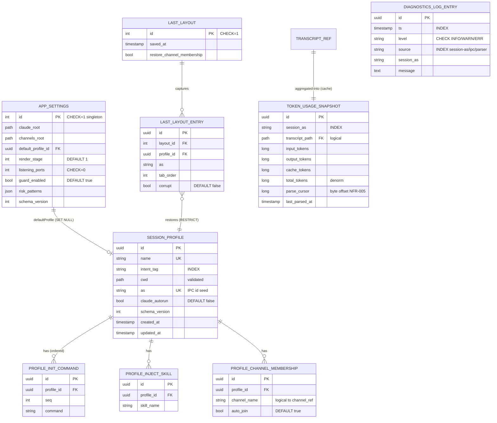
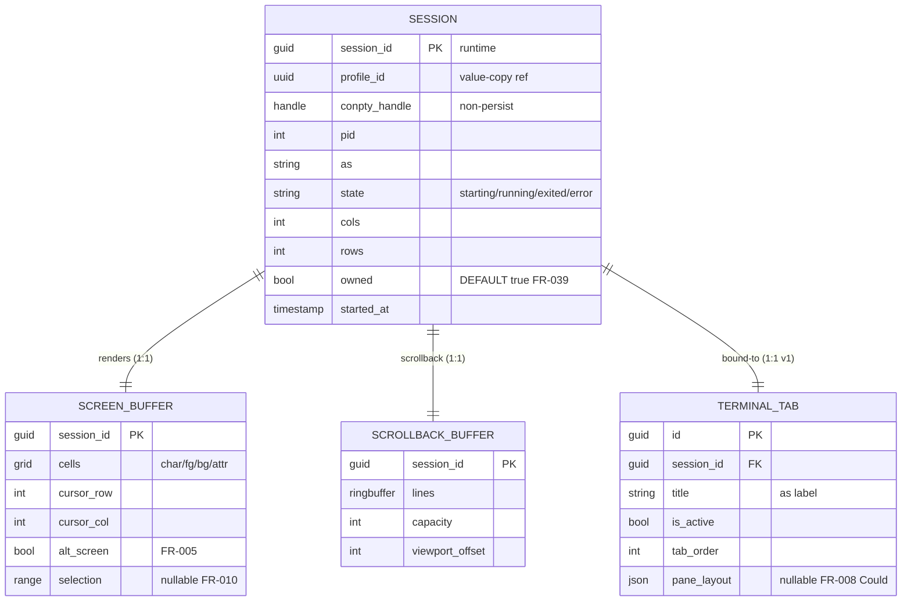
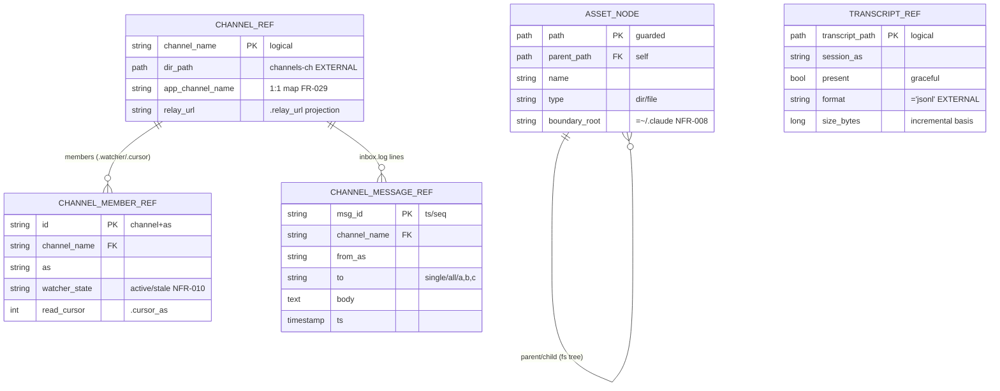

# 09. 데이터베이스 설계 (Database Design — 영속 모델 · ERD · ENT)

> 담당: plan_db_modeler · 깊이: deep · 총 ENT 18 (영속 9 / 런타임 4 / 투영 5) / 7 도메인 분포(SEC 0) · FR 커버리지 43/43
> 본 문서는 FR·FN·SC가 요구하는 데이터를 엔티티(ENT)로 확정하고, **영속화 형태(후속숙제 ①)를 v1 권고안으로 결정**하며, 이 앱의 특성상 큰 비중을 차지하는 **외부 파일 상태(채널·jsonl·자산)를 "소유 엔티티가 아닌 투영(projection)"으로 명확히 경계**짓는다. FR 전수 커버리지를 검증한다.

---

## 0. 개요

### 0-1. 목적·범위

본 문서는 `04`(FR 43/NFR 22)·`05`(FN 53)·`07`(SC 22)가 요구하는 데이터를 엔티티로 영속화하고, `00_meeting_brief` §4 도메인 모델(SessionProfile·Session·Channel·TokenUsage)을 구체 스키마로 확정한다.

- **정의하는 것**: 엔티티(ENT)·컬럼·타입·제약·관계·인덱스 방향 / **영속화 형태 결정(JSON vs SQLite, 후속숙제 ①)** / 영속·런타임·투영 3분류 경계 / 파일 레이아웃·원자적 저장(NFR-011) / FR 전수 커버리지.
- **정의하지 않는 것(경계)**: REST/DTO 계약=08 / 화면 배치=07 / VT 파서·렌더 성능·아키텍처=10 / 일정=12.
- **이 앱의 데이터 특이성 (설계 대전제)**: Control Tower는 **자체 DB보다 로컬 파일 상태 소비가 큰** 앱이다. 채널 파일(`channels/<ch>/`)·세션 jsonl 트랜스크립트·`~/.claude` 자산은 **skill_ipc_control·Claude Code·OS 파일시스템이 스키마를 소유**하며, 우리는 이를 **read/watch(및 write-through)로 투영(projection)**할 뿐 스키마를 소유하지 않는다(C4·C6·NFR-017·NFR-020). 따라서 앱이 실제로 **소유·영속화하는 데이터는 소수**(프로파일·설정·복원 레이아웃·토큰 캐시·진단 로그)다.

### 0-2. 엔티티 ID 체계·도메인·영속 분류

- **ENT-###**: DB 엔티티, 3자리 zero-pad. 본 문서가 자기 네임스페이스로 **신규 발번**(ENT-001~018)한다.
- **참조 전용**: FR-###/NFR-###(04)·FN-{CAT}-##(05)·SC-##(07)·8 카테고리는 레지스트리 frozen 값을 **인용만** 하고 재번호하지 않는다.
- **도메인 정렬**: 각 ENT를 04의 8 카테고리(TRM·SES·PRF·IPC·OBS·AST·SEC·SYS)에 정렬한다. FR↔ENT는 카테고리 일치를 강제하지 않으며(plan_id_system §6은 FR↔ENT 커버리지만 요구), 한 FR이 타 도메인 ENT로 덮일 수 있다.
- **영속 분류(3종) — 본 문서의 1급 축**:

| 마커 | 분류 | 의미 | 스키마 소유 | 예 |
|---|---|---|---|---|
| **[P]** | 영속(Persisted) | 앱이 소유·저장(JSON 파일). 앱 재시작 후 유지 | **앱** | SessionProfile · AppSettings · LastLayout |
| **[C]** | 영속-캐시(Cache) | 외부 소스에서 파생, 재계산 가능한 영속 캐시 | 앱(파생) | TokenUsageSnapshot |
| **[R]** | 런타임(Runtime) | 비영속. 프로세스·메모리 상태(재시작 시 소멸) | 앱(휘발) | Session · ScreenBuffer |
| **[X]** | 투영(Projection) | 외부 파일 상태를 read/watch(+write-through). **우리가 스키마 미소유** | **외부** | ChannelRef · TranscriptRef · AssetNode |

### 0-3. 우선순위·표기 규칙

- **타입 표기**: 논리 타입(`string`·`int`·`long`·`bool`·`timestamp`·`path`·`enum`·`text`·`uuid`)으로 적는다. v1 물리 저장은 JSON이므로 컬럼=JSON 필드다. SQLite 에스컬레이션 시의 물리 타입 매핑은 §8-4에 둔다.
- **제약 표기**: `PK`·`FK->ENT-###`·`UNIQUE`·`NOT NULL`·`DEFAULT`·`CHECK`. FK는 JSON에서 물리 외래키가 아니라 **논리 참조**(ID/이름 by-value)이며, 투영/런타임 FK는 개념적 연결이다.
- **관계·제약·인덱스 라벨**: `REL-##`·`CON-##`·`IDX-##`는 **문서 내부 라벨**(레지스트리 미등재).
- **다이어그램**: ERD만 mermaid `erDiagram`(§3), 그 외 ASCII.

---

## 1. 한눈에 보기

### 1-1. 엔티티 한눈에 (ENT × 도메인 × 영속분류 × 소급 FR)

| ENT | 이름(table) | 도메인 | 분류 | 소급 FR | 소비 SC |
|---|---|---|---|---|---|
| ENT-001 | screen_buffer | TRM | [R] | FR-003·004·005·010 | SC-08 |
| ENT-002 | scrollback_buffer | TRM | [R] | FR-004·007 | SC-08 |
| ENT-003 | terminal_tab | TRM | [R] | FR-006·008 | SC-07·10 |
| ENT-004 | session (runtime) | SES | [R] | FR-001·002·009·011·014·015·016·017·018·023·039 | SC-08·11·12·04 |
| ENT-005 | session_profile | PRF | [P] | FR-011·012·013·018·019·020·021·022·023·043 | SC-14·15·03 |
| ENT-006 | profile_init_command | PRF | [P] | FR-012 | SC-15 |
| ENT-007 | profile_inject_skill | PRF | [P] | FR-019·027 | SC-15·19 |
| ENT-008 | profile_channel_membership | PRF | [P] | FR-011·026 | SC-15·16 |
| ENT-009 | channel_ref | IPC | [X] | FR-024·029 | SC-16 |
| ENT-010 | channel_member_ref | IPC | [X] | FR-024·026 | SC-16 |
| ENT-011 | channel_message_ref | IPC | [X] | FR-025·028 | SC-17·18 |
| ENT-012 | transcript_ref | OBS | [X] | FR-030 | SC-20 |
| ENT-013 | token_usage_snapshot | OBS | [C] | FR-031·032 | SC-20·11 |
| ENT-014 | asset_node | AST | [X] | FR-033·034·035·036 | SC-21·22 |
| ENT-015 | app_settings | SYS | [P] | FR-029·033·037·038·041·042 | SC-02·13·05 |
| ENT-016 | last_layout | SYS | [P] | FR-040·043 | SC-03·01 |
| ENT-017 | last_layout_entry | SYS | [P] | FR-043 | SC-03 |
| ENT-018 | diagnostics_log_entry | SYS | [P] | FR-016(NFR-022) | SC-06·11 |

> 분포: **영속[P] 9** (005·006·007·008·015·016·017·018 = 8 + 캐시[C] 013 = 실질 영속 9) · **런타임[R] 4** (001·002·003·004) · **투영[X] 5** (009·010·011·012·014). 도메인: TRM 3 · SES 1 · PRF 4 · IPC 3 · OBS 2 · AST 1 · SYS 4 · **SEC 0**(횡단 정책 → AppSettings·Session에 데이터 위임).

### 1-2. 동적 스키마 핵심 (한눈)

- **문서-애그리거트 비정규화**: SessionProfile은 관계형으로 3NF(자식 3종 분리)지만 **물리적으로 하나의 JSON 문서로 임베드**한다(원자적 temp→rename의 단위, NFR-011).
- **투영 경계**: Channel·Transcript·Asset은 외부 소유 스키마의 read/watch 투영. 앱은 스키마·수명주기를 소유하지 않는다(재구현 금지 C4·NFR-017).
- **파생 캐시 + 증분 커서**: TokenUsageSnapshot은 jsonl(진실원본, C6)에서 파생. `parseCursor`(바이트 오프셋)로 증분 파싱(NFR-005).
- **audit/진단**: DiagnosticsLogEntry가 append-only NDJSON(감사-유사, NFR-022).

---

## 2. 데이터 요구사항 분석

### 2-1. 핵심 도메인 객체 (04 도메인 모델 → 데이터 관점)

| 브리프 도메인 | 데이터 관점 도출 | 영속 판정 | 근거 FR/근거 |
|---|---|---|---|
| SessionProfile { 의도태그·초기명령·cwd·주입스킬[]·채널멤버십[]·claude자동실행 } | **중심 애그리거트**. 저장·재사용 필수 | **[P] 영속** | FR-019·020 "저장·재사용", 브리프 §4 "저장·재사용 가능해야" |
| Session(런타임) { profile·conpty핸들·pid·as·상태 } | ConPTY **프로세스 상태** — 복원 불가 | **[R] 런타임** | FR-016·043(세션 자체 복원 불가, 프로파일 재기동으로 대체) |
| Channel { name·relayUrl·members } ↔ skill_ipc_control | 외부 채널 디렉토리의 **투영** | **[X] 투영** | C4·NFR-017 "IPC 재구현 금지, 파일 계약만 소비" |
| TokenUsage { session·source=jsonl } | jsonl에서 **파생**되는 집계 캐시 | **[C] 캐시** | C6 "토큰 소스=jsonl 파싱(API 아님)" |
| (신규 도출) AppSettings·LastLayout·DiagnosticsLog | 설정·복원·진단 | **[P] 영속** | FR-042·043·016(NFR-022) |

### 2-2. 데이터 생명주기

```
SessionProfile:  생성(SC-15) -> 조회/목록(SC-14) -> 편집(SC-15) -> 복제(as 신규)/삭제(하드) -> [영속 유지]
Session(런타임): spawn(FR-001) -> running -> exited/error -> 소멸(앱 종료 시 일괄 정리 FN-TRM-02)  [비영속]
Channel/Message: 외부 생성(send.cmd) -> 앱 watch/read 투영 -> UI 표시                     [앱은 소비만]
TokenUsage:      jsonl append 감지 -> 증분 파싱(cursor) -> 집계 캐시 갱신 -> 표시            [파생·재계산 가능]
Asset:           OS 파일 -> 트리 투영/읽기 -> write-through(원자적 저장) -> 트리 갱신         [OS 소유]
```

### 2-3. 데이터 특성·볼륨 (딥 §8-3 상세)

| 데이터 | 정형성 | 읽기:쓰기 | 볼륨(초기/1년/3년) |
|---|---|---|---|
| SessionProfile | 정형(문서) | 읽기 우위 | 3~10 / 20~50 / 50~100 (소수) |
| Session(런타임) | 정형 | — | 동시 ≥8(NFR-012), 휘발 |
| TokenUsageSnapshot | 정형(집계) | 쓰기(증분) 빈번 | 함대 스냅샷 수십 / 이력 축적 시 수백~수천/년 |
| DiagnosticsLog | 반정형(로그) | 쓰기 매우 빈번 | 수천/일 (회전 필요) |
| Channel/Transcript/Asset | 외부 소유 | 앱=읽기(watch) | 앱 미저장(투영) |

### 2-4. NFR 반영

- **NFR-011(원자성)**: 모든 [P] 저장은 temp→rename. JSON 전체-파일 교체가 이를 자명하게 충족.
- **NFR-005(증분 파싱)**: TokenUsageSnapshot.parseCursor로 append분만 재파싱.
- **NFR-008(경로 안전)**: AssetNode 접근은 `~/.claude` 경계 CHECK/가드(FN-SEC-04).
- **NFR-020(방어적 파싱)**: TranscriptRef/ChannelMessageRef 투영 시 미지 필드 무시·손상 라인 skip.
- **NFR-021(ClickOnce 호환)**: 배포 단순성 위해 **네이티브 의존 없는 JSON 우선**(SQLite 네이티브 번들 회피) — §8-4 결정 근거.

---

## 3. ERD (mermaid erDiagram)

> 엔티티가 18개로 많아 **영속분류 3존으로 ERD를 분할**한다(deep: 존별 상세 + §3-4 존간 브리지).

### 3-1. 영속 존 ERD ([P] 소유 + [C] 캐시) — 앱이 스키마를 소유하는 유일한 영역



### 3-2. 런타임 존 ERD ([R] 비영속) — 재시작 시 소멸, 참조용



### 3-3. 투영 존 ERD ([X] 외부 소유) — 앱은 스키마 미소유, read/watch/write-through만



### 3-4. 존간 브리지 (cross-zone, 물리 FK 아님·개념 연결)

```
[P] SESSION_PROFILE --spawn(value-copy)--> [R] SESSION          (FR-011: 프로파일->런타임, 참조 복사)
[R] SESSION --as-map--> [X] TRANSCRIPT_REF --> [C] TOKEN_USAGE  (FR-030/031: as<->jsonl 매핑->집계)
[P] PROFILE_CHANNEL_MEMBERSHIP --by name--> [X] CHANNEL_REF     (FR-026: 프로파일 멤버십<->외부 채널)
[R] SESSION(as) --join--> [X] CHANNEL_MEMBER_REF               (FR-026: 런타임 as<->채널 멤버)
[R] SESSION(as) --source--> [P] DIAGNOSTICS_LOG_ENTRY          (FR-016: 세션 이벤트->진단 로그)
```
캡션: **영속(왼쪽)은 앱 소유, 투영(오른쪽)은 외부 소유**. 브리지는 대부분 `as`(IPC 식별자) 또는 이름/경로에 의한 **논리 조인**이며, 런타임 소멸·외부 파일 부재에 대해 graceful(NFR-020)해야 하므로 물리 FK 무결성을 강제하지 않는다.

---

## 4. 엔티티 정의

> 각 엔티티: 설명 · 소급 FR/구현 FN/소비 SC · 컬럼(타입·제약·설명) · 데이터 특성. FK는 논리 참조(JSON by-value/by-name).

### 4-1. TRM — 터미널 런타임 [R]

#### [ENT-001] screen_buffer          (도메인: TRM · [R] 런타임)
- 설명: VT 파서가 산출한 현재 화면 버퍼(셀 그리드·커서·alt-screen·선택). 비영속(프로세스 종료 시 소멸).
- 소급 FR: FR-003·004·005·010 / 구현 FN: FN-TRM-04·05·07·13 / 소비 SC: SC-08·09

| 컬럼 | 타입 | 제약 | 설명 |
|---|---|---|---|
| session_id | guid | PK, FK->ENT-004 | 소속 세션(1:1) |
| cells | grid | — | 문자·전경/배경색·속성 |
| cursor_row | int | — | 커서 행 |
| cursor_col | int | — | 커서 열 |
| alt_screen | bool | DEFAULT false | alt-screen 활성(렌더②) |
| selection | range | nullable | 드래그 선택 영역(복사 원본) |

- 데이터 특성: 순수 인메모리, 고빈도 갱신(diff 렌더 NFR-001). 영속 0.

#### [ENT-002] scrollback_buffer          (도메인: TRM · [R])
- 설명: 화면을 벗어난 과거 출력 라인 링버퍼 + 뷰포트 오프셋.
- 소급 FR: FR-004·007 / 구현 FN: FN-TRM-06·09·10 / 소비 SC: SC-08

| 컬럼 | 타입 | 제약 | 설명 |
|---|---|---|---|
| session_id | guid | PK, FK->ENT-004 | 소속 세션 |
| lines | ringbuffer | — | 스크롤아웃 라인 |
| capacity | int | DEFAULT (설정) | 상한(용량 관리) |
| viewport_offset | int | DEFAULT 0 | 조회 위치(0=하단 최신) |

- 데이터 특성: 인메모리 링버퍼, 상한 회수. 영속 0.

#### [ENT-003] terminal_tab          (도메인: TRM · [R])
- 설명: 탭↔세션 바인딩·활성 여부·분할 레이아웃. v1은 세션당 1탭(단일 pane→탭, C8); 분할은 Could.
- 소급 FR: FR-006·008 / 구현 FN: FN-TRM-08·11 / 소비 SC: SC-07·10
- 복원 시엔 ENT-017(last_layout_entry)로 투영-저장(런타임 자체는 비영속).

| 컬럼 | 타입 | 제약 | 설명 |
|---|---|---|---|
| id | guid | PK | 탭 ID(런타임) |
| session_id | guid | FK->ENT-004 | 바인딩 세션 |
| title | string | — | 탭 라벨(as) |
| is_active | bool | DEFAULT false | 활성 탭(=활성 세션 명시) |
| tab_order | int | — | 정렬 |
| pane_layout | json | nullable | 분할(FR-008, 후속) |

### 4-2. SES — 세션 런타임 [R]

#### [ENT-004] session          (도메인: SES · [R] 런타임 ★핵심 런타임)
- 설명: 프로파일로 기동된 **런타임 세션**. ConPTY 핸들·pid·as·상태를 보유. **비영속**(프로세스라 앱 재시작 시 소멸 → FR-043은 프로파일 기반 재기동으로 대체).
- 소급 FR: FR-001·002·009·011·014·015·016·017·018·023·039 / 구현 FN: FN-TRM-01·02·03·12·SES-01~10·SEC-03 / 소비 SC: SC-08·11·12·04·07

| 컬럼 | 타입 | 제약 | 설명 |
|---|---|---|---|
| session_id | guid | PK (런타임) | 런타임 세션 ID |
| profile_id | uuid | ref->ENT-005 (value-copy) | 기동 프로파일(값 복사; 원본 삭제 무영향 FR-021) |
| conpty_handle | handle | — | ConPTY 핸들(비영속) |
| pid | int | — | OS 프로세스 ID |
| as | string | — | IPC 식별자(프로파일 as에서 전파 FR-023) |
| state | enum | CHECK(starting/running/exited/error) | 런타임 상태(FR-016) |
| cols | int | — | 열(리사이즈 FR-007) |
| rows | int | — | 행 |
| owned | bool | DEFAULT true | 앱-소유 범위 강제(FR-039) |
| started_at | timestamp | — | 기동 시각 |

- 데이터 특성: 동시 ≥8(NFR-012), 상태머신, 크래시 격리(NFR-009). 영속 0.

### 4-3. PRF — 세션 프로파일 [P] (중심 애그리거트)

#### [ENT-005] session_profile          (도메인: PRF · [P] 영속 ★중심 애그리거트)
- 설명: 오케스트레이션-우선 **중심 애그리거트**(C9/#9). 하나의 JSON 문서로 저장(자식 3종 임베드). 앱이 소유·영속화하는 가장 중요한 데이터.
- 소급 FR: FR-011·012·013·018·019·020·021·022·023·043 / 구현 FN: FN-PRF-01~07·SES-01·02·03 / 소비 SC: SC-14·15·03

| 컬럼 | 타입 | 제약 | 설명 |
|---|---|---|---|
| id | uuid | PK | 프로파일 고유 ID |
| name | string | UNIQUE, NOT NULL | 표시 이름 |
| intent_tag | string | NOT NULL, INDEX | 의도태그(control/sangmin+noter/Proj_N) — 그룹/필터(FR-022) |
| cwd | path | NOT NULL, validated(FN-PRF-02) | 작업디렉토리(FR-012) |
| as | string | UNIQUE(채널-스코프 권고), NOT NULL | IPC 식별자 기본값(런타임 Session.as 시드 FR-023) |
| claude_autorun | bool | DEFAULT false | claude 자동실행(FR-013) |
| schema_version | int | DEFAULT 1 | 마이그레이션용(§8-4) |
| created_at | timestamp | NOT NULL | |
| updated_at | timestamp | NOT NULL | |

- 임베드 자식: `init_commands[]`(ENT-006) · `inject_skills[]`(ENT-007) · `channel_memberships[]`(ENT-008).
- 데이터 특성: 소수(수십), 읽기 우위, 원자적 저장(NFR-011). 물리=`profiles/<id>.json` 1파일.

#### [ENT-006] profile_init_command          (도메인: PRF · [P], 임베드)
- 설명: 기동 시 순차 실행할 초기 명령(순서 有). 관계형 뷰; 물리는 프로파일 JSON 내 배열.
- 소급 FR: FR-012 / 구현 FN: FN-SES-02 / 소비 SC: SC-15

| 컬럼 | 타입 | 제약 | 설명 |
|---|---|---|---|
| id | uuid | PK | |
| profile_id | uuid | FK->ENT-005 | 소속 프로파일 |
| seq | int | NOT NULL | 실행 순서 |
| command | string | NOT NULL | 초기 명령 |

#### [ENT-007] profile_inject_skill          (도메인: PRF · [P], 임베드)
- 설명: IPC 스킬 주입 시 트리거 프롬프트를 구성할 스킬 목록(예: skill_ipc_control).
- 소급 FR: FR-019·027 / 구현 FN: FN-PRF-01·IPC-05 / 소비 SC: SC-15·19

| 컬럼 | 타입 | 제약 | 설명 |
|---|---|---|---|
| id | uuid | PK | |
| profile_id | uuid | FK->ENT-005 | |
| skill_name | string | NOT NULL | 트리거 대상 스킬명 |

#### [ENT-008] profile_channel_membership          (도메인: PRF · [P], 임베드)
- 설명: 프로파일이 기동 시 참여할 채널 목록. 앱 채널명 by-name으로 ENT-009(투영) 참조.
- 소급 FR: FR-011·026 / 구현 FN: FN-IPC-04·SES-01 / 소비 SC: SC-15·16

| 컬럼 | 타입 | 제약 | 설명 |
|---|---|---|---|
| id | uuid | PK | |
| profile_id | uuid | FK->ENT-005 | |
| channel_name | string | NOT NULL (논리 ref->ENT-009) | 참여 채널명 |
| auto_join | bool | DEFAULT true | 기동 시 자동 참여 |

### 4-4. IPC — 채널 투영 [X] (외부 소유, 재구현 금지)

> **경계 선언**: ENT-009~011은 `channels/<ch>/`의 `inbox.log`·`.relay_url`·`.cursor_<as>`·`.watcher_<as>.pid`를 **read/watch로 투영**한 것이다. **스키마·수명주기는 skill_ipc_control이 소유**하며, 앱은 저장하지 않고(전송은 `send.cmd` 재사용) 파싱된 뷰 모델만 인메모리로 유지한다(C4·NFR-017).

#### [ENT-009] channel_ref          (도메인: IPC · [X] 투영)
- 설명: 채널 디렉토리 투영 + 앱 채널↔IPC channel 1:1 매핑.
- 소급 FR: FR-024·029 / 구현 FN: FN-IPC-01·07 / 소비 SC: SC-16

| 컬럼 | 타입 | 제약 | 설명 |
|---|---|---|---|
| channel_name | string | PK (논리) | 채널명 |
| dir_path | path | — (외부) | `channels/<ch>/` 경로 |
| app_channel_name | string | — | 앱 채널명(1:1 매핑 FR-029, 후속 ④) |
| relay_url | string | nullable | `.relay_url` 투영(로컬) |

#### [ENT-010] channel_member_ref          (도메인: IPC · [X])
- 설명: 채널 멤버(as) 상태 투영(watcher·read cursor·stale).
- 소급 FR: FR-024·026 / 구현 FN: FN-IPC-02·04 / 소비 SC: SC-16

| 컬럼 | 타입 | 제약 | 설명 |
|---|---|---|---|
| id | string | PK (channel_name+as) | |
| channel_name | string | FK->ENT-009 | |
| as | string | — | 멤버 IPC 식별자 |
| watcher_state | enum | (active/stale) | `.watcher_<as>.pid` 상태(NFR-010) |
| read_cursor | int | — | `.cursor_<as>` 위치 |

#### [ENT-011] channel_message_ref          (도메인: IPC · [X])
- 설명: `inbox.log` 메시지 라인 투영(대화 뷰). 전송은 send.cmd, 우리는 append 포맷 미소유.
- 소급 FR: FR-025·028 / 구현 FN: FN-IPC-03·06 / 소비 SC: SC-17·18

| 컬럼 | 타입 | 제약 | 설명 |
|---|---|---|---|
| msg_id | string | PK (ts/seq) | 라인 식별 |
| channel_name | string | FK->ENT-009 | |
| from_as | string | — | 송신 as |
| to | string | — | to 컨벤션(single/all/`a,b,c`) |
| body | text | — | 본문 |
| ts | timestamp | — | 시각 |

### 4-5. OBS — 관측·토큰 [X]+[C]

#### [ENT-012] transcript_ref          (도메인: OBS · [X] 투영)
- 설명: Claude Code 세션 jsonl 트랜스크립트 투영. **포맷은 Claude Code 소유**(C6), 방어적 파싱(NFR-020).
- 소급 FR: FR-030 / 구현 FN: FN-OBS-01 / 소비 SC: SC-20

| 컬럼 | 타입 | 제약 | 설명 |
|---|---|---|---|
| transcript_path | path | PK (논리) | jsonl 경로 |
| session_as | string | — | 매핑된 세션 as |
| present | bool | — | 파일 존재(부재 graceful) |
| format | const | ='jsonl' | 외부 포맷 |
| size_bytes | long | — | 현재 크기(증분 기준) |

#### [ENT-013] token_usage_snapshot          (도메인: OBS · [C] 영속-캐시)
- 설명: jsonl에서 파생한 **집계 캐시** + 증분 커서. 진실원본=jsonl(C6)이므로 손실 시 재계산 가능. v1 JSON 캐시, 이력 축적 시 SQLite 에스컬레이션 대상(§8-4).
- 소급 FR: FR-031·032 / 구현 FN: FN-OBS-02·03 / 소비 SC: SC-20·11

| 컬럼 | 타입 | 제약 | 설명 |
|---|---|---|---|
| id | uuid | PK | |
| session_as | string | INDEX(IDX-03) | 세션 as(표시 조인) |
| transcript_path | path | 논리 FK->ENT-012 | 소스 트랜스크립트 |
| input_tokens | long | DEFAULT 0, CHECK>=0 | |
| output_tokens | long | DEFAULT 0, CHECK>=0 | |
| cache_tokens | long | DEFAULT 0, CHECK>=0 | |
| total_tokens | long | 파생 저장(비정규화) | 표시 성능용(§8-2) |
| parse_cursor | long | DEFAULT 0, CHECK>=0 | 마지막 파싱 바이트 오프셋(증분 NFR-005) |
| last_parsed_at | timestamp | — | |

- 데이터 특성: 세션/트랜스크립트당 1행, 증분 쓰기 빈번. 함대 스냅샷 수십 / 이력 유지 시 수백~수천/년.

### 4-6. AST — 프롬프트 자산 [X]

#### [ENT-014] asset_node          (도메인: AST · [X] 투영, write-through)
- 설명: `~/.claude/{rules,skills,agents}` 파일시스템 트리 투영. 읽기 + write-through CRUD(원자적 저장). **스키마=OS 파일시스템**, 우리는 미소유. 모든 접근 경로 가드(NFR-008/FN-SEC-04).
- 소급 FR: FR-033·034·035·036 / 구현 FN: FN-AST-01~04·SEC-04 / 소비 SC: SC-21·22

| 컬럼 | 타입 | 제약 | 설명 |
|---|---|---|---|
| path | path | PK (논리), CHECK(경계 내) | 절대 경로(가드 검증) |
| parent_path | path | FK->self(ENT-014) | 트리 부모 |
| name | string | — | 파일/폴더명 |
| type | enum | (dir/file) | 노드 유형 |
| boundary_root | const | =`~/.claude` | 경계 루트(NFR-008) |

- 데이터 특성: OS 소유, 앱 미저장(요청 시 트리 로드). 대용량 파일 스트리밍 읽기(SC-22).

### 4-7. SYS — 앱 셸·설정·복원·진단 [P]

#### [ENT-015] app_settings          (도메인: SYS · [P] 영속 싱글턴)
- 설명: 앱 설정 싱글턴 + 횡단 정책(SEC 위임: 위험 가드 설정·포트 0 표기). ClickOnce 업데이트 캐시(선택).
- 소급 FR: FR-029·033·037·038·041·042 / 구현 FN: FN-SYS-03·SEC-01·02 / 소비 SC: SC-02·13·05

| 컬럼 | 타입 | 제약 | 설명 |
|---|---|---|---|
| id | int | PK, CHECK=1 | 싱글턴 |
| claude_root | path | DEFAULT `~/.claude` | 자산 루트(FR-033) |
| channels_root | path | — | 채널 루트(FR-029) |
| default_profile_id | uuid | FK->ENT-005, nullable | 기본 프로파일(SET NULL) |
| render_stage | enum | DEFAULT 1 (1/2) | 렌더 단계(NFR-013 무중단) |
| listening_ports | int | CHECK=0 | 포트 0 정책 표기(FR-038/NFR-006) |
| guard_enabled | bool | DEFAULT true | 위험 커맨드 가드 on/off(FR-037) |
| risk_patterns | string[] | — | 위험 패턴 목록(후속 ⑧) |
| web_monitor_mode | enum | nullable | 흡수/병존(후속 ⑥) |
| last_update_check | timestamp | nullable | ClickOnce 확인 캐시(FR-041, 선택) |
| schema_version | int | DEFAULT 1 | |

#### [ENT-016] last_layout          (도메인: SYS · [P])
- 설명: 직전 셸 구성(열린 탭/프로파일) 스냅샷 헤더. 재시작 후 재기동 제안(세션 자체 복원 불가).
- 소급 FR: FR-040·043 / 구현 FN: FN-SYS-04·01 / 소비 SC: SC-03·01

| 컬럼 | 타입 | 제약 | 설명 |
|---|---|---|---|
| id | int | PK, CHECK=1 | 싱글턴(직전 1개) |
| saved_at | timestamp | — | |
| restore_channel_membership | bool | DEFAULT true | 재참여 옵션(SC-03) |

#### [ENT-017] last_layout_entry          (도메인: SYS · [P])
- 설명: 복원 대상 탭별 항목(프로파일 참조·as·순서·손상 플래그).
- 소급 FR: FR-043 / 구현 FN: FN-SYS-04·SES-10 / 소비 SC: SC-03

| 컬럼 | 타입 | 제약 | 설명 |
|---|---|---|---|
| id | uuid | PK | |
| layout_id | int | FK->ENT-016 | |
| profile_id | uuid | FK->ENT-005 (RESTRICT) | 복원 대상 프로파일 |
| as | string | — | 직전 as |
| tab_order | int | — | 탭 순서 |
| corrupt | bool | DEFAULT false | 손상 감지 시 비활성(SC-03) |

#### [ENT-018] diagnostics_log_entry          (도메인: SYS · [P] append-only NDJSON)
- 설명: 세션 기동/종료·주입·IPC·파서 오류·크래시 격리 이벤트 로그(사후 진단·감사-유사).
- 소급 FR: FR-016(NFR-022) / 구현 FN: FN-SYS-05·SES-08 / 소비 SC: SC-06·11

| 컬럼 | 타입 | 제약 | 설명 |
|---|---|---|---|
| id | uuid | PK | |
| ts | timestamp | INDEX(IDX-04) | 발생 시각 |
| level | enum | CHECK(INFO/WARN/ERR) | 레벨 |
| source | string | INDEX(IDX-04) | session as / ipc / parser |
| session_as | string | nullable | 관련 세션 |
| message | text | — | 메시지 |

---

## 5. 동적 스키마/특수 패턴

| 패턴 | 대상 ENT | 트리거(요구) | 트레이드오프 |
|---|---|---|---|
| **문서-애그리거트 임베드(비정규화)** | ENT-005 + 006·007·008 | NFR-011 원자성 · FR-020 재사용 | 애그리거트 단위 원자 저장·조인 제거 ↔ 부분 갱신 시 전체 재기록(소수라 무해) |
| **투영(projection) 엔티티** | ENT-009·010·011·012·014 | C4·C6·NFR-017 재구현 금지 | 재구현·중복 저장 제거·단일 진실원본 ↔ 외부 포맷 변경/부재에 방어적 파싱 필요(NFR-020) |
| **파생 캐시 + 증분 커서** | ENT-013 | NFR-005 증분 파싱 · FR-031 | 재파싱 회피(성능) ↔ 캐시 staleness(커서·재계산으로 관리) |
| **JSONB/유연 컬럼** | ENT-003.pane_layout · ENT-015.risk_patterns | FR-008 후속 · 후속 ⑧ 미확정 | 스키마 확정 지연 흡수 ↔ 질의성 저하(소량이라 무해) |
| **audit/history(append-only)** | ENT-018 | NFR-022 진단 | 사후 추적성 ↔ 무한 증가 → 회전/보존 정책 필요(§8-3) |
| **싱글턴(CHECK=1)** | ENT-015·016 | 설정/직전-레이아웃 유일 | 단순·경쟁 없음(단일 유저 C7) |
| **self-referential 트리** | ENT-014 | FR-033 트리 브라우저 | 재귀 탐색 자연 표현 ↔ 깊은 트리 lazy-load |
| **soft-delete 미채택** | ENT-005(하드 삭제) | FR-021 · C7 단일유저 | 복잡도 제거 ↔ 실수 삭제 방어는 SC 확인 프롬프트로 대체 |
| **멀티테넌시·파티셔닝** | 해당 없음 | 단일 유저·로컬(C7) | 불필요 — 명시적 미채택 |

---

## 6. 제약·무결성 규칙

### 6-1. 관계 (REL)

```
[REL-01] ENT-005 <-> ENT-006 | 1:N | FK 위치: ENT-006.profile_id | 무결성: CASCADE(임베드=문서 동반)
[REL-02] ENT-005 <-> ENT-007 | 1:N | FK 위치: ENT-007.profile_id | 무결성: CASCADE
[REL-03] ENT-005 <-> ENT-008 | 1:N | FK 위치: ENT-008.profile_id | 무결성: CASCADE
[REL-04] ENT-005 <-> ENT-004 | 1:N | 참조 위치: ENT-004.profile_id (value-copy) | 무결성: 없음(런타임, 원본 삭제 무영향 FR-021)
[REL-05] ENT-004 <-> ENT-001 | 1:1 | 키: session_id | 무결성: 런타임 동반 소멸
[REL-06] ENT-004 <-> ENT-002 | 1:1 | 키: session_id | 무결성: 런타임 동반
[REL-07] ENT-004 <-> ENT-003 | 1:1(v1) | FK 위치: ENT-003.session_id | 무결성: 탭 닫기->세션 종료 연동(FN-SES-05)
[REL-08] ENT-005 <-> ENT-009 | N:M | 중간테이블: ENT-008(profile_channel_membership) | by channel_name
[REL-09] ENT-009 <-> ENT-010 | 1:N | FK 위치: ENT-010.channel_name | 무결성: 투영(외부 소유, 강제 없음)
[REL-10] ENT-009 <-> ENT-011 | 1:N | FK 위치: ENT-011.channel_name | 무결성: 투영
[REL-11] ENT-004 <-> ENT-010 | N:? | by as (런타임 세션<->채널 멤버) | 무결성: 논리 조인(as)
[REL-12] ENT-004 <-> ENT-012 | 1:0..1 | by as (세션<->jsonl 매핑) | 무결성: graceful(부재 허용 FR-030)
[REL-13] ENT-012 <-> ENT-013 | 1:1 | 논리 FK: ENT-013.transcript_path | 무결성: 캐시(재계산 가능)
[REL-14] ENT-015 <-> ENT-005 | N:1 | FK 위치: ENT-015.default_profile_id | 무결성: SET NULL(기본 프로파일 삭제 시)
[REL-15] ENT-016 <-> ENT-017 | 1:N | FK 위치: ENT-017.layout_id | 무결성: CASCADE
[REL-16] ENT-017 <-> ENT-005 | N:1 | FK 위치: ENT-017.profile_id | 무결성: RESTRICT/손상 플래그(삭제 시 corrupt=true, SC-03 비활성)
[REL-17] ENT-014 <-> ENT-014 | 1:N | FK 위치: ENT-014.parent_path | 무결성: 트리(OS 소유)
[REL-18] ENT-004 <-> ENT-018 | 1:N | 참조: ENT-018.session_as | 무결성: 없음(로그는 세션 소멸 후에도 보존)
```

### 6-2. 제약 (CON)

```
[CON-01] 대상: ENT-005.name | UNIQUE, NOT NULL | 프로파일 이름 유일 | 목록 식별
[CON-02] 대상: ENT-005.as  | UNIQUE(채널-스코프 권고), NOT NULL | as 유일성 | IPC 정체성 충돌 방지(FR-023, FN-PRF-07)
[CON-03] 대상: ENT-005.cwd | NOT NULL + 존재 검증 | 유효 경로 | 기동 실패 예방(FN-PRF-02)
[CON-04] 대상: ENT-005.claude_autorun | DEFAULT false | 미지정 시 순수 pwsh | FR-013
[CON-05] 대상: ENT-004.state | CHECK IN(starting,running,exited,error) | 상태 도메인 | FR-016
[CON-06] 대상: ENT-015.id / ENT-016.id | CHECK=1 | 싱글턴 강제 | 설정/레이아웃 유일
[CON-07] 대상: ENT-015.listening_ports | CHECK=0 | 포트 0 정책 | FR-038/NFR-006(외부 미노출)
[CON-08] 대상: ENT-013.(input/output/cache/parse_cursor) | CHECK>=0 | 음수 불가 | 파싱 무결성
[CON-09] 대상: ENT-014.path | CHECK(starts_with boundary_root) + `..` 정규화 차단 | 경로 탈출 차단 | NFR-008/FN-SEC-04 ★
[CON-10] 대상: ENT-018.level | CHECK IN(INFO,WARN,ERR) | 레벨 도메인 | SC-06 필터
[CON-11] 대상: ENT-006.seq | NOT NULL, 프로파일 내 순서 유일 | 실행 순서 결정 | FR-012 순차 주입
[CON-12] 대상: ENT-008.channel_name | NOT NULL | 채널 참여 대상 | FR-026
```

---

## 7. 인덱스·쿼리 패턴

> v1 물리 저장=JSON이므로 인덱스는 **로드 시 인메모리 구조**로 구현된다. 아래는 **논리 인덱스 방향**이며, SQLite 에스컬레이션(§8-4) 시 물리 인덱스가 된다.

```
[IDX-01] 대상: ENT-005.intent_tag | B-Tree/인메모리 그룹맵 | 근거: SC-14 의도태그 그룹/필터 — 프로파일 그룹핑 조회
[IDX-02] 대상: ENT-005.as | Unique/Hash | 근거: as 유일성 검증(CON-02)·as->프로파일 역조회(FN-PRF-07)
[IDX-03] 대상: ENT-013.session_as | B-Tree/Hash | 근거: SC-20/SC-11 세션별 토큰 표시 조인 조회
[IDX-04] 대상: ENT-018(ts, source, level) | Composite B-Tree | 근거: SC-06 진단 로그 타임라인 + level/source 필터
[IDX-05] 대상: ENT-014.parent_path | B-Tree | 근거: SC-21 트리 확장(부모->자식 lazy-load) 자식 열거
[IDX-06] 대상: ENT-011(channel_name, ts) | (투영, inbox.log 자연 순서) | 근거: SC-17 채널 대화 시간순 렌더
```

대표 쿼리(논리):
- SC-14: `SELECT profile GROUP BY intent_tag` → IDX-01.
- SC-15 저장 시: `EXISTS profile WHERE as = ?` (유일성) → IDX-02.
- SC-20: `SELECT as, total_tokens FROM token_snapshot ORDER BY total DESC` → IDX-03.
- SC-06: `SELECT * FROM diag WHERE level>=WARN AND source=? ORDER BY ts DESC LIMIT n` → IDX-04(복합).
- SC-21: `SELECT * FROM asset_node WHERE parent_path = ?` → IDX-05.

> 투영/런타임 엔티티(009~012·014·001~004)는 물리 인덱스 대상이 아니다. 인덱스 채택은 실질적으로 **ENT-013·018**(축적형)에서만 의미가 크며, 이는 SQLite 에스컬레이션 판단의 핵심 근거다(§8-4).

---

## 8. 트레이드오프·정규화

### 8-1. 정규형 수준

| ENT | 정규형 | 비고 |
|---|---|---|
| ENT-005 session_profile | 관계형 3NF, 물리 **비정규화 문서** | 자식 3종 분리=3NF; JSON 임베드로 의도적 denorm |
| ENT-006·007·008 | 3NF | 각 값이 profile_id+자체키에 완전 종속 |
| ENT-015·016 | BCNF | 싱글턴, 함수종속 단순 |
| ENT-017 | 3NF | layout_id·profile_id 참조 정규 |
| ENT-018 | 3NF(로그 append) | 이벤트 원자 레코드 |
| ENT-013 token_usage | **3NF 위반(의도적)** | `total_tokens`=파생 저장(input+output+cache) |
| ENT-001~004(런타임) | N/A | 인메모리 |
| ENT-009~012·014(투영) | N/A | 외부 스키마, 우리가 정규화 안 함 |

### 8-2. 의도적 비정규화 + 근거

1. **SessionProfile 문서 임베드**: 애그리거트를 한 파일로 원자 저장(NFR-011 temp→rename 단위)·조인 제거·소수 레코드. 부분 갱신 시 전체 재기록 비용은 무시 가능(문서 수 KB).
2. **TokenUsageSnapshot.total_tokens 파생 저장**: SC-20/SC-11 표시·정렬 성능. 단일 라이터(증분 파싱)라 갱신 시 항상 재계산 → 갱신 이상 실질 무해.

### 8-3. 잠재 이상현상 점검

| 이상 | 발생 지점 | 대응 |
|---|---|---|
| 삭제 이상 | 프로파일 삭제 시 ENT-017.profile_id·ENT-015.default_profile_id 댕글링 | REL-16 RESTRICT/corrupt 플래그, REL-14 SET NULL |
| 수정 이상 | total_tokens 파생값 부분 갱신 | 증분 파싱마다 전량 재계산(단일 라이터) |
| 삽입 이상 | 없음(문서 애그리거트는 자기완결) | — |
| 투영 무결성 | 외부 채널/jsonl 부재·포맷 변경 | graceful/방어적 파싱(NFR-020), 물리 FK 미강제 |

### 8-4. 영속화 형태 결정 (후속숙제 ①) + 마이그레이션·볼륨 (deep) ★

**결정(v1 권고안 확정): JSON-파일 스토어(primary) + SQLite는 "축적형(토큰 이력·진단)의 에스컬레이션 대상"으로 지정 — 하이브리드를 실용적으로 "JSON-first, SQLite-ready"로 해소.**

판단 매트릭스:

| 요소 | JSON 파일 | SQLite | v1 선택 근거 |
|---|---|---|---|
| 레코드 수 | 프로파일 수십(소수) | — | 소수 → JSON 충분 |
| 원자성(NFR-011) | 전체-파일 temp→rename **자명 충족** | 트랜잭션(단, 네이티브 의존) | JSON 단순 |
| 배포(ClickOnce, NFR-021) | **네이티브 의존 0** | SQLite 네이티브 바이너리 번들 필요 | **JSON**(배포 단순·NFR-021) ★ |
| 가독/이식/git | JSON 우위(`~/.claude` 생태계 정합) | 바이너리 | JSON |
| 동시성 | 단일 유저·단일 라이터(C7) | 불필요한 강점 | JSON 무리 없음 |
| 질의/집계/이력 | 약함 | **강함(시계열·정렬·필터)** | → **토큰 이력·진단만** 해당 |

- **v1 물리 레이아웃**:
```
%AppData%/ControlTower/
  profiles/<id>.json      # ENT-005~008 (프로파일당 1파일=개별 원자 저장, 전량 재기록 회피)
  settings.json           # ENT-015 (싱글턴)
  last_layout.json        # ENT-016+017
  cache/token_usage.json  # ENT-013 (파생 캐시 + parse_cursor)
  logs/diagnostics.ndjson # ENT-018 (append-only, 회전)
```
- **에스컬레이션 트리거(SQLite로 승격할 조건)**: (a) 토큰 **이력/시계열 분석**이 요구로 승격되어 ENT-013이 수백~수천/년으로 축적, (b) 진단 로그의 **질의형 조회**(복합 필터·기간 집계, IDX-04)가 상시화. 두 축적형(ENT-013·018)만 SQLite 테이블로 이관하고 프로파일/설정은 JSON 유지(진짜 하이브리드).
- **마이그레이션 고려**: 모든 [P] 문서에 `schema_version` 필드 → 로드 시 버전 업캐스트. JSON→SQLite 이관 시 `parse_cursor`·집계값 그대로 컬럼 매핑(무손실). 저장은 항상 temp→rename + 쓰기 전 백업.
- **SQLite 물리 타입 매핑(승격 시)**: string→TEXT · int/long→INTEGER · bool→INTEGER(0/1) · timestamp→TEXT(ISO8601)/INTEGER(epoch) · path→TEXT · json→TEXT.

---

## 9. 요약 및 검증

### 9-1. 총계·분포

- **ENT 총 18** — 도메인: TRM 3 · SES 1 · PRF 4 · IPC 3 · OBS 2 · AST 1 · SYS 4 · SEC 0.
- **영속 분류**: [P] 영속 8 + [C] 캐시 1 = **실질 영속 9** · [R] 런타임 4 · [X] 투영 5.
- **관계 총 18(REL)** — 1:1 3 · 1:N 11 · N:M 1(중간=ENT-008) · N:? 논리조인 3.
- **핵심 인사이트**: 앱이 **스키마를 소유하는 영속 엔티티는 9개뿐**이며, 그중 중심은 SessionProfile 애그리거트. 나머지 데이터 비중(채널·jsonl·자산)은 전부 외부 소유 **투영**이다.

### 9-2. FR 커버리지 확인 (★불변식 — 43/43, 미커버 0)

| FR | ENT | | FR | ENT |
|---|---|---|---|---|
| FR-001 | 004[R] | | FR-023 | 005·004 |
| FR-002 | 004[R] | | FR-024 | 009·010[X] |
| FR-003 | 001[R] | | FR-025 | 011[X] |
| FR-004 | 001·002[R] | | FR-026 | 008·010 |
| FR-005 | 001[R] | | FR-027 | 007·004 |
| FR-006 | 003[R] | | FR-028 | 011[X] |
| FR-007 | 002·004[R] | | FR-029 | 009·015 |
| FR-008 | 003[R] | | FR-030 | 012[X] |
| FR-009 | 004[R] | | FR-031 | 013·012 |
| FR-010 | 001[R] | | FR-032 | 013 |
| FR-011 | 005·004·008 | | FR-033 | 014·015 |
| FR-012 | 005·006 | | FR-034 | 014[X] |
| FR-013 | 005 | | FR-035 | 014[X] |
| FR-014 | 004·018 | | FR-036 | 014[X] |
| FR-015 | 004[R] | | FR-037 | 015(guard cfg)◦ |
| FR-016 | 004·018 | | FR-038 | 015(policy)◦ |
| FR-017 | 004[R] | | FR-039 | 004(owned)◦ |
| FR-018 | 005·004 | | FR-040 | 016(layout)◦ |
| FR-019 | 005·006·007·008 | | FR-041 | 015(update cache)◦ |
| FR-020 | 005[P] | | FR-042 | 015[P] |
| FR-021 | 005[P] | | FR-043 | 016·017·005 |
| FR-022 | 005 | | | |

> **미커버 FR = 0 (43/43)** ✅ 불변식 충족.
> ◦ **데이터-경량 FR(5건)**: FR-037(가드=정책·런타임 인터셉트, 패턴목록만 ENT-015에 영속)·FR-038(포트0=집행·표기)·FR-039(소유범위=런타임 집행, owned 플래그)·FR-040(셸 조합=UI, 복원가능분만 ENT-016)·FR-041(ClickOnce=배포 인프라 외부, 업데이트 캐시만 ENT-015). 각각 ≥1 ENT 데이터 접점을 가지되 본질은 정책/UI/배포임을 명시.

### 9-3. 고아 ENT 점검

- 모든 ENT가 ≥1 REL에 참여. **고아 ENT = 0.**

### 9-4. SC-ENT 매핑 점검 (화면 요구 데이터 반영)

| SC | 소비 ENT | SC | 소비 ENT |
|---|---|---|---|
| SC-01 | 015·016 | SC-13 | 015(risk cfg) |
| SC-02 | 015 | SC-14 | 005·006·007·008 |
| SC-03 | 016·017·005 | SC-15 | 005·006·007·008 |
| SC-04 | 004 | SC-16 | 009·010·008 |
| SC-05 | 015(update) | SC-17 | 011 |
| SC-06 | 018·004 | SC-18 | 011 |
| SC-07 | 003 | SC-19 | 007·004 |
| SC-08 | 001·002·004 | SC-20 | 012·013 |
| SC-09 | 001 | SC-21 | 014 |
| SC-10 | 003 | SC-22 | 014 |
| SC-11 | 004·013·018 | | |
| SC-12 | 004 | | |

> 22개 SC 전부 ≥1 ENT로 데이터 충족. **미매핑 SC = 0.**

### 9-5. 자체 검증 게이트

| 게이트 | 결과 |
|---|---|
| FR 전수 커버리지(미커버 FR=0) | ✅ 43/43 |
| 고아 ENT 0(모든 ENT ≥1 관계) | ✅ 18/18 |
| SC-ENT 커버(모든 SC ≥1 ENT) | ✅ 22/22 |
| 상위 ID 재번호 0(FR/FN/SC 인용만) | ✅ |
| ENT 네임스페이스 유일(ENT-001~018) | ✅ 중복 0 |
| 영속/런타임/투영 경계 명시(외부 스키마 미소유) | ✅ [X] 5·[R] 4 명시 |
| 영속화 형태 결정(후속 ①) | ✅ JSON-first, SQLite-ready(§8-4) |

---

## 문서 메타

- 버전: v1.0 / 생성일: 2026-07-01
- 담당: plan_db_modeler · 깊이: deep · 발번 ID: ENT-001~018 (FR/FN/SC·카테고리는 참조만, 재번호 없음)
- 입력: `04_requirements.md`(FR 43/NFR 22·후속숙제①) · `05_functions.md`(FN 53) · `07_interfaces.md`(SC 22 표시 데이터) · `00_meeting_brief.md`(도메인 모델) · 규약(plan_doc_skeleton·plan_id_system)
- 관련 문서: [`04_requirements`](./04_requirements.md) · [`05_functions`](./05_functions.md)(추적성 매트릭스 ENT 열 완성 대상) · [`07_interfaces`](./07_interfaces.md)(SC→ENT) · [`10_tech`](./10_tech.md)(SQLite 승격·성능 검증)
- 미해결·후속: ① 영속화 형태 = **본 문서 §8-4에서 JSON-first 결정**(SQLite 승격 조건 명시) · ④ 채널 1:1 매핑(ENT-009.app_channel_name) · ⑤ 자산 편집 범위(ENT-014) · ⑥ web_monitor(ENT-015.web_monitor_mode) · ⑧ 위험 가드 정책(ENT-015.risk_patterns) → `13_followups` 연계.
