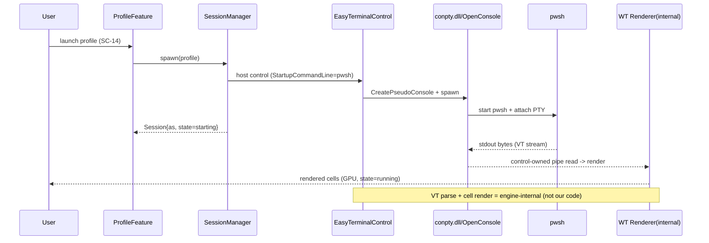
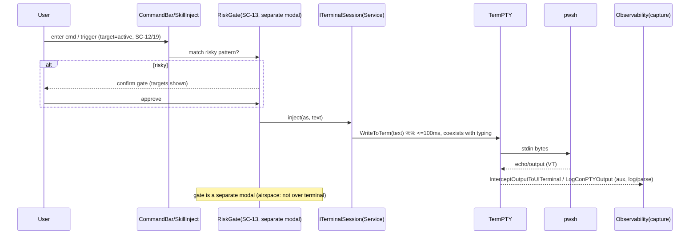
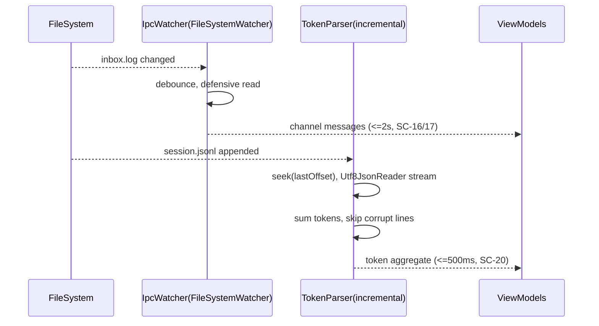

# 10. 기술 스펙·아키텍처 (Tech Spec & Architecture)

> 담당: plan_tech_researcher · 깊이: deep · 스택 10영역 / RISK 10 / NFR 충족 22/22
> 본 문서는 FR 43·NFR 22·SC 22·도메인 모델이 요구하는 품질을, **검증된 runbook(06/06b/07)** 에 근거해 재확정한다 — 터미널 엔진을 self-build(자체 ConPTY·VT 파서·GlyphRun 셀 렌더러)에서 **EasyWindowsTerminalControl(공식 Windows Terminal 렌더러 임베드) 채택(INTEGRATE/BUY)** 으로 반전하고, self-build를 NO-GO 폴백으로 강등한다. 기술 리스크(RISK)를 재정리하며 모든 NFR의 충족 수단을 검증한다.

---

## 0. 개요

### 0-1. 목적·범위

본 문서는 skill_plan 파이프라인의 **기술 스펙 단일 원천(10)** 이다. 기존 문서 10은 터미널 substrate·VT 파서·셀 렌더러를 **추정(self-build)** 으로 확정했으나, 사용자의 **직접 구현·검증 후 역산출한 runbook**(06 임베드 터미널 GO·06b 주입/캡처·07 수명)이 이 추정을 뒤집었다. 본 재작성은 **runbook을 권위 입력**으로 삼아 터미널 엔진 결정을 반전하되, 여전히 유효한 부분(Feature×Layer·ClickOnce·NFR 전수 매핑·in-proc 서비스·동시성 마샬링·원자 저장·IPC 재사용·jsonl 파서)은 계승한다.

- **정의하는 것**: (a) 영역별 스택 확정·근거·대안(§3) / (b) 통합 엔진을 감싸는 Feature×Layer 아키텍처(§4) / (c) 대표 데이터 흐름(§5) / (d) 외부 라이브러리·native 의존·파일 계약(§6) / (e) 기술 리스크 RISK-### + PoC(§7) / (f) 배포 토폴로지·native 동봉·비용(§8) / (g) NFR 22종 전수 충족 검증(§9).
- **정의하지 않는 것(경계)**: FR/NFR·SC·ENT는 **참조 전용**(재번호 금지). 프로파일 영속 스키마·ERD 최종 형태(JSON vs SQLite)는 **09 소관**(본 문서는 저장 기술 후보·원자성 수단까지만). REST/DTO는 08 소관이나 서버·수신 포트가 없어(NFR-006) 08은 in-proc 계약으로 축소.
- **핵심 제약 계승·반전**:
  - C2(ConPTY 0순위 substrate) — **유지**. 단 substrate를 자체 P/Invoke가 아닌 **통합 컨트롤이 제공**(공식 Windows Terminal 콘솔 호스트).
  - C3(VT 파서=라이브러리, 렌더러=자체 WPF) — **반전**. runbook 06 검증으로 파서·렌더러 **둘 다 공식 WT 엔진**이 제공(Microsoft.Terminal.Control). C3의 상위 의도(자체 시퀀스 파싱 금지·파싱/렌더 버그 리스크 제거)는 오히려 **강화**되었다.
  - C4/NFR-017(IPC 재구현 금지)·C5(주입=입력 파이프)·C6(토큰=jsonl 파싱)·C7(로컬·인증 없음)·C8(ClickOnce)·C9(Feature×Layer)·C10(claude 관찰=렌더②) — **유지**.
- **세션 모델(사용자 확정)**: 관리 대상 = **앱-소유(인앱 spawn EmbeddedTerminal) 세션만**. 외부 pwsh 추적(legacy `SessionMonitor`/`ProcessTracker`)은 초기 잔류물로 **v1 오케스트레이션 대상 아님**(FR-017·FR-039·C1 정합). 2-Feature 공존 모델로 취급하지 않는다.
- **NFR 충족 불변식(★최우선)**: NFR-001~022 전량이 스택·아키텍처의 구체 수단으로 매핑된다(미매핑 0, §9).
- **입력 상태 주의**: `09_database`는 병렬 산출 → 저장소 정합은 도메인 모델 참조, 스키마 확정 항목은 `(09 확정 예정)` 표기.

### 0-2. 기술 영역 체계·RISK ID

- **`[TS-##]`(기술 스택 라벨)** · **`[EXT-##]`(외부 의존 라벨)**: 문서 내부 라벨(레지스트리 미등재, 참조 전용).
- **`RISK-###`(기술 리스크)**: 본 문서가 신규 발번하는 유일한 레지스트리 ID(3자리). 상위 ID(FR/NFR/SC/ENT)는 참조만 한다.
- **영역(7 표준 + 터미널 특화 3)**: Frontend·Backend·Storage·Infrastructure·Authentication·Monitoring + **Embedded Terminal Engine·Terminal Substrate(fallback)·Session Injection/Capture**(본 제품 정체성 영역).

### 0-3. 표기 규칙

- **다이어그램**: 스택 구성도·아키텍처·의존 트리·배포 토폴로지는 **ASCII**. 시간축 왕복만 mermaid `sequenceDiagram`(§5).
- **확률/영향도**: `H`(상)·`M`(중)·`L`(하). 우선순위 = 확률×영향도.
- **결정 표기**: `BUILD`(자체)·`INTEGRATE/BUY`(라이브러리·컨트롤 채택)·`REUSE`(기존 자산 소비).
- **GO/NO-GO**: runbook 06 PoC 게이트 판정. 본 v1은 **GO**(EasyWindowsTerminalControl로 pwsh 렌더·타이핑·claude TUI 동작, .NET 10 SDK 10.0.301 검증).

---

## 1. 한눈에 보기

### 1-1. 기술 스택 영역 한눈에

| TS | 영역 | 확정 기술 | 결정 | 대안(fallback) | 관련 NFR | 관련 RISK |
|---|---|---|---|---|---|---|
| TS-01 | Frontend/UI | WPF (.NET 10 LTS) + MVVM(CommunityToolkit.Mvvm) | REUSE 구조 | WinUI3(마찰로 배제)·Avalonia(불필요) | 019·016·014 | — |
| TS-02 | **Embedded Terminal Engine** | **EasyWindowsTerminalControl 1.0.36** — 공식 WT 렌더러(Microsoft.Terminal.Control native + Microsoft.Terminal.Wpf) + ConPTY 내장. 파서·렌더러·substrate 일체 | **INTEGRATE/BUY** | self-build(TS-03 폴백) | 001·015·013·019 | 001·002·003 |
| TS-03 | **Terminal Substrate (fallback)** | MS `GUIConsole.ConPTY` 샘플 — ConPTY 자체 P/Invoke + VT 자체 렌더 | **BUILD(폴백)** | — (NO-GO 시에만) | 019·001 | 003 |
| TS-04 | **Session Injection/Capture** | `TermPTY.WriteToTerm`(주입) · `InterceptOutputToUITerminal`·`LogConPTYOutput`+`GetConsoleText()`·`ReadDelimitedTermPTY`(캡처) | INTEGRATE(컨트롤 API) | — | 002·001·022 | 004 |
| TS-05 | Backend/앱 서비스 | in-proc .NET 서비스 + DI(Microsoft.Extensions.DI/Hosting) | BUILD | — (서버 없음) | 016·009 | 006 |
| TS-06 | Storage | JSON 파일 + `System.Text.Json`, atomic temp→rename **(09 확정 예정)** | BUILD-light | SQLite(Microsoft.Data.Sqlite) | 011 | 009 |
| TS-07 | IPC (협업) | `skill_ipc_control` 파일 계약 소비 — FileSystemWatcher + send.cmd | REUSE | — (재구현 금지 C4) | 017·004·010 | 008 |
| TS-08 | Observability/토큰 | 증분 jsonl 파서 — `Utf8JsonReader` + 오프셋 커서 (+ 06b 출력 캡처=보조 관측) | BUILD-light | ccusage 로직 참고 | 005·020·022 | 007 |
| TS-09 | Infrastructure/배포 | ClickOnce (.NET 10) + **native 자산 동봉**(conpty.dll·OpenConsole.exe·WT 렌더러) | REUSE+ | MSIX·자체 인스톨러 | 021·019 | 010·001 |
| TS-10 | Monitoring/진단 | Microsoft.Extensions.Logging + 롤링 파일(Serilog opt.) | BUILD-light | — | 022 | — |
| — | Authentication | **N/A** — 로컬 단일 유저·수신 포트 0(C7·NFR-006) | (없음 명시) | — | 006 | — |
| — | Concurrency | 컨트롤이 파이프 스레드 소유 + 앱은 출력캡처 델리게이트 **Dispatcher 마샬링** + 주입-타이핑 공존 | INTEGRATE+BUILD | — | 001·002·009 | 004 |

> 아키텍처 패턴: **모듈러 모놀리스 (Feature×Layer 하이브리드, 단일 프로세스)** — 단일 파워유저·로컬·단일 창이므로 MSA/서버리스 부적합.
> **엔진 반전 요지**: 기존 10은 substrate/파서/렌더러 3영역을 각각 자체제작(BUILD)했으나, runbook 06이 **하나의 NuGet 컨트롤(공식 WT 백엔드)** 로 세 영역을 **동시에 충족**함을 실측(GO)했다. → self-build 3영역이 **TS-02 단일 INTEGRATE + TS-03 폴백** 으로 축약된다.

### 1-2. 기술 리스크 RISK-### 한눈에

| RISK | 제목 | 확률 | 영향 | 우선 | 영향 FR/NFR | PoC | 변경 |
|---|---|:--:|:--:|:--:|---|:--:|---|
| RISK-001 | **통합 엔진 native 배포 함정**(conpty.dll·OpenConsole.exe 미복사 → 검정 화면) | M | H | ★최상 | FR-001·002·004·009 / NFR-019·021·001 | ●GO+CI게이트 | repurpose(구: ConPTY 자체제작) |
| RISK-002 | **airspace(HwndHost) 오버레이 제약** — 터미널 위 WPF 겹침 불가 | H | M | 상 | FR-004·005·037 / NFR-015·013 | ●확인 | repurpose(구: 렌더 성능) |
| RISK-003 | **통합 엔진 의존**(beta CI 드리프트·버전 핀·단일 유지보수·라이선스) | M | M | 중 | FR-003·005 / NFR-018·019 | ○핀·확인 | repurpose(구: 파서 선정) |
| RISK-004 | 출력 캡처 델리게이트 스레드 마샬링·주입-타이핑 공존(06b) | M | M | 중 | FR-002·014 / NFR-001·002·009 | ●06b PoC | 지속(reframe) |
| RISK-005 | alt-screen/TUI(claude) 렌더 정확도 | L | M | 하 | FR-005 / NFR-013(C10) | ○06 GO로 해소 | 지속(대폭 완화) |
| RISK-006 | 세션 소유·수명·좀비 정리(RestartTerm/Disconnect/자식 정리) | M | M | 중 | FR-015·016·017·039 / NFR-009·012 | ●07 PoC | 지속(reframe) |
| RISK-007 | jsonl 포맷 변동·증분 파싱 | M | M | 중 | FR-030·031 / NFR-005·020 | ○ | 지속(불변) |
| RISK-008 | IPC 파일 계약 결합 | M | M | 중 | FR-024·025·029 / NFR-010·017 | ○ | 지속(불변) |
| RISK-009 | 상태 영속 원자성·손상 | L | M | 하 | FR-020·035 / NFR-011 | — | 지속(불변) |
| RISK-010 | **ClickOnce + native 의존 배포 호환**(self-contained 동봉·서명) | M | M | 중 | FR-041 / NFR-021·019 | ○게시검증 | 지속(상향) |

> **리스크 지형 반전**: 기존 ★최상 4건(RISK-001/002/003/004 = self-build substrate·렌더 임계경로) 중 렌더 성능(002)·파서 선정(003)은 **공식 WT 렌더러 채택으로 대폭 완화**되어 **airspace·엔진 의존**이라는 실재 리스크로 repurpose되었다. 새 임계경로는 **native 배포(RISK-001)** — "빌드 OK인데 터미널 검정"이 유일한 GO 저해 요인(06 실측). RISK ID 변경표는 NOTES 참조.

---

## 2. 기술 요구사항 분석

| 축 | 도출 내용 | 근거 |
|---|---|---|
| **플랫폼** | Windows 11 데스크톱 **단독**, .NET 10 LTS·WPF. 크로스플랫폼·모바일·웹 없음 | NFR-019·C7 |
| **실시간 요구** | (a) PTY 출력 스트림 실시간 렌더(**공식 WT GPU 렌더러**가 흡수) · (b) IPC inbox.log watch ≤2s · (c) 토큰 증분 갱신 | NFR-001·004·005 |
| **데이터 특성** | 저volume 정형(프로파일 N개·JSON) + 고volume 스트림(PTY 바이트·jsonl append). 읽기≫쓰기. 100MB jsonl 증분 스캔 | FR-020·031 |
| **인증/보안** | 인증 **없음**. 3중 로컬 가드: 앱-소유 세션 범위(C1)·경로 탈출 차단(NFR-008)·위험 주입 게이트(NFR-007). 수신 포트 0(NFR-006) | C7·FR-037/038/039 |
| **트래픽/동시성** | 네트워크 0. 동시 세션 ≥8(각 = 컨트롤 인스턴스 + ConPTY 자식). 컨트롤이 파이프 스레딩 소유 → 앱은 캡처 마샬링·주입만 | NFR-003·012 |
| **특수 기술** | (1) **임베드 터미널 컨트롤**(EasyWindowsTerminalControl, 공식 WT 백엔드) · (2) **native 자산 배포**(conpty.dll·OpenConsole.exe) · (3) **프로그램적 주입·출력 캡처**(TermPTY API) · (4) 파일 watch/원자 write · (5) 증분 jsonl 파싱 | runbook 06/06b/07·C6·NFR-011 |

핵심 함의(브리프 §2 계승): **입력 파이프는 렌더①에서 조기 확보** → 커맨드/스킬 주입(FR-014/027·L2)이 렌더 완성(FR-005·렌더②)에 볼모잡히지 않는다. **엔진 반전으로 이 함의는 더 강해진다** — 렌더①·② 모두 공식 렌더러가 즉시 제공(06 GO로 claude alt-screen TUI 동작 확인)하므로, 주입/제어(TS-04)는 렌더 완성도와 사실상 무관하게 처음부터 가용하다(후속숙제 ②③⑦ 해소).

---

## 3. 기술 스택 제안 (영역별)

### [TS-01] Frontend/UI — WPF (.NET 10 LTS) + CommunityToolkit.Mvvm — REUSE
- 후보: WPF(.NET 10) vs WinUI3 vs Avalonia. 추천: **WPF**.
- 근거: 기존 소스(Shell/Features/Shared) WPF 확정(NFR-019·C9), .NET 10 LTS, MVVM=`ObservableObject`/`RelayCommand`(기존 `Shared/Core` 정합). runbook 06/06b가 VM-First `DataTemplate` 매핑으로 EmbeddedTerminal을 조합.
- 고려: WinUI3 TerminalControl 임베드는 SwapChainPanel 투명 합성 불가·Win10 제약·주입 API 미노출로 배제(02 CS-013) — 단 그 **백엔드(공식 WT 렌더러)만 WPF용으로 뽑아온 것이 TS-02**.

### [TS-02] Embedded Terminal Engine — EasyWindowsTerminalControl 1.0.36 — INTEGRATE/BUY ★반전 핵심
- 후보: **EasyWindowsTerminalControl(공식 WT 백엔드 임베드)** vs self-build(ConPTY 자체 + VtNetCore 파서 + GlyphRun 셀 렌더러) vs WinUI TerminalControl 직접 임베드.
- 추천: **EasyWindowsTerminalControl 1.0.36**(NuGet, mitchcapper, MIT). 패키지 설명 그대로 *"a high performance full-feature WPF terminal control that uses the Official Windows Terminal console host for the backend driver"* — 24-bit 색·ANSI/VT 시퀀스·**GPU 가속 렌더링**·마우스 지원 내장.
- 구성(runbook 06 실측):
  - `EasyWindowsTerminalControl.EasyTerminalControl` — XAML 호스트 컨트롤. `StartupCommandLine="powershell.exe"`(교체 가능: pwsh·cmd·claude).
  - 렌더러 = **`Microsoft.Terminal.Control`(native)** + `Microsoft.Terminal.Wpf` — 공식 Windows Terminal 렌더러. **자체 VT 파서·GlyphRun 셀 렌더러 불필요**(컨트롤 내장).
  - substrate = `CI.Microsoft.Windows.Console.ConPTY`(conpty.dll + OpenConsole.exe).
- 근거: (a) runbook 06 **GO 검증** — .NET 10(SDK 10.0.301)에서 restore/build/pwsh 렌더/사람 타이핑/`claude` TUI 동작 실측. 패키지 TFM은 net6/net8-windows7.0 제공 → net10 프로젝트가 net8.0-windows7.0 자산 선택("모든 프레임워크 호환")이 정상. (b) 파싱·렌더 두 리스크를 **공식 렌더러 신뢰**로 동시 제거(기존 RISK-002/003 대폭 완화). (c) 02 Build-vs-Buy 재판정: 기존 결정 #5/#6의 "self-build 렌더러"는 **임베드 마찰 없는 WPF용 공식 백엔드가 실재함**을 06이 입증하며 반전됨.
- 고려: **native 배포 함정(RISK-001)** · **beta CI 의존 드리프트(RISK-003)** · **airspace HwndHost 제약(RISK-002)** — §7에서 상술.

### [TS-03] Terminal Substrate (fallback) — MS GUIConsole.ConPTY — BUILD(폴백)
- 위치: **NO-GO 폴백 전용**. EasyWindowsTerminalControl이 .NET 10에서 끝내 안 될 때만 채택.
- 구성: microsoft/terminal `samples/ConPTY/GUIConsole` — `GUIConsole.ConPTY`(netstandard2.0 P/Invoke: `CreatePseudoConsole`/입출력 익명 파이프/`STARTUPINFOEX`) + `GUIConsole.WPF`(WPF 호스트). **소스 편입 필요**(NuGet 미패키징), VT100 렌더 자체 처리.
- 근거: beta 의존 0·공식 샘플. runbook 06 폴백 구조 그대로. **본 v1은 GO라 미사용(기록용)**.
- ⚠ 폴백 채택 시: **기존 10의 self-build 우려(렌더 성능·파서 커버리지·파이프 데드락)가 재활성화** → RISK-002/003의 원래 self-build 버전을 12 로드맵에서 재도입해야 함.

### [TS-04] Session Injection/Capture — TermPTY API — INTEGRATE(컨트롤 API)
- 주입(앱→터미널, 사람 타이핑 공존): `TermPTY.WriteToTerm(ReadOnlySpan<char>)` · `WriteToTermBinary(ReadOnlySpan<byte>)`. 기존 10의 "ConPTY 입력 파이프 raw write"를 이 API로 대체(FR-014/027, NFR-002 ≤100ms).
- 출력 캡처(신규): `InterceptOutputToUITerminal`(델리게이트 `void(ref Span<char>)`) · `LogConPTYOutput`(bool)+`ConPTYTerm.GetConsoleText()` · `ReadDelimitedTermPTY`(구분자까지). **관찰(로깅/파싱) 위주, VT 변형 회피**(README Limitations — 변형 시 커서 위치 어긋남).
- 근거: 사람 타이핑과 앱 주입이 한 입력 경로에 공존, 출력은 화면 렌더(컨트롤)와 앱 수집이 동시(06b 개념도). **토큰 소스는 여전히 jsonl(C6)** 이나, 출력 캡처가 **보조 관측 채널**로 가용(진단·자동반응).
- 고려: 델리게이트 호출 스레드 불명·주입-타이핑 충돌 여부는 **06b PoC 선결 항목(RISK-004)**. MVVM 경계(VM→컨트롤 TermPTY 접근)는 코드비하인드 주입 또는 attached behavior로 확정(06b).

### [TS-05] Backend/앱 서비스 — in-proc .NET 서비스 + DI — BUILD (계승)
- 추천: in-proc 서비스 계층(Feature 모듈 내부 Services), DI=`Microsoft.Extensions.DependencyInjection`(+ Generic Host `IHostedService`로 장기 실행 작업·크래시 격리 NFR-009).
- 근거: 서버·네트워크 API 없음(NFR-006) → 08은 in-proc 계약으로 축소. Feature×Layer(NFR-016) — 각 Feature가 Models/Views/ViewModels/Services + (06b 신설)Interfaces, Feature 간 직접 참조 0.

### [TS-06] Storage — JSON 파일(atomic) 1순위 · SQLite 대안 — BUILD-light **(09 확정 예정)** (계승)
- 추천(잠정, 09 위임): 저volume·소수 애그리거트라 **JSON + 원자적 temp→rename**. NFR-011 = `File.WriteAllText(temp)`→`File.Move(temp,dest,overwrite:true)`. 프로파일 수·쿼리 요구 증가 시 SQLite 승격. **최종 스키마·ERD는 09 확정**.

### [TS-07] IPC(협업) — skill_ipc_control 파일 계약 소비 — REUSE (계승)
- 구성: `channels/<ch>/`의 `inbox.log`·`.relay_url`·`.cursor_<as>`를 FileSystemWatcher watch + 방어적 read, 송신은 `send.cmd`·`set_url.cmd` 프로세스 호출 재사용. relay/큐/watcher 로직 재구현 0(C4·NFR-017).
- 고려: 계약 스키마 결합(RISK-008) → 읽기 전용 어댑터 `IIpcFileContract`로 변동 흡수 1곳.

### [TS-08] Observability/토큰 — 증분 jsonl 파서 — BUILD-light (계승, 보조 채널 추가)
- 추천: 세션별 마지막 오프셋 저장, append분만 `Utf8JsonReader` 스트리밍 파싱·누적 집계(NFR-005 100MB ≤500ms·C6). 미지 필드 무시·손상 라인 skip(NFR-020).
- **신규**: TS-04 출력 캡처(`LogConPTYOutput`/`GetConsoleText`)가 **보조 관측 채널**로 세션 출력 로깅·진단을 보강(단 토큰 집계 원천은 jsonl 유지).

### [TS-09] Infrastructure/배포 — ClickOnce (.NET 10) + native 동봉 — REUSE+ (계승, 반전 반영)
- 추천: ClickOnce(C8·runbook 02 계승·NFR-021)·자동 업데이트(FR-041).
- **반전 반영**: 기존 10은 "ConPTY=OS 내장이라 native 의존 배포 불필요"로 판단했으나, EasyWindowsTerminalControl은 **conpty.dll·OpenConsole.exe·Microsoft.Terminal.Control.dll(native)** 를 동봉해야 한다. RID=win-x64·self-contained·서명이 ClickOnce 매니페스트에 반영되어야 함(RISK-010·001). 코드 서명 인증서 권고(SmartScreen).

### [TS-10] Monitoring/진단 — Microsoft.Extensions.Logging + 롤링 파일 — BUILD-light (계승)
- 추천: `Microsoft.Extensions.Logging` + 롤링 파일 sink(Serilog opt.). 세션 기동/종료·주입·IPC·크래시 격리·**native 로드 실패**를 구조화 로깅(NFR-022, SC-06 진단 뷰 소스).

### [—] Authentication — N/A (명시) (계승)
- 인증·인가·비밀 저장 없음. 로컬 단일 유저·수신 포트 0(C7·NFR-006). 대체 보호 = 앱-소유 범위 가드(FR-039)·경로 가드(NFR-008)·위험 주입 게이트(NFR-007).

### [—] Concurrency — 컨트롤 소유 파이프 스레드 + 앱 Dispatcher 마샬링 — INTEGRATE+BUILD (반전)
- **컨트롤이 ConPTY 파이프 읽기 스레드·데드락 관리를 소유**(기존 10의 "파이프별 전용 스레드 자체 구현"이 컨트롤로 이전 — 큰 de-risk). 앱 책임은 축소: (a) `InterceptOutputToUITerminal` 캡처 델리게이트를 **UI Dispatcher 마샬링**, (b) `WriteToTerm` 주입을 사람 타이핑과 한 입력 경로에 큐 없이 합류(NFR-002). 잔여 스레딩 불확실성은 RISK-004(06b PoC).

---

## 4. 아키텍처 (ASCII 구성도 + 패턴)

### 4-1. 패턴 선정 — 모듈러 모놀리스 (Feature×Layer 하이브리드) (계승)
- 선정: **모듈러 모놀리스(단일 WPF 프로세스, Feature 모듈 경계)**. 렌더①→② 무중단은 이제 **엔진이 기본 제공**(모듈 경계 인터페이스만 유지). MSA/서버리스는 NFR-006 위반 → 배제.
- 모듈 경계(NFR-016): `Shell`(얇은 조합) / `Features/{EmbeddedTerminal, Session, Profile, Ipc, Observability, Asset, Settings}` / `Shared/{Core, Interop}`. Feature 간 직접 참조 0.

### 4-2. 시스템 구성도 (통합 엔진 · 엔진 경계 · airspace)

```
+==========================================================================+
|                CONTROL TOWER  (single WPF process, .NET 10)                |
|                                                                           |
|  +---------------------- Shell (thin composition) --------------------+   |
|  |  L-NAV dock | T-terminal zone | R-orchestration dock | S-chrome     |   |
|  +----+------------+-----------------+------------------+-------------+    |
|       |            |                 |                  |                  |
|  +----v----+  +----v-----+    +------v------+    +------v------+           |
|  | Profile |  | Session  |    |     Ipc     |    | Observ /    |           |
|  | Feature |  | Feature  |    |   Feature   |    | Asset Feat. |           |
|  +----+----+  +----+-----+    +------+------+    +------+------+           |
|       |            | owns app-owned only |              |                  |
|       |     +------v-----------+         |              |                  |
|       |     | SessionManager   |         |              |                  |
|       |     | (in-app spawn)   |         |              |                  |
|       |     +------+-----------+         |              |                  |
|  +----v---------+  | spawn N   +---------v---+   +-------v-------+         |
|  | Storage JSON |  |           | Ipc file    |   | jsonl incr    |         |
|  | (atomic)     |  |           | contract    |   | parser        |         |
|  +--------------+  |           | (read/watch)|   | (+capture aux)|         |
|            +-------v-----------------------+ |   +-------+-------+         |
|            | Features/EmbeddedTerminal     | |           |                 |
|            |  Interfaces/ ITerminalSession | |           |                 |
|            |  Services/   TermPTY wrapper  | |           |                 |
|            |  ViewModels/ TerminalViewModel| |           |                 |
|            |  Views/      TerminalView     | |           |                 |
|            +-------+-----------------------+ |           |                 |
|      engine boundary (ITerminalSession)      |           |                 |
|                    |                         |           |                 |
|          +---------v-----------------------+ |           |                 |
|          | EasyTerminalControl (HwndHost)  | |           |                 |
|          |  Microsoft.Terminal.Control     | |  <-- official WT renderer   |
|          |  Microsoft.Terminal.Wpf         | |      (GPU, 24-bit, VT)      |
|          +--+---------------------+--------+ |           |                 |
+-------------|-----------------|----|---------|-----------|-----------------+
      conpty.dll |    OpenConsole.exe |         |  (FS read)|
         +-------v-----------------v--+    +----v-----------v----+
         |  ConPTY (in/out pipes)     |    | ~/.claude *.jsonl   |
         +-------------+--------------+    | channels/<ch>/      |
                       |                   +---------------------+
                 +-----v-----+  ... (app-owned processes only, C1)
                 |  pwsh     |
                 +-----------+
```
캡션: **EmbeddedTerminal Feature가 EasyTerminalControl(공식 WT 백엔드)을 호스팅**하고, 우리 소유 경계 `ITerminalSession`(06b Interfaces)이 주입/캡처/수명을 감싼다(엔진 교체=폴백 TS-03을 이 1곳에서, NFR-018). 컨트롤 내부에서 conpty.dll·OpenConsole.exe가 pwsh를 spawn하고 Microsoft.Terminal.Control이 렌더 — **VT 파싱·셀 렌더는 우리 코드가 아님**. SessionManager는 **앱-소유(인앱 spawn) 세션만** 추적(외부 pwsh 추적=legacy, 대상 아님). IPC/관측은 파일시스템만 read/watch(C4).

> **airspace 제약(RISK-002)**: EasyTerminalControl은 native HwndHost라 **터미널 위에 WPF 요소를 겹칠 수 없다**. 경고 배너·출력 로그·위험 게이트는 **별도 패널/모달**로 배치(07 SC-08 렌더② 경고배너·SC-06 로그·SC-13 게이트는 터미널 존 밖). 컨텍스트 메뉴(SC-09)는 HwndHost 위 허용 → 유지.

### 4-3. 주입·출력 캡처 스레딩 모델 (컨트롤 소유 파이프 · 앱 마샬링)

```
   [pwsh proc]                                   UI thread (Dispatcher)
       |  stdout(bytes)                                 ^
       v                                                | marshaled (log/parse)
  +==================================+                  |
  | EasyTerminalControl (native)     |--render(internal)--> WT renderer (screen)
  |  conpty pipe read (CONTROL-owned)|                  |
  |  deadlock mgmt = control's job   |                  |
  +======+===================+=======+                  |
  WriteToTerm|         InterceptOutputToUITerminal /    |
 (app inject)|          LogConPTYOutput+GetConsoleText  |  app capture
       ^     v                 v-------------------------+
   [UI keys] (shared input path) --> pwsh stdin
       |
   (human typing + app injection coexist, 06b)
```
캡션(RISK-004 대응): 기존 10의 "파이프별 전용 스레드 데드락(자체 관리)"은 **컨트롤이 소유**하므로 앱에서 사라진 큰 de-risk. 앱 책임은 두 가지 — (1) `WriteToTerm` 주입이 사람 타이핑과 한 입력 경로에 충돌 없이 합류(≤100ms, NFR-002), (2) `InterceptOutputToUITerminal`/`GetConsoleText` 캡처를 **UI Dispatcher로 마샬링**해 로깅/파싱. 델리게이트 호출 스레드·주입 공존은 06b PoC 선결.

---

## 5. 주요 데이터 흐름 (mermaid sequenceDiagram)

### 5-1. 세션 spawn + 렌더 왕복 (FR-001·002·004·005) — 엔진 반전 반영


### 5-2. 커맨드/IPC 스킬 주입 + 위험 게이트 + 출력 캡처 (FR-014·027·037 · NFR-002) — TermPTY API


### 5-3. IPC 채널 watch + 토큰 증분 파싱 (FR-024·031 · NFR-004·005) (계승)


---

## 6. 외부 라이브러리·API

| EXT | 이름 | 용도 | 관련 FR | 라이선스 | 비용 | 난이도 | 대안 |
|---|---|---|---|---|---|:--:|---|
| EXT-01 | **EasyWindowsTerminalControl 1.0.36** | 임베드 터미널 엔진(공식 WT 렌더러+ConPTY+VT 일체) | FR-001·002·003·004·005·007·009 | **MIT** | 무료 | 보통(native 배포 주의) | self-build(EXT-11) |
| EXT-02 | **CI.Microsoft.Terminal.Wpf 1.22.250204002** | 공식 WT 렌더러 WPF 호스트(전이, **버전 핀**) | FR-004·005 | MS(beta CI) | 무료 | — | — |
| EXT-03 | **CI.Microsoft.Windows.Console.ConPTY 1.22.250314001** | ConPTY + native conpty.dll·OpenConsole.exe(직접참조+GeneratePathProperty) | FR-001·002 | MS(beta CI) | 무료 | 보통 | OS ConPTY(폴백) |
| EXT-04 | CommunityToolkit.Mvvm | MVVM(ObservableObject·RelayCommand) | FR-040 | MIT | 무료 | 낮음 | 직접구현 |
| EXT-05 | Microsoft.Extensions.DI/Hosting | DI·수명·호스팅 | FR-040·016 | MIT | 무료 | 낮음 | 직접 컨테이너 |
| EXT-06 | System.Text.Json (`Utf8JsonReader`) | 프로파일 영속·jsonl 증분 파싱 | FR-020·031 | MIT(내장) | 무료 | 보통 | Newtonsoft(느림) |
| EXT-07 | Microsoft.Extensions.Logging (+Serilog opt.) | 진단 로그 | FR-016(NFR-022) | MIT/Apache | 무료 | 낮음 | 자체 로거 |
| EXT-08 | **skill_ipc_control 파일 계약** | 채널 watch/read·send.cmd·relay | FR-024·025·027·029 | 내부 자산 | 무료 | 보통 | (재구현 금지 C4) |
| EXT-09 | Claude Code jsonl 트랜스크립트 | 토큰 소스 | FR-030·031 | 비공식 포맷 | 무료 | 보통(방어) | (대안 없음) |
| EXT-10 | ClickOnce (MSBuild/SDK) | 배포·자동 업데이트·native 동봉 | FR-041 | 내장 | 무료(+서명) | 보통 | MSIX |
| EXT-11 | **MS GUIConsole.ConPTY 샘플(폴백)** | NO-GO 시 self-build substrate+VT 렌더 | FR-001~005 | MIT(소스 편입) | 무료 | 높음 | — |
| EXT-12 | Microsoft.Data.Sqlite (조건부) | 프로파일 영속 대안 | FR-020 | MIT | 무료 | 보통 | JSON 파일 |

의존 관계(ASCII 트리):
```
[Control Tower]
  +--> EXT-01 EasyWindowsTerminalControl (MIT)       [INTEGRATE engine]
  |       +--> EXT-02 CI.Microsoft.Terminal.Wpf  (pin)  --> Microsoft.Terminal.Control.dll (native renderer)
  |       '--> EXT-03 CI.Microsoft.Windows.Console.ConPTY (pin, direct-ref)
  |               +--> conpty.dll        (runtimes/win10-x64/native)  <-- MANUAL copy required
  |               '--> OpenConsole.exe   (build/native/runtimes/x64)  <-- MANUAL copy required
  +--> EXT-04 CommunityToolkit.Mvvm
  +--> EXT-05 MS.Ext.DI/Hosting
  +--> EXT-06 System.Text.Json
  +--> EXT-07 MS.Ext.Logging (+Serilog)
  +--> EXT-08 skill_ipc_control  --consumes--> channels/<ch>/{inbox.log,.relay_url,.cursor}
  |                              --invokes---> send.cmd / set_url.cmd
  +--> EXT-09 ~/.claude/**/*.jsonl (read-only, defensive)
  +--> EXT-10 ClickOnce (deploy, must bundle native x2 + WT renderer)
  ...  EXT-11 GUIConsole.ConPTY (fallback, source-embed, NO-GO only)
  '--> EXT-12 SQLite (conditional, 09)
```
캡션: 외부 네트워크 SaaS·유료 API **0건**(로컬 전용). 핵심 코드 의존이 **EXT-01(엔진)** 에 집중되며, 그 아래 native 자산(conpty.dll·OpenConsole.exe)은 **.NET SDK 앱에 자동 복사되지 않아 수동 `<None>` 복사가 구조적으로 필수**(RISK-001). beta CI 패키지(EXT-02/03)는 버전을 **정확히 핀**(RISK-003).

---

## 7. 기술 리스크 및 PoC

### [RISK-001] 통합 엔진 native 배포 함정 (★최상)
- 영향: FR-001·002·004·009 / NFR-019·021·001 · 가능성 M / 영향도 H (엔진이 못 뜨면 전 오케스트레이션 정지)
- 내용: EasyWindowsTerminalControl은 native 부품(`Microsoft.Terminal.Control.dll` 렌더러, `conpty.dll` 가짜 콘솔, `OpenConsole.exe` PTY 호스트)에 의존. `conpty.dll`·`OpenConsole.exe`는 **.NET SDK 앱에 자동 복사되지 않음**. 게다가 컨트롤이 두 `CI.Microsoft.*` 의존을 `exclude="Build,Analyzers"`로 끌어와 패키지 자동복사 build 타겟마저 전이 차단 → **수동 복사가 구조적으로 필수**. 누락 시 **"빌드 OK인데 터미널 검정"**(06 실측 핵심 교훈).
- 완화(06 확정 절차): csproj에 `RuntimeIdentifier=win-x64`(MSB3270 회피) + `UseRidGraph=true`(NETSDK1206 회피) + ConPTY 패키지 **직접참조**(`GeneratePathProperty=true`) + `<None ... CopyToOutputDirectory="PreserveNewest">` 2줄. 빌드 후 출력 **루트**에 핵심 5개(EasyWindowsTerminalControl.dll·Microsoft.Terminal.Control.dll·Microsoft.Terminal.Wpf.dll·conpty.dll·OpenConsole.exe) 존재 검증.
- **PoC 권고**: runbook 06에서 **GO 검증 완료**. 추가 = **CI 게이트에 "native 2종 출력 루트 존재" 자동 검사**. 성공 기준: 클린 빌드 후 native 2종 존재·검정 화면 0·빌드 경고 0.

### [RISK-002] airspace(HwndHost) 오버레이 제약 (상)
- 영향: FR-004·005·037 / NFR-015·013 (07 SC-08·SC-06·SC-13 설계) · 가능성 H(확정 제약) / 영향도 M
- 내용: EasyTerminalControl은 native HwndHost라 **터미널 위에 일반 WPF 요소를 겹쳐 그릴 수 없다**(WebView2 동일). 07의 렌더② TUI 깨짐 경고 배너(SC-08)·출력 로그·위험 확인 게이트(SC-13)를 터미널 위에 오버레이 불가.
- 완화: 경고 배너·출력 로그·상태 표시는 **터미널 존과 별도 패널**(하단/우측), 위험 게이트(SC-13)는 **별도 모달 창**. 선택 컨텍스트 메뉴(SC-09)는 HwndHost 위 허용 → 유지. → **07 SC 설계 제약으로 피드백**(레이아웃 재배치).
- **PoC 권고**: 컨텍스트 메뉴 표시 + 별도 패널 배너 렌더 확인(06에서 컨텍스트 메뉴 OK 실측).

### [RISK-003] 통합 엔진 의존 (beta CI 드리프트·유지보수·라이선스) (중)
- 영향: FR-003·005 / NFR-018·019 · 가능성 M / 영향도 M · **후속숙제 ② 대체·해소**
- 내용: (a) EasyWindowsTerminalControl은 아직 공개 패키징 안 된 Windows Terminal **beta 패키지**(`CI.Microsoft.Terminal.Wpf`·`CI.Microsoft.Windows.Console.ConPTY`, CI 피드)에 의존 → 저수준 API·버전 변동 가능. (b) 컨트롤 자체가 **단일 유지보수자**(mitchcapper) 저장소. (c) 라이선스: **NuGet은 MIT 명시(1.0.36, 2025-05-19)** — 배포 자유 largely 확보. 단 repo LICENSE 파일 및 `CI.Microsoft.*`(Microsoft) native 재배포 조건 최종 확인 권고.
- 완화: `CI.Microsoft.*` 버전 **정확히 핀**(드리프트 차단). 엔진 접근을 우리 경계 인터페이스 `ITerminalSession`(06b) 뒤에 격리(NFR-018) → NO-GO/유지보수 공백 시 **폴백(TS-03)** 으로 1곳 교체. MIT라 소스 vendoring 옵션 확보.
- **PoC 권고**: 핀 버전 restore/build 재현성(06 GO). 라이선스 최종 확인 게이트(배포 전).

### [RISK-004] 출력 캡처 델리게이트 스레드 마샬링·주입-타이핑 공존 (중)
- 영향: FR-002·014 / NFR-001·002·009 · 가능성 M / 영향도 M · 06b 선결 항목
- 내용: `InterceptOutputToUITerminal` 델리게이트가 어느 스레드에서 호출되는지 불명. `WriteToTerm` 주입이 사람 타이핑과 같은 입력 경로에 충돌 없이 합류하는지. VT 변형 시 커서 위치 어긋남(README Limitations).
- 완화: **관찰(로깅/파싱) 위주**, VT 변형 회피. 캡처 델리게이트 → UI Dispatcher 마샬링. 주입은 `WriteToTerm`(큐 없이 직접, ≤100ms). **파이프 스레드 데드락 관리는 컨트롤 책임으로 이관**(기존 self-build RISK 제거).
- **PoC 권고**: 06b 블루프린트대로 명령 1줄 주입 + 출력 캡처(사람 타이핑 공존 유지).

### [RISK-005] alt-screen/TUI(claude) 렌더 정확도 (하 — 06 GO로 대폭 해소)
- 영향: FR-005 / NFR-013 · C10 · 가능성 L / 영향도 M · **후속숙제 ⑦ 해소**
- 내용: 과거 self-build 렌더에서 ★최상 리스크였으나, **공식 Windows Terminal 렌더러 + 06 GO 검증(claude TUI 동작 확인)** 으로 대폭 해소. 잔여: 폰트 폴백(CJK·이모지·박스드로잉).
- 완화: `FontFamilyWhenSettingTheme`(기본 Cascadia Code) 확인. **렌더② 별도 마일스톤 불필요**(엔진 내장 → 후속숙제 ⑦ 소멸).

### [RISK-006] 세션 소유·수명·좀비 정리 (중)
- 영향: FR-015·016·017·018·039 / NFR-009·012 · 가능성 M / 영향도 M · 07 선결 항목
- 내용: 앱-소유 EmbeddedTerminal 세션의 종료·재시작·정리. 창 닫힘 시 ConPTY 자식(OpenConsole/pwsh)이 확실히 종료되지 않으면 **좀비 프로세스**.
- 완화: `RestartTerm(TermPTY useTerm=null, bool disposeOld=true)`·`DisconnectConPTYTerm()`. `TerminalView` 종료 훅(Unloaded/Closing)에서 Dispose → 자식 정리. SessionManager가 **앱-소유 함대만** 추적(외부 pwsh 추적=legacy 배제, FR-039/C1). 세션별 격리(NFR-009).
- **PoC 권고**: 07대로 종료/재시작 + 창 닫힘 시 자식 종료 확인. 성공 기준: 100회 spawn/close 반복 좀비 0.

### [RISK-007] jsonl 포맷 변동·증분 파싱 (중, 불변)
- 영향: FR-030·031 / NFR-005·020 · M/M
- 완화: `Utf8JsonReader` 증분 + 오프셋 커서 · 미지 필드 무시·손상 라인 skip · rotation 감지 시 오프셋 리셋. 보조로 06b 출력 캡처 로깅 가능(토큰 원천은 jsonl 유지, C6).

### [RISK-008] IPC 파일 계약 결합 (중, 불변)
- 영향: FR-024·025·029 / NFR-010·017 · M/M
- 완화: 읽기 전용 어댑터 `IIpcFileContract`로 규약 캡슐화·재구현 0·stale는 가드 의미론 흡수(NFR-010)·매핑 미확정 구간 가정+경고 배너(SC-16).

### [RISK-009] 상태 영속 원자성·손상 (하, 불변)
- 영향: FR-020·035 / NFR-011 · L/M
- 완화: temp→rename 원자 write·실패 시 원본 보존(09에서 SQLite 승격 시 트랜잭션).

### [RISK-010] ClickOnce + native 의존 배포 호환 (중, 상향)
- 영향: FR-041 / NFR-021·019 · 가능성 M / 영향도 M · RISK-001 직결
- 내용: 기존 "ConPTY OS 내장이라 native 의존 없음" 전제가 반전됨 — 이제 **conpty.dll·OpenConsole.exe·Microsoft.Terminal.Control.dll** 를 ClickOnce self-contained 산출물에 동봉해야. win-x64 RID·beta CI 어셈블리·서명이 매니페스트에 반영 안 되면 실행/업데이트 실패("검정 화면"이 배포본에서 재현).
- 완화: publish 프로파일에 native 2종 + WT 렌더러 포함 **게시 후 실측** · self-contained win-x64 · 코드 서명 · dev/staging/prod 채널 분리.
- **PoC 권고**: 게시본을 **클린 머신**에서 실행 → pwsh 렌더 확인.

### 7-11. 압축 PoC 권고 (통합·배포 vertical-slice) — 대부분 GO 완료
기존 임계경로(self-build substrate·렌더)는 **엔진 채택으로 소멸**했다. 새 vertical-slice는 **통합 + 배포**이며, 상당수 이미 GO:
```
[PoC: integrate control -> inject/capture -> lifecycle -> ClickOnce native bundling]
 1. csproj(RID·UseRidGraph·GeneratePathProperty·<None>) + restore/build (RISK-001)   [06 GO]
 2. EasyTerminalControl 임베드 -> pwsh 렌더 + 사람 타이핑 (RISK-001/002)               [06 GO]
 3. claude TUI 진입 alt-screen 렌더 (RISK-005)                                        [06 GO]
 4. TermPTY.WriteToTerm 명령 주입 + 출력 캡처(사람 타이핑 공존) (RISK-004)             [06b 대기]
 5. RestartTerm/DisconnectConPTYTerm + 창 닫힘 자식 정리(좀비 0) (RISK-006)            [07 대기]
 6. 경고배너/로그 별도 패널 + 컨텍스트 메뉴(airspace) (RISK-002)                        [부분]
 7. ClickOnce 게시 -> 클린 머신 native 동봉 실행 (RISK-010)                            [대기]
```
성공 기준(게이트): 검정 화면 0 · 빌드 경고 0 · 주입 ≤100ms·타이핑 공존 · 좀비 0 · claude TUI 정상 · 게시본 클린 머신 렌더. → **1~3은 06으로 통과(후속숙제 ②③⑦ 해소)**, 잔여는 06b/07/ClickOnce.

---

## 8. 배포 토폴로지

- **클라우드**: 없음(로컬 데스크톱, 수신 포트 0·NFR-006).
- **배포 방식**: ClickOnce(파일/웹 배포, 자동 업데이트 FR-041) — **native 자산(conpty.dll·OpenConsole.exe·WT 렌더러) 동봉 필수**(RISK-010).
- **환경 분리**: dev(로컬 디버그·정상 데스크톱 실행으로 검증) / staging(내부 게시·서명·클린 머신 스모크) / prod(정식 게시).
- **CI/CD**:
```
[Commit]->[Build(.NET10,win-x64)]->[Native asset check]->[Test/PoC게이트]->[ClickOnce Publish(staging)]->[Clean-machine Smoke]--approve-->[Prod]
                                          |                                                                       +--reject-->[Commit]
                                   conpty.dll·OpenConsole.exe·WT renderer 출력 루트 존재?  (검정 화면 방지)
```
- **배포 산출물 토폴로지**:
```
[Dev machine]                         [Publish point (static/file host)]
  MSBuild publish(win-x64)  --ClickOnce-->  setup.exe + .application + manifests
   + native x2 + WT renderer bundled            |  auto-update check (FR-041)
                                                v
                                           [User machine]
                                            ControlTower.exe (WPF, .NET10)
                                              +-- EasyTerminalControl (native: conpty.dll, OpenConsole.exe, Microsoft.Terminal.Control.dll)
                                              +-- ~/.claude (local read/watch)
```

### 8-1. 월간 인프라 비용 추정 (deep)

| 항목 | 사양 | 월 비용(USD) | 비고 |
|---|---|---|---|
| 서버/컴퓨트 | 없음(로컬) | $0 | 포트 0 |
| 데이터베이스 | 없음(로컬 파일) | $0 | JSON/SQLite |
| ClickOnce 호스팅 | 정적 파일 호스트 | $0 ~ $5 | 대역폭 미미 |
| 네트워크/트래픽 | 업데이트 매니페스트만 | ~$0 | |
| 코드 서명 인증서 | OV/EV(SmartScreen 완화) | ~$8 ~ $33/월 | 연 $100~$400 상각(권고) |
| 외부 API/SaaS·엔진 라이선스 | 없음(EasyWindowsTerminalControl=MIT) | $0 | 유료 의존 0 |
| **합계** | | **~$0 ~ $40/월** | 서명 인증서 외 사실상 0 |

> 엔진을 BUY(NuGet)했으나 **MIT라 라이선스 비용 0**. Warp($200/월 티어) 대비 비용 우위가 곧 차별점(02 D7).

---

## 9. NFR 충족 검증 (★불변식 — 전수 매핑, 미매핑 0)

| NFR | 영역 | 충족 수단(기술·패턴) | 관련 RISK |
|---|---|---|---|
| NFR-001 렌더 처리량 | 성능 | TS-02 **공식 Windows Terminal GPU 렌더러** — 06 GO(pwsh 대량 출력·claude TUI 동작). 자체 diff 렌더 불필요 | RISK-001·004 |
| NFR-002 주입 지연 | 성능 | TS-04 `TermPTY.WriteToTerm` 직접 write(큐 없음, 타이핑 공존) ≤100ms | RISK-004 |
| NFR-003 다중 세션 동시성 | 성능 | 컨트롤 인스턴스별 세션·컨트롤 소유 파이프 스레드·앱-소유 함대만 | RISK-006 |
| NFR-004 IPC watch 반영 | 성능 | TS-07 FileSystemWatcher+debounce ≤2s | RISK-008 |
| NFR-005 토큰 파싱 | 성능 | TS-08 `Utf8JsonReader` 증분+오프셋 커서 ≤500ms/100MB | RISK-007 |
| NFR-006 포트 0 | 보안 | **Authentication N/A** — 수신 소켓 0·IPC 파일 기반·컨트롤은 로컬 pwsh spawn만 | — |
| NFR-007 위험 확인 | 보안 | 위험 패턴 매처 게이트(SC-13, **별도 모달**) — WriteToTerm 전 100% 경유 | RISK-002 |
| NFR-008 경로 안전 | 보안 | 경로 정규화+`..` 차단·~/.claude 경계(FN-SEC-04) | RISK-009 |
| NFR-009 크래시 격리 | 신뢰성 | 세션별 컨트롤/자식 프로세스 격리·SessionManager 상태 전이·`DisconnectConPTYTerm` | RISK-006·004 |
| NFR-010 stale 복구 | 신뢰성 | TS-07 skill_ipc_control 가드 의미론 흡수 | RISK-008 |
| NFR-011 영속 원자성 | 신뢰성 | TS-06 temp→rename 원자 write(실패 시 원본 보존) | RISK-009 |
| NFR-012 세션 확장(≥8) | 확장성 | 컨트롤 소유 이벤트 I/O·가상화 목록·앱-소유 함대 선형 열화 | RISK-006 |
| NFR-013 렌더 단계 확장 | 확장성 | 렌더①·② **엔진 기본 제공**(06 GO로 alt-screen 동작) → 단계 확장 재작업 소멸 | RISK-005 |
| NFR-014 워크플로 효율 | 사용성 | MVVM 커맨드·키보드 단축키(≤3 상호작용)·프리셋 1클릭 | — |
| NFR-015 터미널 UX 정합 | 사용성 | TS-02 **공식 WT 렌더러 = WT 수준 parity 기본 내장**(selection/scrollback/focus/24-bit) | RISK-002 |
| NFR-016 Feature×Layer | 유지보수 | TS-05 모듈러 모놀리스·EmbeddedTerminal 4+1레이어(Interfaces 신설)·참조 0 | — |
| NFR-017 IPC 재구현 금지 | 유지보수 | TS-07 파일 계약 소비만·`IIpcFileContract` 어댑터 | RISK-008 |
| NFR-018 엔진 교체성 | 유지보수 | TS-04 경계 인터페이스 `ITerminalSession` 1곳 — 엔진(TS-02)↔폴백(TS-03) 교체 격리 | RISK-003 |
| NFR-019 플랫폼 호환 | 호환성 | TS-01/02 Win11·.NET10 LTS·WPF·EasyWindowsTerminalControl **06 GO(SDK 10.0.301)** | RISK-001·003·010 |
| NFR-020 jsonl 포맷 호환 | 호환성 | TS-08 방어적 파싱(미지 필드 무시·손상 skip) | RISK-007 |
| NFR-021 ClickOnce 호환 | 호환성 | TS-09 ClickOnce(.NET10) + **native 자산 동봉·서명 검증** | RISK-010·001 |
| NFR-022 진단 로그 | 관측성 | TS-10 MS.Ext.Logging 롤링(세션·주입·IPC·**native 로드 실패**·캡처) | RISK-004 |

> **충족률 22/22 (100%), 미매핑 0.** 성능·UX 계열(NFR-001·013·015)은 기존 실측 의존에서 **공식 WT 렌더러 신뢰 + 06 GO 검증**으로 근거가 격상되었다(후속숙제 ②③⑦ 해소). 위반 발생 시 §3 스택 보강(또는 폴백 TS-03)으로 복귀.

---

## 10. 요약

- **영역별 추천 스택**: WPF(.NET10 LTS)+MVVM · **EasyWindowsTerminalControl 1.0.36(INTEGRATE/BUY, MIT) — 공식 WT 렌더러+ConPTY+VT 일체** · TermPTY 주입/캡처 · self-build는 NO-GO 폴백(TS-03) · JSON 원자 저장(09 확정 예정) · skill_ipc_control 소비(REUSE) · 증분 jsonl 파서 · ClickOnce+native 동봉 · 인증 없음(포트 0).
- **엔진 반전**: 기존 self-build 3영역(ConPTY·VtNetCore 파서·GlyphRun 셀 렌더러)이 **단일 통합 컨트롤**로 축약. 파싱·렌더 리스크를 공식 렌더러 신뢰로 제거, 새 임계경로는 **native 배포(RISK-001)**.
- **아키텍처 패턴**: 모듈러 모놀리스(Feature×Layer) · EmbeddedTerminal Feature가 EasyTerminalControl 호스팅 · `ITerminalSession` 엔진 경계(교체/폴백 격리) · 앱-소유 SessionManager(외부 추적 legacy 배제) · 컨트롤 소유 파이프 스레드 + 앱 Dispatcher 마샬링.
- **외부 의존**: 코드 의존 12건(EXT-01~12), **외부 네트워크 SaaS·유료 API 0**. 핵심 결합 = 엔진(EXT-01)+native(EXT-02/03)·IPC 계약(EXT-08)·jsonl(EXT-09).
- **RISK 총수 10** — ★최상 1(RISK-001 native 배포). 렌더 성능(구 RISK-002)·파서 선정(구 RISK-003)은 대폭 완화되어 airspace·엔진 의존으로 repurpose.
- **예상 비용**: ~$0~$40/월(서명 인증서 외 사실상 0, 엔진 MIT).
- **NFR 충족률 22/22 (100%)** — 미매핑 0.
- **후속숙제 해소**: **② 파서 선정 = 소멸**(엔진 내장) · **③ 렌더 성능 목표 = 06 GO로 해소**(공식 GPU 렌더러) · **⑦ 렌더② 마일스톤 = 소멸**(alt-screen 기본 제공). ①(영속 형태)=TS-06→09 · ④(채널 매핑)=RISK-008 · ⑤⑥⑧=요구/보안.

## 문서 메타

- 버전: v2.0 (엔진 반전 재작성) / 생성일: 2026-07-01
- 담당: plan_tech_researcher · 깊이: deep
- 입력(권위 우선): **runbook 06/06b/07(직접 구현·검증본)** > `00_meeting_brief` · `04_requirements`(참조 전용) · `07_interfaces`(airspace 반영) · `02_market`(Build-vs-Buy) · 규약 · 웹 검증(NuGet/GitHub)
- 발번 ID: **RISK-001~010**(재정리, TS/EXT는 문서 내부 라벨). FR/NFR/SC/ENT 재번호 0.
- 관련 문서: [`04_requirements`](./04_requirements.md) · [`07_interfaces`](./07_interfaces.md)(airspace 레이아웃 재배치) · [`09_database`](./09_database.md) · [`12_roadmap`](./12_roadmap.md)(RISK ID 변경 패치·②③⑦ 소멸 반영) · runbook [`06`](../../runbooks/06_wpf_send_command_to_powershell.md)/[`06b`](../../runbooks/06b_wpf_command_injection_output_capture.md)/[`07`](../../runbooks/07_wpf_session_termination.md)
- 미해결·후속(→ `13_followups`): 06b(주입/캡처 스레딩)·07(좀비 정리) PoC · ClickOnce native 동봉 게시 검증 · 라이선스 최종 확인(largely resolved=MIT) · beta CI 버전 핀 유지.

### 출처 (URL)
- EasyWindowsTerminalControl (GitHub, mitchcapper): https://github.com/mitchcapper/EasyWindowsTerminalControl
- EasyWindowsTerminalControl (NuGet, 1.0.36, MIT): https://www.nuget.org/packages/easywindowsterminalcontrol/
- Creating a Pseudoconsole session (ConPTY): https://learn.microsoft.com/en-us/windows/console/creating-a-pseudoconsole-session
- microsoft/terminal — ConPTY GUIConsole 폴백 샘플: https://github.com/microsoft/terminal/tree/main/samples/ConPTY/GUIConsole
- .NET 10 (LTS): https://devblogs.microsoft.com/dotnet/announcing-dotnet-10/
- .NET RID 사용 가이드(UseRidGraph/NETSDK1206): https://aka.ms/dotnet/rid-usage
- runbook 06/06b/07(직접 검증본): docs/runbooks/06·06b·07
