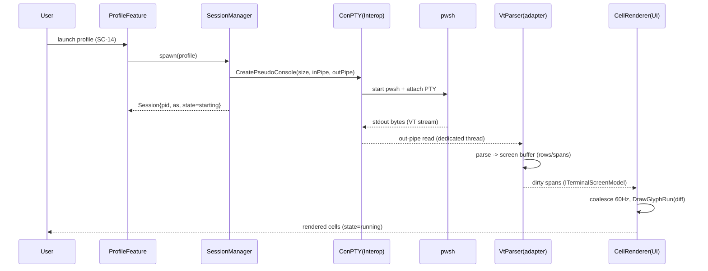
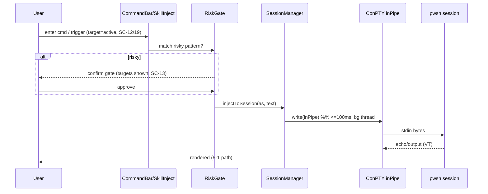
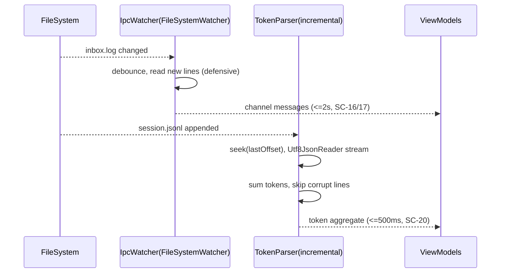

# 10. 기술 스펙·아키텍처 (Tech Spec & Architecture)

> 담당: plan_tech_researcher · 깊이: deep · 스택 10영역 / RISK 10 / NFR 충족 22/22
> 본 문서는 FR 43·NFR 22·SC 22·도메인 모델(브리프 §4)이 요구하는 품질을, ConPTY 자체제작·VT 파서 라이브러리·WPF 자체 셀 렌더러·파일 기반 IPC 소비로 실현하는 기술 스택·아키텍처를 확정하고, 기술 리스크(RISK)를 발번하며, 모든 NFR의 충족 수단을 검증한다.

---

## 0. 개요

### 0-1. 목적·범위

본 문서는 skill_plan 파이프라인의 **기술 스펙 단일 원천(10)**이다. `00_meeting_brief`(결정 로그 11건)·`04_requirements`(FR/NFR·제약 C1~C10·후속숙제 ①~⑧)·`07_interfaces`(SC 22·화면 성능 전제)·`02_market`(Build vs Buy·VT 파서 후보·ConPTY 함정)를 입력으로, "무엇을·왜"를 **"어떤 기술로·어떻게"**로 확정한다.

- **정의하는 것**: (a) 영역별 기술 스택 확정과 근거·대안(§3) / (b) Feature×Layer 위의 세션 소유·I/O 스레딩·파서-렌더 경계 아키텍처(§4) / (c) 대표 데이터 흐름(§5) / (d) 외부 라이브러리·파일 계약 의존(§6) / (e) 기술 리스크 RISK-### + PoC(§7) / (f) 배포 토폴로지·비용(§8) / (g) NFR 22종 전수 충족 검증(§9).
- **정의하지 않는 것(경계)**: FR/NFR·SC·ENT는 **참조 전용**(재번호 금지). 프로파일 영속 스키마·ERD의 최종 형태(JSON vs SQLite)는 **09 DB 모델러 소관**(본 문서는 저장 기술 후보·원자성 수단까지만, 스키마 확정은 위임). REST/DTO는 08 소관이나 본 제품은 서버·네트워크 API가 없어(NFR-006 포트 0) 08은 in-proc 서비스 계약으로 축소된다.
- **핵심 제약 계승**: C2(ConPTY 0순위 substrate — 모든 능력이 "앱의 세션 I/O 소유"에 의존) · C3(VT 파서=라이브러리, 렌더러=자체 WPF) · C4/NFR-017(IPC 재구현 금지) · C5(주입=트리거 프롬프트 입력 파이프) · C6(토큰=jsonl 파싱) · C7(로컬 전용·인증 없음) · C8(ClickOnce) · C9(Feature×Layer) · C10(claude 관찰은 렌더②).
- **NFR 충족 불변식(★최우선)**: NFR-001~022 전량이 스택·아키텍처·패턴의 구체 수단으로 매핑된다(미매핑 0, §9).
- **입력 상태 주의**: `09_database`는 본 문서와 **병렬 산출(Step 8)**로 아직 미제공 → 저장소 정합은 브리프 §4 도메인 모델(SessionProfile·Session·Channel·TokenUsage) 참조로 진행하고, 스키마 확정 항목은 `(09 확정 예정)` 표기.

### 0-2. 기술 영역 체계·RISK ID

- **`[TS-##]`(기술 스택 라벨)**: 영역별 확정 스택. **문서 내부 라벨**이며 레지스트리에 등재하지 않는다(참조 전용).
- **`[EXT-##]`(외부 의존 라벨)**: 외부 라이브러리·파일 계약·서비스. 문서 내부 라벨.
- **`RISK-###`(기술 리스크)**: 본 문서가 **신규 발번**하는 유일한 레지스트리 ID(3자리 zero-pad). 상위 ID(FR/NFR/SC/ENT)는 `$$id_registry`에서 참조만 한다.
- **영역(7 표준 + 터미널 특화 3)**: Frontend·Backend(앱 서비스)·Database/Storage·Infrastructure(배포)·Authentication·Monitoring + **Terminal Substrate·VT Parser·Cell Renderer**(본 제품 정체성 영역).

### 0-3. 표기 규칙

- **다이어그램**: 스택 구성도·아키텍처·의존 트리·배포 토폴로지는 **ASCII**(박스 내부는 ASCII 식별자만, 한글은 박스 밖 캡션). 시간축 왕복 흐름만 mermaid `sequenceDiagram`(§5).
- **확률/영향도**: `H`(상)·`M`(중)·`L`(하). RISK 우선순위 = 확률×영향도.
- **결정 표기**: `BUILD`(자체)·`INTEGRATE/BUY`(라이브러리 채택)·`REUSE`(기존 자산 소비). 02 Build-vs-Buy(B1~B8)와 정합.
- **PoC 권고**: 핵심 RISK에 검증 가설·성공 기준을 명시. 압축 PoC(§7-11)는 리스크 집중형 단일 왕복.

---

## 1. 한눈에 보기

### 1-1. 기술 스택 영역 한눈에

| TS | 영역 | 확정 기술 | 결정 | 대안(fallback) | 관련 NFR | 관련 RISK |
|---|---|---|---|---|---|---|
| TS-01 | Frontend/UI | WPF (.NET 10 LTS) + MVVM(CommunityToolkit.Mvvm) | REUSE 구조/BUILD UI | WinUI3(마찰로 배제) | 019·016·014 | 001·010 |
| TS-02 | **Cell Renderer** | **WPF 자체 셀 렌더러 — DrawingVisual + GlyphRun, dirty-region diff** | **BUILD** | FormattedText(느림)·WinUI TermControl(임베드 마찰) | 001·015·013 | 002·008 |
| TS-03 | **Terminal Substrate** | **ConPTY 자체 P/Invoke**(CreatePseudoConsole/Resize/ClosePseudoConsole) | **BUILD** | vs-pty.net·Porta.Pty(참조/폴백) | 019·009·002 | 001·007 |
| TS-04 | **VT Parser** | **VtNetCore(MIT)** — `ITerminalScreenModel` 어댑터 뒤 | INTEGRATE | XtermSharp engine·libvt100(parse-only) | 018·013 | 003·008 |
| TS-05 | Backend/앱 서비스 | in-proc .NET 서비스 + DI(Microsoft.Extensions.DependencyInjection/Hosting) | BUILD | — (서버 없음) | 016·009 | 006 |
| TS-06 | Database/Storage | JSON 파일 + `System.Text.Json`, atomic temp→rename **(09 확정 예정)** | BUILD-light | SQLite(Microsoft.Data.Sqlite) | 011 | 009 |
| TS-07 | IPC (협업) | `skill_ipc_control` 파일 계약 소비 — FileSystemWatcher + send.cmd | REUSE | — (재구현 금지 C4) | 017·004·010 | 006 |
| TS-08 | Observability/토큰 | 증분 jsonl 파서 — `Utf8JsonReader` + 파일 오프셋 커서 | BUILD-light | ccusage 로직 참고(CLI 배제) | 005·020 | 005 |
| TS-09 | Infrastructure/배포 | ClickOnce (.NET 10 MSBuild publish) | REUSE | MSIX·자체 인스톨러 | 021·019 | 010 |
| TS-10 | Monitoring/진단 | Microsoft.Extensions.Logging + 롤링 파일(Serilog opt.) | BUILD-light | — | 022 | — |
| — | Authentication | **N/A** — 로컬 단일 유저·인증 없음·수신 포트 0(C7·NFR-006) | (없음 명시) | — | 006 | — |
| — | Concurrency | `System.Threading.Channels` 펌프 + 파이프별 전용 스레드 + Dispatcher 마샬링 | BUILD | — | 001·002·009 | 001·002 |

> 아키텍처 패턴: **모듈러 모놀리스 (Feature×Layer 하이브리드, 단일 프로세스)** — 단일 파워유저·로컬·단일 창이므로 MSA/서버리스 부적합. 각 Feature 모듈이 세션·프로파일·IPC·관측·자산 경계를 소유.

### 1-2. 기술 리스크 RISK-### 한눈에

| RISK | 제목 | 확률 | 영향 | 우선 | 영향 FR/NFR | PoC |
|---|---|:--:|:--:|:--:|---|:--:|
| RISK-001 | ConPTY 임베드 substrate 자체제작 (spawn·pipe·lifecycle·resize) | M | H | ★최상 | FR-001·002·007·015 / NFR-019·009 | ●압축PoC |
| RISK-002 | 대량 출력 렌더 성능 (WPF 셀 렌더러 30fps·리페인트 ≤50ms) | H | H | ★최상 | FR-004·005·007 / NFR-001·015 | ●압축PoC |
| RISK-003 | VT 파서 라이브러리 적합성·유지보수 (dormant·alt-screen/xterm 커버리지) | H | H | ★최상 | FR-003·005 / NFR-018·013 | ●PoC |
| RISK-004 | ConPTY I/O 스레딩 데드락·리페인트 폭주 | M | H | 상 | FR-002 / NFR-001·009 | ●PoC |
| RISK-005 | alt-screen/TUI(claude) 렌더 정확도 | M | M | 중 | FR-005 / NFR-013(C10) | ○PoC |
| RISK-006 | 세션 소유·계보·생명주기 추적 (pid·as·상태·크래시 격리) | M | M | 중 | FR-016·039·017 / NFR-009·012 | ○ |
| RISK-007 | jsonl 포맷 변동·증분 파싱 (비공식 스키마) | M | M | 중 | FR-030·031 / NFR-005·020 | ○ |
| RISK-008 | IPC 파일 계약 결합 (skill_ipc_control 규약 변동·stale) | M | M | 중 | FR-024·025·029 / NFR-010·017 | ○ |
| RISK-009 | 상태 영속 원자성·손상 (프로파일/자산 저장) | L | M | 하 | FR-020·035 / NFR-011 | — |
| RISK-010 | ClickOnce + .NET 10 네이티브 의존 배포 호환 | L | M | 하 | FR-041 / NFR-021·019 | ○ |

> 리스크 집중 = **RISK-001·002·003·004**(모두 L0 substrate·렌더). C2("모든 능력이 ConPTY I/O 소유에 의존") 때문에 이 4건이 v1 전체의 임계경로 → **압축 PoC(§7-11)로 선제 차단**한다.

---

## 2. 기술 요구사항 분석

FR/NFR·SC·도메인 모델에서 도출한 기술 요구:

| 축 | 도출 내용 | 근거 |
|---|---|---|
| **플랫폼** | Windows 11 데스크톱 **단독**, .NET 10 LTS·WPF. 크로스플랫폼·모바일·웹 없음(단일 창) | NFR-019·C7·브리프 §0 |
| **실시간 요구** | (a) PTY 출력 스트림 실시간 렌더(대량 출력 폭주 흡수) · (b) IPC inbox.log watch ≤2s · (c) 토큰 증분 갱신. 서버 push 아닌 **로컬 파일·파이프 이벤트 구동** | NFR-001·004·005 |
| **데이터 특성** | 저volume 정형(프로파일 N개·JSON) + 고volume 스트림(PTY 바이트·jsonl append). 읽기≫쓰기(관측). 대용량 순차 스캔(100MB jsonl 증분) | FR-020·031, 도메인 §4 |
| **인증/보안** | 인증 **없음**. 대신 3중 로컬 가드: 앱-소유 세션 범위(C1)·경로 탈출 차단(NFR-008)·위험 주입 게이트(NFR-007). 수신 포트 0(NFR-006) | C7·FR-037/038/039 |
| **트래픽/동시성** | 네트워크 트래픽 0. 동시성 = **동시 세션 ≥8**(각 세션 = 프로세스 + 파이프 2 + 파서 + 렌더 뷰). idle CPU ≤10%·메모리 ≤800MB | NFR-003·012 |
| **특수 기술** | (1) **ConPTY pseudoconsole**(P/Invoke) · (2) **VT/ANSI 시퀀스 파싱**(라이브러리) · (3) **GPU 없는 WPF 고성능 텍스트 렌더**(GlyphRun) · (4) **파일시스템 watch/원자적 write** · (5) **증분 JSON 스트림 파싱** | C2·C3·C6·NFR-011 |

핵심 함의(브리프 §2): **입력 파이프는 렌더①에서 조기 확보** → 커맨드/스킬 주입(FR-014/027·L2)이 렌더 완성(FR-005·렌더②)에 볼모잡히지 않는다. 기술 설계는 이 **입력경로/출력경로 분리**를 1급 원칙으로 삼는다.

---

## 3. 기술 스택 제안 (영역별)

### [TS-01] Frontend/UI — WPF (.NET 10 LTS) + CommunityToolkit.Mvvm — REUSE 구조

- 후보: **WPF(.NET 10)** vs WinUI3 vs Avalonia. 추천: **WPF**.
- 근거: 브리프·기존 소스(Shell/Features/Shared)가 WPF 확정(NFR-019·C9). .NET 10은 **LTS(2028-11까지 지원)**, WPF는 .NET 10에서 성능 개선·Fluent 테마·품질 향상 지속.[^dotnet10][^wpfnet10] MVVM은 CommunityToolkit.Mvvm(`ObservableObject`·`RelayCommand` — 기존 `Shared/Core`의 ViewModelBase/RelayCommand와 정합).
- 고려: WinUI3 임베드 컨트롤은 **SwapChainPanel 투명 합성 불가·Win10 제약·UIA 자체구현**으로 WPF 앱과 마찰(02 CS-013) → 배제. Avalonia는 크로스플랫폼 이점이 단일 Windows 타깃에 불필요.

### [TS-02] Cell Renderer — WPF 자체 셀 렌더러 (DrawingVisual + GlyphRun, dirty-region diff) — BUILD

- 후보: **GlyphRun(`DrawingContext.DrawGlyphRun`)** vs FormattedText/TextBlock vs WinUI TerminalControl 임베드.
- 추천: **DrawingVisual 호스트 + GlyphRun 직접 그리기 + dirty-region diff 렌더**.
- 근거: 벤치마크상 **GlyphRun이 WPF 최속 텍스트 경로**(TextLine>FormattedText>TextBlock 순으로 느려짐), DrawingVisual은 레이아웃/이벤트 오버헤드 없는 경량 시각 요소.[^glyphbench][^drawvisual] 터미널 셀 그리드는 고정폭·격자라 GlyphRun 인덱스/좌표 계산과 궁합이 좋음. 화면 전체 재그리기 대신 **변경 셀(row span) 단위 diff**만 무효화하여 NFR-001(≥30fps·리페인트≤50ms) 달성.
- 고려: 폰트 폴백(이모지·CJK·박스드로잉)·커서 블링크·selection 오버레이·스크롤백 뷰포트를 자체 구현해야 함(비용). 이것이 **RISK-002**의 근원 → §7-11 압축 PoC로 실측 선행. WinUI TermControl 임베드는 앱-소유 주입/제어 API 미노출로 FR-014/039를 못 채워 배제(02 B3).

### [TS-03] Terminal Substrate — ConPTY 자체 P/Invoke — BUILD

- 후보: **자체 P/Invoke**(`CreatePseudoConsole`/`ResizePseudoConsole`/`ClosePseudoConsole` + 익명 파이프) vs vs-pty.net(Microsoft) vs Porta.Pty vs winpty.NET.
- 추천: **자체 P/Invoke 얇은 래퍼**(MS `GUIConsole.ConPTY` 샘플 계보, ~200 LOC), 관리형 래퍼는 **참조/폴백**.
- 근거: C2·결정 #4/#7 — 앱-소유 세션 lifecycle·임의 입력 파이프 주입(FR-014)·소유 범위 강제(FR-039)를 **완전 통제**하려면 파이프 핸들·스레드·종료 순서를 직접 소유해야 한다. 관리형 래퍼(vs-pty.net·Porta.Pty)는 편의를 주지만 lifecycle/파이프 노출 통제력이 낮고, Porta.Pty는 크로스플랫폼 추상화로 Windows 전용 요구엔 과함.[^psession][^ptynet] MS 문서가 **파이프별 전용 스레드**를 명시(데드락 회피, RISK-004).[^psession]
- 고려: `CreatePseudoConsole` 크래시 이슈(긴 경로·힙 손상) 알려짐[^psession] → 배포 경로·자체 진단(NFR-022)로 방어. Win11 24H2부터 `ClosePseudoConsole` 즉시 반환(데드락 완화)이나, 하위 호환 위해 **출력 파이프 drain 후 close** 순서 준수.

### [TS-04] VT Parser — VtNetCore(MIT), 어댑터 경계 뒤 — INTEGRATE

- 후보 실측 관점 비교:

| 후보 | 라이선스 | 유지보수 | alt-screen | 스크린버퍼 모델 | 파서/렌더 경계 | 판정 |
|---|---|---|:--:|---|---|---|
| **VtNetCore** | **MIT** | dormant(~2018) | **○ 지원**(alternate buffer) | ● 완비(VirtualTerminalController + viewport rows/spans) | ● 뷰포트가 rows/spans 산출 → WPF 렌더에 직결 | **1순위(primary)** |
| XtermSharp(engine) | MIT | 저활동 | ○(xterm.js 포팅) | ● Terminal 버퍼 | ◐ Cocoa/콘솔 프론트만, 엔진은 분리 가능 | 2순위(fallback) |
| libvt100 | MIT/BSD 계열 | 저활동 | △ 불명확 | △ parse-only(콜백) — 스크린버퍼 자체구현 필요 | ● 순수 파서(가장 얇은 경계) | 3순위(경량 대안) |
| AnsiVtConsole.NetCore | MIT | 활성 | ✗(콘솔 출력용) | ✗ 스크린모델 없음 | — | 배제(용도 불일치) |

- 추천: **VtNetCore를 `ITerminalScreenModel` 어댑터 뒤에 채택**. 근거: 4후보 중 **alt-screen·xterm 시퀀스·스크롤백·viewport(rows/spans) 산출**을 모두 갖춘 유일한 완성형 에뮬레이터이며 MIT(포크/벤더링 자유), 뷰포트 rows/spans가 TS-02 셀 렌더러 입력과 직결(NFR-018 경계 1곳).[^vtnetcore]
- 고려(핵심): **후보 모두 dormant** → 유지보수 공백이 **RISK-003**. 완화 = ① 우리 소유 경계 인터페이스(`ITerminalScreenModel`) 도입으로 파서 교체를 1곳에 격리(NFR-018), ② 채택 즉시 **MIT 라이선스로 소스 vendoring/fork**(외부 릴리스 의존 제거), ③ PoC에서 `claude` alt-screen TUI 실렌더로 커버리지 실측(§7). libvt100은 커버리지 부족 시 스크린버퍼 자체구현 부담 → 최후 대안.

### [TS-05] Backend/앱 서비스 — in-proc .NET 서비스 + DI — BUILD

- 후보: in-proc 서비스(단일 프로세스) vs 로컬 백그라운드 서비스 프로세스 분리.
- 추천: **in-proc 서비스 계층**(Feature 모듈 내부 Services), DI = `Microsoft.Extensions.DependencyInjection`(+ 선택적 Generic Host로 lifetime·logging 통합).
- 근거: 서버·네트워크 API 없음(NFR-006) → REST/DTO(08)는 in-proc 인터페이스 계약으로 축소. Feature×Layer(NFR-016) 준수를 위해 각 Feature가 Models/Views/ViewModels/Services 4레이어, Feature 간 직접 참조 0(공유는 Shared/Core·이벤트).
- 고려: 세션 I/O·파서·파일 watch 등 장기 실행 백그라운드 작업 다수 → Generic Host의 `IHostedService`로 수명 관리 권고(크래시 격리 NFR-009).

### [TS-06] Database/Storage — JSON 파일(atomic) 1순위 · SQLite 대안 — BUILD-light **(09 확정 예정)**

- 후보: **JSON 파일(System.Text.Json)** vs SQLite(Microsoft.Data.Sqlite).
- 추천(잠정, 09 위임): 저volume·소수 애그리거트(프로파일 N개·앱 설정·레이아웃)라 **JSON 파일 + 원자적 temp→rename**이 단순·투명·백업 용이. 트랜스크립트/토큰은 파생 데이터라 영속 대상 아님(원본 jsonl 참조).
- 근거: NFR-011(원자성) = `File.WriteAllText(temp)` → `File.Move(temp, dest, overwrite:true)`(동일 볼륨 rename은 사실상 원자적). 후속숙제 ①.
- 고려: 프로파일 수가 커지거나 쿼리·인덱싱 요구가 생기면 SQLite 승격. **최종 형태·스키마·ERD는 09 DB 모델러가 확정** — 본 문서는 원자성 수단·후보까지만.

### [TS-07] IPC(협업) — skill_ipc_control 파일 계약 소비 — REUSE

- 후보: 재사용(파일 계약 소비) vs 재구현. 추천: **재사용만**(C4·NFR-017 재구현 0).
- 구성: `channels/<ch>/`의 `inbox.log`·`.relay_url`·`.cursor_<as>`를 **FileSystemWatcher로 watch + 방어적 read**, 송신은 기존 `send.cmd`·`set_url.cmd`를 **프로세스 호출**로 재사용. 앱은 GUI 프론트엔드일 뿐 relay/큐/watcher 로직을 만들지 않는다.
- 근거: 결정 #3·브리프 §5. stale `.watcher_<as>.pid`는 skill_ipc_control 가드 의미론에 정합되게 흡수(NFR-010).
- 고려: 파일 계약 스키마가 skill_ipc_control 변경에 결합(**RISK-008**) → 계약을 **읽기 전용 어댑터**(`IIpcFileContract`)로 캡슐화해 변동 흡수 지점을 1곳으로.

### [TS-08] Observability/토큰 — 증분 jsonl 파서 — BUILD-light

- 후보: 전체 재파싱 vs **증분(오프셋 커서)**. 추천: **증분** — 세션별 마지막 파일 오프셋 저장, append분만 `Utf8JsonReader`로 스트리밍 파싱·누적 집계.
- 근거: NFR-005(100MB에서 갱신 ≤500ms)·C6. 저수준 `Utf8JsonReader`는 할당 최소·고속. ccusage(CS-010)의 jsonl 접근을 로직 참고하되 **CLI 종속 배제**·관제탑 내장(02 B5).
- 고려: 비공식 스키마 변동(**RISK-005/007**) → 미지 필드 무시·손상 라인 skip(NFR-020) 방어적 파싱. 파일 rotation/재작성 감지 시 오프셋 리셋.

### [TS-09] Infrastructure/배포 — ClickOnce (.NET 10) — REUSE

- 후보: **ClickOnce** vs MSIX vs 자체 인스톨러. 추천: **ClickOnce**(C8·runbook 02 계승·NFR-021).
- 근거: 기존 파이프라인 계승, 자동 업데이트(FR-041)·낮은 마찰. .NET 10에서 WPF ClickOnce 배포 지원 유지.[^dotnet10]
- 고려: ConPTY는 OS 내장 API라 별도 네이티브 의존 배포 불필요하나, **VtNetCore vendoring 어셈블리·self-contained 여부·서명**이 ClickOnce 매니페스트에 반영되어야 함(**RISK-010**). 코드 서명 인증서 권고(SmartScreen 완화).

### [TS-10] Monitoring/진단 — Microsoft.Extensions.Logging + 롤링 파일 — BUILD-light

- 추천: `Microsoft.Extensions.Logging` 추상화 + 롤링 파일 sink(Serilog 선택). 세션 기동/종료·주입·IPC·파서 오류·크래시 격리 이벤트를 구조화 로깅(NFR-022, SC-06 진단 뷰 소스).
- 근거: 로컬 사후 진단이 유일 관측 수단(서버·원격 텔레메트리 없음). 격리 성공/실패(NFR-009) 검증 근거가 로그.

### [—] Authentication — N/A(명시)

- 인증·인가·세션토큰·비밀 저장 **없음**. 로컬 단일 유저·수신 포트 0(C7·NFR-006). 대체 보호 = 앱-소유 범위 가드(FR-039)·경로 가드(NFR-008)·위험 주입 게이트(NFR-007). 이 "없음"을 §9에서 NFR-006 충족 수단으로 명시 매핑.

### [—] Concurrency — Channels 펌프 + 파이프별 전용 스레드 + Dispatcher 마샬링 — BUILD

- 각 세션: 출력 파이프 전용 **읽기 스레드** → `System.Threading.Channels`(bounded) → 파서 소비 → dirty-region → **Dispatcher(UI 스레드) 마샬링**. 입력 파이프는 별도 write(주입 지연 NFR-002≤100ms). MS 데드락 경고(파이프별 스레드) 준수(RISK-004).

---

## 4. 아키텍처 (ASCII 구성도 + 패턴)

### 4-1. 패턴 선정 — 모듈러 모놀리스 (Feature×Layer 하이브리드)

- 선정: **모듈러 모놀리스(단일 WPF 프로세스, Feature 모듈 경계)**. 근거: 팀 규모 = 단일 파워유저/소수 개발 · 복잡도 = 도메인 다수(터미널·세션·IPC·관측·자산)이나 배포 단위 1개 · 확장 요구 = 렌더①→② 무중단(NFR-013)은 **모듈 내 경계 인터페이스**로 충족(프로세스 분리 불필요). MSA/서버리스는 네트워크·인증·운영 부담만 추가(NFR-006 위반) → 배제.
- 모듈 경계(NFR-016): `Shell`(얇은 조합) / `Features/{Terminal, Session, Profile, Ipc, Observability, Asset, Settings}` / `Shared/{Core, Interop}`. Feature 간 직접 참조 0, 통신은 Shared 이벤트·인터페이스.

### 4-2. 시스템 구성도 (앱-소유 세션 · 파서-렌더 경계 · I/O 스레딩)

```
+==========================================================================+
|                    CONTROL TOWER  (single WPF process)                     |
|                                                                           |
|  +---------------------- Shell (thin composition) --------------------+   |
|  |  L-NAV dock | T-terminal zone | R-orchestration dock | S-chrome     |   |
|  +----+------------+------------------+-----------------+-------------+    |
|       |            |                  |                 |                  |
|  +----v----+  +----v-----+     +------v------+   +------v------+           |
|  | Profile |  | Session  |     |     Ipc     |   | Observ /    |           |
|  | Feature |  | Feature  |     |   Feature   |   | Asset Feat. |           |
|  +----+----+  +----+-----+     +------+------+   +------+------+           |
|       |            |                  |                 |                  |
|       |     +------v-----------+      |                 |                  |
|       |     | SessionManager   |      |                 |                  |
|       |     | (app-owned fleet)|      |                 |                  |
|       |     +--+------------+--+      |                 |                  |
|       |        | owns N        |      |                 |                  |
|  +-----v--------v------+       |      |                 |                  |
|  | Storage (JSON atom) |   +---v------v---+       +-----v-------+          |
|  | profiles/settings   |   | Terminal     |       | jsonl incr  |          |
|  +---------------------+   | Feature      |       | parser      |          |
|                            +---+------+---+       +-----+-------+          |
|         parser-render boundary |      |                 |                  |
|              ITerminalScreenModel     |                 |                  |
|                            |   |      |                 |                  |
|                    +-------v-+ | +----v-----------+      |                 |
|                    | VtParser| | | Cell Renderer  |      |                 |
|                    | adapter | | | GlyphRun+diff  |      |                 |
|                    +----+----+ | +----------------+      |                 |
+-------------------------|------|-------------------------|-----------------+
                          |      | (P/Invoke Interop)      | (FS read)
                   +------v------v------+          +-------v--------+
                   |  ConPTY substrate  |          | ~/.claude      |
                   | pwsh + pipes(in/out)|         | *.jsonl        |
                   +------+------+------+          | channels/<ch>/ |
                     in   |      |  out            | ~/.claude tree |
                          |      |                 +----------------+
                    +-----v-+  +-v------+
                    | pwsh  |  | pwsh   |  ... (app-owned processes only, C1)
                    +-------+  +--------+
```
캡션: Shell은 5존을 조합만(비즈니스 로직 0). SessionManager가 **앱-소유 세션 함대**를 소유(외부 프로세스 배제, 폐기되는 ProcessTracker 대체). Terminal Feature 내부에서 **ConPTY(입력·출력 파이프) → VT 파서 어댑터 → 셀 렌더러**로 흐르고, 파서-렌더는 `ITerminalScreenModel` **단일 경계 인터페이스**(NFR-018)로 분리. IPC/관측 Feature는 파일시스템(channels/·jsonl)만 read/watch(재구현 0, C4).

### 4-3. 세션별 I/O 스레딩 모델 (데드락 회피 · 리페인트 흡수)

```
   [pwsh proc]                                          UI thread (Dispatcher)
       |  stdout(bytes)                                       ^
       v                                                      | coalesced 60Hz
  +----------------+   Channel<byte[]>    +---------------+    | dirty spans
  | OUT-pipe read  |------(bounded)------>| VT parser     |----+ invalidate
  | (dedicated thr)|                      | screen model  |
  +----------------+                      +---------------+
                                                 ^
  +----------------+   direct write               | screen buffer (rows/spans)
  | IN-pipe write  |<---- inject/keys ------------ (parser owns)
  | (bg, <=100ms)  |
  +----------------+
       ^  Ctrl+C / keys (VT-encoded)
       |
   [UI key events]
```
캡션(RISK-004 대응): **출력 파이프 = 세션마다 전용 읽기 스레드**(MS 데드락 경고 준수), 파서로 bounded Channel 전달 → 파서가 스크린모델 갱신 → UI는 **60Hz로 coalesce된 dirty span만** 무효화(대량 출력 리페인트 폭주 흡수, NFR-001). **입력 파이프는 독립 write 경로**(주입 지연 NFR-002)라 렌더 부하와 무관 → 브리프 §2 "입력경로 조기 확보" 실현. 한 세션 파이프/파서 예외는 그 세션 스레드에 격리(NFR-009).

---

## 5. 주요 데이터 흐름 (mermaid sequenceDiagram)

### 5-1. 세션 spawn + 렌더 왕복 (FR-001·002·003·004)



### 5-2. 커맨드/IPC 스킬 주입 + 위험 게이트 (FR-014·027·037 · NFR-002)



### 5-3. IPC 채널 watch + 토큰 증분 파싱 (FR-024·031 · NFR-004·005)



---

## 6. 외부 라이브러리·API

| EXT | 이름 | 용도 | 관련 FR | 라이선스 | 비용 | 난이도 | 대안 |
|---|---|---|---|---|---|:--:|---|
| EXT-01 | **VtNetCore** | VT/ANSI 파싱·스크린버퍼 | FR-003·005 | MIT | 무료 | 높음 | XtermSharp·libvt100 |
| EXT-02 | **ConPTY (kernel32/OS)** | pseudoconsole spawn·resize | FR-001·002·007 | OS 내장 | 무료 | 높음 | vs-pty.net·Porta.Pty |
| EXT-03 | CommunityToolkit.Mvvm | MVVM(ObservableObject·RelayCommand) | FR-040 | MIT | 무료 | 낮음 | Prism·직접구현 |
| EXT-04 | Microsoft.Extensions.DependencyInjection/Hosting | DI·수명·호스팅 | FR-040·016 | MIT | 무료 | 낮음 | 직접 컨테이너 |
| EXT-05 | System.Text.Json (`Utf8JsonReader`) | 프로파일 영속·jsonl 증분 파싱 | FR-020·031 | MIT(내장) | 무료 | 보통 | Newtonsoft(느림) |
| EXT-06 | Microsoft.Extensions.Logging (+Serilog opt.) | 진단 로그 | FR-016(NFR-022) | MIT/Apache | 무료 | 낮음 | 자체 로거 |
| EXT-07 | **skill_ipc_control 파일 계약** | 채널 watch/read·send.cmd·relay | FR-024·025·027·029 | 내부 자산 | 무료 | 보통 | (재구현 금지 C4) |
| EXT-08 | Claude Code jsonl 트랜스크립트 | 토큰 소스 | FR-030·031 | 비공식 포맷 | 무료 | 보통(방어) | (대안 없음) |
| EXT-09 | Microsoft.Data.Sqlite (조건부) | 프로파일 영속 대안 | FR-020 | MIT | 무료 | 보통 | JSON 파일 |
| EXT-10 | ClickOnce (MSBuild/SDK) | 배포·자동 업데이트 | FR-041 | 내장 | 무료(+서명 인증서) | 보통 | MSIX |

의존 관계(ASCII 트리):
```
[Control Tower]
  +--> EXT-02 ConPTY (OS)           [BUILD substrate]
  +--> EXT-01 VtNetCore (vendored)  [INTEGRATE, MIT fork]
  +--> EXT-03 CommunityToolkit.Mvvm
  +--> EXT-04 MS.Ext.DI/Hosting
  +--> EXT-05 System.Text.Json
  +--> EXT-06 MS.Ext.Logging (+Serilog)
  +--> EXT-07 skill_ipc_control  --consumes--> channels/<ch>/{inbox.log,.relay_url,.cursor}
  |                              --invokes---> send.cmd / set_url.cmd
  +--> EXT-08 ~/.claude/**/*.jsonl (read-only, defensive)
  +--> EXT-10 ClickOnce (deploy)
  '--> EXT-09 SQLite (conditional, 09)
```
캡션: 외부 네트워크 서비스·유료 API·클라우드 SaaS 의존 **0건**(로컬 전용). 핵심 코드 의존은 EXT-01(파서)·EXT-02(ConPTY)·EXT-07(IPC 계약)에 집중 → RISK-001/003/008과 직결.

---

## 7. 기술 리스크 및 PoC

### [RISK-001] ConPTY 임베드 substrate 자체제작 (★최상)
- 영향: FR-001·002·007·015 / NFR-019·009·002 · 가능성 M / 영향도 H (C2 — 전 오케스트레이션이 여기 의존)
- 내용: `CreatePseudoConsole`/`ResizePseudoConsole`/`ClosePseudoConsole` P/Invoke + 익명 파이프 2개 + 프로세스 생성/종료/리사이즈를 자체 소유. 핸들 수명·종료 순서 오류 시 좀비 프로세스·데드락·리소스 누수. `CreatePseudoConsole` 크래시 이슈(긴 경로·힙 손상) 존재.[^psession]
- 완화: MS `GUIConsole.ConPTY` 샘플 계보 얇은 래퍼(~200 LOC) · 파이프별 전용 스레드 · 출력 drain 후 close 순서 · Win11 24H2 즉시반환 활용 · 진단 로그(NFR-022)로 lifecycle 추적.
- **PoC 권고(압축 §7-11 포함)**: pwsh spawn → 입력 파이프 write → 출력 파이프 read → 정상/강제 종료 → 리사이즈 왕복. **성공 기준**: 100회 spawn/kill 반복에서 좀비 0·핸들 누수 0·데드락 0.

### [RISK-002] 대량 출력 렌더 성능 (★최상)
- 영향: FR-004·005·007 / NFR-001·015 · 가능성 H / 영향도 H · 후속숙제 ③
- 내용: `cat 대용량`·빌드 로그·claude TUI 리페인트 폭주 시 WPF 셀 렌더러가 30fps 유지·리페인트 ≤50ms를 못 지키면 멈춤/드랍. VS Code 문서화된 **ConPTY 뷰포트 소유·리페인트 폭주**가 그대로 유입.[^vscode]
- 완화: DrawingVisual+GlyphRun 최속 경로 · **dirty-region diff**(변경 span만) · 60Hz coalesce(출력 이벤트를 프레임 단위로 병합) · 스크롤백 링버퍼 상한 · 출력 backpressure(bounded Channel).
- **PoC 권고**: 10만 라인 스트리밍 + 빠른 스크롤 + alt-screen 전환 스트레스. **성공 기준**: 평균 ≥30fps·리페인트 p95 ≤50ms·프레임 드랍/멈춤 0·메모리 안정(누수 0). 후속숙제 ③ 목표치를 이 실측으로 확정.

### [RISK-003] VT 파서 라이브러리 적합성·유지보수 (★최상)
- 영향: FR-003·005 / NFR-018·013 · 가능성 H / 영향도 H · 후속숙제 ②
- 내용: 유력 후보(VtNetCore·XtermSharp)가 모두 **dormant(~2018)** → 보안/버그/신규 xterm 시퀀스 미추적. alt-screen·claude TUI 커버리지 미검증 시 화면 깨짐(C10).
- 완화: **우리 소유 경계 인터페이스 `ITerminalScreenModel`**(파서 교체 1곳 격리, NFR-018) · MIT 소스 **vendoring/fork**(외부 릴리스 의존 제거) · 커버리지 갭은 어댑터 계층에서 보정.
- **PoC 권고**: VtNetCore로 `claude` 실 세션 alt-screen TUI + 색·커서·스크롤백 렌더, `vttest` 부분 통과. **성공 기준**: claude TUI 시각적 깨짐 0·핵심 시퀀스(SGR·CUP·ED/EL·alt-buffer·DECAWM) 정확 반영. 실패 시 XtermSharp engine으로 어댑터만 교체해 재측정(경계 검증).

### [RISK-004] ConPTY I/O 스레딩 데드락·리페인트 폭주 (상)
- 영향: FR-002 / NFR-001·009 · 가능성 M / 영향도 H
- 내용: MS 경고 — 파이프를 단일 스레드로 서비스하면 한 버퍼가 차서 대기하는 동안 다른 채널 블로킹 호출로 **데드락**.[^psession] 출력 폭주가 UI 스레드로 직결되면 앱 멈춤.
- 완화: **파이프별 전용 스레드** + bounded Channel + UI Dispatcher 마샬링(§4-3) · `ClosePseudoConsole`을 출력 읽기 스레드에서 호출 금지(drain 후).
- **PoC 권고**: 동시 8세션 각 대량 출력 + 동시 주입. **성공 기준**: 데드락 0·UI 응답 유지·idle 복귀 후 CPU ≤10%(NFR-003).

### [RISK-005] alt-screen/TUI(claude) 렌더 정확도 (중)
- 영향: FR-005 / NFR-013 · C10 · 가능성 M / 영향도 M · 후속숙제 ⑦
- 내용: claude는 alt-screen TUI → 렌더② 미완 시 관찰 품질 미확보. 단, 주입/제어(L2)는 렌더①에서 가능해 볼모 아님(브리프 §2).
- 완화: 렌더①(색·커서·스크롤백)과 렌더②(alt-buffer·TUI)를 **동일 스크린모델 위 단계 확장**(NFR-013), 렌더② 미완 구간엔 SC-08 "TUI 깨짐 경고 배너 + 주입/제어 가능" 표기.
- PoC 권고: RISK-003 PoC에 흡수(alt-buffer 정확도 측정).

### [RISK-006] 세션 소유·계보·생명주기 추적 (중)
- 영향: FR-016·039·017 / NFR-009·012 · 가능성 M / 영향도 M
- 내용: pid·as·상태(starting/running/exited/error)·conpty 핸들을 앱-소유 함대로 정확히 추적해야 크래시 격리(NFR-009)·범위 강제(FR-039)·다중 확장(NFR-012) 성립. 프로세스 종료 이벤트 유실 시 유령 세션.
- 완화: SessionManager가 단일 소유·`Process.Exited`/파이프 EOF 이벤트로 상태 전이 · 세션별 격리 예외 경계 · 앱-소유 핸들만 제어 API 수용(외부 배제).
- PoC 권고: RISK-001 PoC에 상태 전이 검증 포함.

### [RISK-007] jsonl 포맷 변동·증분 파싱 (중)
- 영향: FR-030·031 / NFR-005·020 · 가능성 M / 영향도 M
- 내용: Claude Code 트랜스크립트는 **비공식·변경 가능** 포맷. 스키마 변동·손상 라인·파일 rotation 시 집계 오류/크래시.
- 완화: `Utf8JsonReader` 증분 + 오프셋 커서 · 미지 필드 무시·손상 라인 skip(NFR-020) · rotation 감지 시 오프셋 리셋 · ccusage 로직 참고.
- PoC 권고: 실제 jsonl 샘플로 증분 100MB 갱신 ≤500ms 측정.

### [RISK-008] IPC 파일 계약 결합 (중)
- 영향: FR-024·025·029 / NFR-010·017 · 가능성 M / 영향도 M
- 내용: skill_ipc_control 파일 규약(inbox.log·.cursor·.watcher pid·send.cmd 인자)이 바뀌면 앱 결합 파손. stale watcher 복구·1:1 매핑(후속숙제 ④) 미확정.
- 완화: **읽기 전용 어댑터 `IIpcFileContract`**로 규약 캡슐화(변동 흡수 1곳) · 재구현 0(NFR-017) · stale는 가드 의미론 준수 흡수(NFR-010) · 매핑 미확정 구간 "가정 매핑 + 경고 배너"(SC-16).
- PoC 권고: 채널 watch→UI 반영 ≤2s·send.cmd 왕복·stale 복구 시나리오.

### [RISK-009] 상태 영속 원자성·손상 (하)
- 영향: FR-020·035 / NFR-011 · 가능성 L / 영향도 M
- 내용: 프로파일/자산 저장 중 크래시 시 부분 기록 손상.
- 완화: temp→rename 원자적 write · 저장 실패 시 원본 보존(SC-15/22) · (09에서 SQLite 승격 시 트랜잭션).

### [RISK-010] ClickOnce + .NET 10 네이티브 의존 배포 호환 (하)
- 영향: FR-041 / NFR-021·019 · 가능성 L / 영향도 M
- 내용: vendored 파서 어셈블리·self-contained·서명이 ClickOnce 매니페스트에 미반영 시 실행/업데이트 실패. SmartScreen 경고.
- 완화: ClickOnce publish 프로파일에 의존 어셈블리 포함 검증 · 코드 서명 인증서 · dev/staging/prod 채널 분리 게시.

### 7-11. 압축 PoC 권고 (리스크 집중형 단일 왕복)
RISK-001·002·003·004를 **하나의 vertical-slice PoC**로 묶어 임계경로를 선제 차단한다(브리프 §2 입력/출력 경로 분리 검증 포함).

```
[PoC: ConPTY -> pipe I/O -> VT parse -> minimal cell render 왕복]
 1. ConPTY로 pwsh spawn (RISK-001)
 2. IN-pipe write: 커맨드 주입 + Ctrl+C/방향키 (NFR-002 <=100ms)          <- 입력경로(렌더 무관)
 3. OUT-pipe dedicated thread -> Channel -> VtNetCore parse (RISK-003·004)
 4. 최소 GlyphRun 셀 렌더 + dirty diff (RISK-002)
 5. 스트레스: 10만 라인 + 빠른 스크롤 + claude alt-screen 진입 (NFR-001)
 6. 8세션 동시 + 동시 주입 (RISK-004·NFR-003)
 7. 100x spawn/kill 반복 (RISK-001 누수/좀비/데드락)
```
성공 기준(게이트): 데드락/좀비/핸들누수 0 · 평균 ≥30fps·리페인트 p95 ≤50ms · 주입 ≤100ms · claude TUI 깨짐 0 · idle CPU ≤10%. → **통과 시 렌더 성능 목표(후속숙제 ③) 확정**, 실패 시 파서 교체(어댑터 경계 검증)·렌더 최적화 반복 후 로드맵 L0 일정 재산정.

---

## 8. 배포 토폴로지

- **클라우드**: 없음(로컬 데스크톱, 수신 포트 0·NFR-006). 서버·DB·큐 인프라 부재.
- **배포 방식**: ClickOnce(파일/웹 배포 지점에서 설치·자동 업데이트).
- **환경 분리**: dev(로컬 디버그) / staging(내부 게시 채널·서명 검증) / prod(정식 ClickOnce 게시).
- **CI/CD**:
```
[Commit]->[Build(.NET10)]->[Test+PoC게이트]->[ClickOnce Publish(staging)]->[Smoke]--approve-->[Prod publish]
                                                                              +--reject-->[Commit]
```
- **배포 산출물 토폴로지**:
```
[Dev machine]                         [Publish point (static/file host)]
  MSBuild publish  --ClickOnce-->        setup.exe + .application + manifests
                                              |  auto-update check (FR-041)
                                              v
                                         [User machine]
                                          ControlTower.exe (WPF, .NET10)
                                            +-- ConPTY (OS)  +-- ~/.claude (local)
```

### 8-1. 월간 인프라 비용 추정 (deep)

| 항목 | 사양 | 월 비용(USD) | 비고 |
|---|---|---|---|
| 서버/컴퓨트 | 없음(로컬 실행) | $0 | 포트 0·서버 없음 |
| 데이터베이스 | 없음(로컬 파일) | $0 | JSON/SQLite 로컬 |
| ClickOnce 호스팅 | 정적 파일 호스트(Blob/Pages/사내) | $0 ~ $5 | 대역폭 미미 |
| 네트워크/트래픽 | 자동 업데이트 매니페스트 다운로드만 | ~$0 | |
| 코드 서명 인증서 | OV/EV(SmartScreen 완화) | ~$8 ~ $33/월 | 연 $100~$400 상각(선택·권고) |
| 외부 API/SaaS | 없음 | $0 | 유료 의존 0 |
| **합계** | | **~$0 ~ $40/월** | 사실상 서명 인증서 외 0 |

> 클라우드 종속·구독 비용 0(02 D7 로컬·무료 포지셔닝과 정합). Warp($200/월 티어) 대비 비용 우위가 곧 차별점.

---

## 9. NFR 충족 검증 (★불변식 — 전수 매핑, 미매핑 0)

| NFR | 영역 | 충족 수단(기술·패턴) | 관련 RISK |
|---|---|---|---|
| NFR-001 렌더 처리량 | 성능 | TS-02 GlyphRun+DrawingVisual dirty-diff · 60Hz coalesce · bounded Channel backpressure(§4-3) | RISK-002 |
| NFR-002 주입 지연 | 성능 | TS-03 입력 파이프 독립 write(bg 스레드, 큐 없음) ≤100ms | RISK-001 |
| NFR-003 다중 세션 동시성 | 성능 | 이벤트 구동 파이프 I/O(폴링 0)·세션 경량 뷰·공유 렌더 Dispatcher | RISK-004·006 |
| NFR-004 IPC watch 반영 | 성능 | TS-07 FileSystemWatcher+debounce ≤2s(relay 폴링 정합) | RISK-008 |
| NFR-005 토큰 파싱 | 성능 | TS-08 `Utf8JsonReader` 증분+오프셋 커서 ≤500ms/100MB | RISK-005·007 |
| NFR-006 포트 0 | 보안 | **Authentication N/A** — 수신 소켓 0·IPC 파일 기반·relay 외부(v2) | — |
| NFR-007 위험 확인 | 보안 | 위험 패턴 매처 게이트(SC-13) — PTY write 전 100% 경유 | RISK-001 |
| NFR-008 경로 안전 | 보안 | 경로 정규화+`..` 차단·~/.claude 경계 체크(FN-SEC-04) | RISK-009 |
| NFR-009 크래시 격리 | 신뢰성 | 세션별 프로세스+전용 스레드+격리 예외 경계·SessionManager 상태 전이 | RISK-006·004 |
| NFR-010 stale 복구 | 신뢰성 | TS-07 skill_ipc_control 가드 의미론 흡수(동의 정책) | RISK-008 |
| NFR-011 영속 원자성 | 신뢰성 | TS-06 temp→rename 원자 write(실패 시 원본 보존) | RISK-009 |
| NFR-012 세션 확장(≥8) | 확장성 | 이벤트 구동 I/O·가상화 목록·선형 열화 이내 | RISK-006 |
| NFR-013 렌더 단계 확장 | 확장성 | `ITerminalScreenModel` 경계 — 렌더①→② 동일 버퍼 단계 확장 | RISK-003·005 |
| NFR-014 워크플로 효율 | 사용성 | MVVM 커맨드·키보드 단축키(≤3 상호작용)·프리셋 1클릭 | — |
| NFR-015 터미널 UX 정합 | 사용성 | TS-02 selection/scrollback/focus 자체 렌더 parity(WT/VSCode 수준) | RISK-002 |
| NFR-016 Feature×Layer | 유지보수 | TS-05 모듈러 모놀리스·Feature 4레이어·Feature 간 참조 0 | — |
| NFR-017 IPC 재구현 금지 | 유지보수 | TS-07 파일 계약 소비만·`IIpcFileContract` 어댑터(재구현 0) | RISK-008 |
| NFR-018 파서 교체성 | 유지보수 | TS-04 경계 인터페이스 1곳·파서 vendoring/fork | RISK-003 |
| NFR-019 플랫폼 호환 | 호환성 | TS-01/03 Win11·.NET10 LTS·WPF·ConPTY | RISK-001·010 |
| NFR-020 jsonl 포맷 호환 | 호환성 | TS-08 방어적 파싱(미지 필드 무시·손상 skip) | RISK-007 |
| NFR-021 ClickOnce 호환 | 호환성 | TS-09 ClickOnce(.NET10) 계승·매니페스트 의존 검증 | RISK-010 |
| NFR-022 진단 로그 | 관측성 | TS-10 MS.Ext.Logging 롤링 파일(세션·주입·IPC·파서·크래시 이벤트) | — |

> **충족률 22/22 (100%), 미매핑 0.** 성능·격리 계열(NFR-001·002·009·013)은 실측 의존 → §7 PoC로 목표치 확정. 함수 아닌 품질(NFR-006·016 등)은 아키텍처/구조 수단으로 충족. 위반 발생 시 Step 2(§3) 스택 보강으로 복귀.

---

## 10. 요약

- **영역별 추천 스택**: WPF(.NET10 LTS)+MVVM · **ConPTY 자체 P/Invoke(BUILD)** · **VtNetCore(INTEGRATE, MIT vendoring)** · **WPF 자체 셀 렌더러 GlyphRun+diff(BUILD)** · JSON 원자 저장(09 확정 예정) · skill_ipc_control 파일 계약 소비(REUSE) · 증분 jsonl 파서 · ClickOnce 배포 · 인증 없음(포트 0).
- **아키텍처 패턴**: 모듈러 모놀리스(Feature×Layer 하이브리드) · 앱-소유 SessionManager · 파이프별 전용 스레드+bounded Channel+Dispatcher(데드락/리페인트 흡수) · `ITerminalScreenModel` 파서-렌더 경계.
- **외부 의존**: 코드 의존 10건(EXT-01~10), **외부 네트워크 SaaS·유료 API 0**. 핵심 결합 = 파서(EXT-01)·ConPTY(EXT-02)·IPC 계약(EXT-07).
- **RISK 총수 10** (★최상 4: RISK-001/002/003/004 = L0 substrate·렌더 임계경로).
- **예상 비용**: ~$0~$40/월(서명 인증서 외 사실상 0, 로컬·무료).
- **NFR 충족률 22/22 (100%)** — 미매핑 0. 성능·격리 계열은 **압축 PoC(§7-11)로 목표치 실측·확정**(후속숙제 ②③ 해소).
- **후속숙제 해소 매핑**: ②(파서 선정)=TS-04/RISK-003 · ③(렌더 성능 목표)=RISK-002 압축 PoC · ①(영속 형태)=TS-06→09 · ④(채널 매핑)=RISK-008 · ⑦(렌더② 시점)=RISK-005/로드맵.

## 문서 메타

- 버전: v1.0 / 생성일: 2026-07-01
- 담당: plan_tech_researcher · 깊이: deep
- 입력: `00_meeting_brief.md`(결정 로그 11·ConPTY 0순위·도메인 모델) · `04_requirements.md`(FR43/NFR22·C1~C10·후속숙제①~⑧, 참조 전용) · `07_interfaces.md`(SC22·화면 성능 전제) · `02_market.md`(Build-vs-Buy B1~B8·VT 파서 후보·ConPTY 함정) · 규약(plan_doc_skeleton·plan_id_system) · 웹 리서치(§ 출처)
- 발번 ID: **RISK-001~010** (FR/NFR/SC/ENT·8카테고리는 참조만, 재번호 0). TS-##·EXT-##는 문서 내부 라벨(레지스트리 미등재).
- 미제공 입력: `09_database`(병렬 산출) — 저장소 스키마는 도메인 모델 참조·`(09 확정 예정)` 표기.
- 관련 문서: [`04_requirements`](./04_requirements.md) · [`07_interfaces`](./07_interfaces.md) · [`09_database`](./09_database.md)(영속 스키마) · [`12_roadmap`](./12_roadmap.md)(RISK→일정·렌더②시점 ⑦)
- 미해결·후속(→ `13_followups`): 후속숙제 ②③④⑤⑥⑦ 기술 항목 + 압축 PoC 결과에 따른 렌더 성능 목표 확정.

### 출처 (URL)
[^dotnet10]: Announcing .NET 10 (LTS, 2025-11). https://devblogs.microsoft.com/dotnet/announcing-dotnet-10/
[^wpfnet10]: What's new in WPF for .NET 10. https://learn.microsoft.com/en-us/dotnet/desktop/wpf/whats-new/net100
[^psession]: Creating a Pseudoconsole session (ConPTY, 파이프별 스레드·데드락·Close 순서). https://learn.microsoft.com/en-us/windows/console/creating-a-pseudoconsole-session
[^vtnetcore]: VtNetCore (MIT, VT100/XTerm, alt-buffer·viewport rows/spans). https://github.com/darrenstarr/VtNetCore
[^glyphbench]: WPF Text Rendering Benchmark (GlyphRun 최속). https://github.com/dgrunwald/WPF-Text-Rendering-Benchmark
[^drawvisual]: Graphics rendering overview — DrawingVisual (경량). https://learn.microsoft.com/en-us/dotnet/desktop/wpf/graphics-multimedia/wpf-graphics-rendering-overview
[^vscode]: VS Code Terminal Advanced (ConPTY 뷰포트 소유·리페인트 quirk). https://code.visualstudio.com/docs/terminal/advanced
[^ptynet]: microsoft/vs-pty.net · Porta.Pty (관리형 ConPTY 래퍼 참조). https://github.com/microsoft/vs-pty.net · https://github.com/tomlm/Porta.Pty
[^xtermsharp]: XtermSharp (MIT, xterm.js 포팅 엔진, fallback). https://github.com/migueldeicaza/XtermSharp
[^libvt100]: libvt100 (pure C# VT100/ANSI parser, parse-only). https://github.com/rasmus-toftdahl-olesen/libvt100
[^conptysample]: MS ConPTY GUIConsole 관리형 샘플(PseudoConsole.cs). https://github.com/microsoft/terminal/blob/main/samples/ConPTY/GUIConsole/GUIConsole.ConPTY/PseudoConsole.cs
