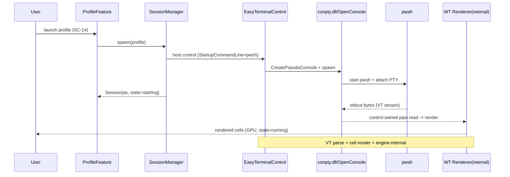
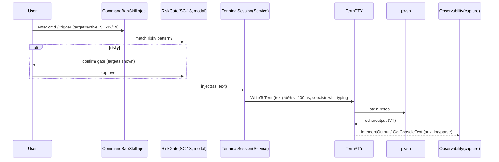
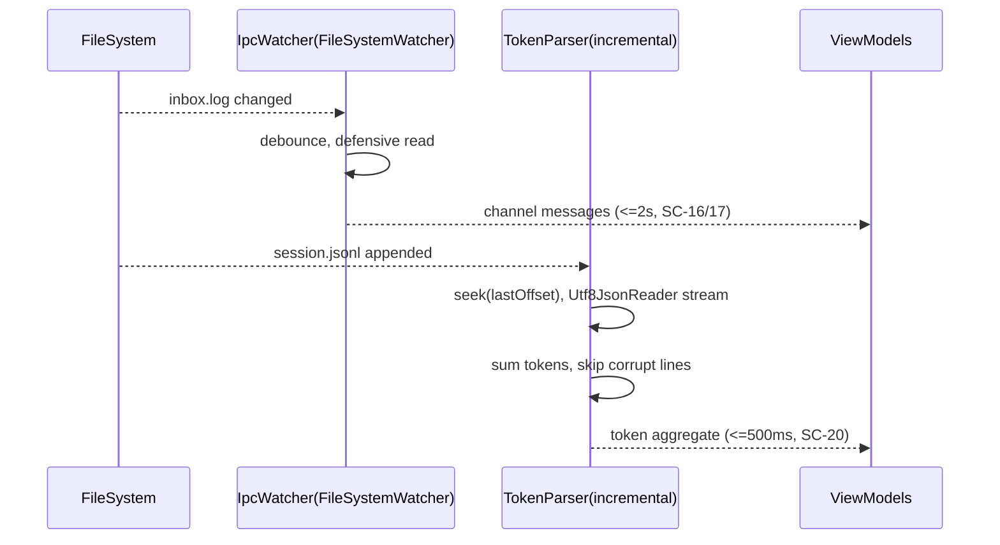

# 10. 기술 스펙·아키텍처 (Tech Spec & Architecture)

> 담당: plan_tech_researcher · 깊이: deep · 스택 10영역 / RISK 10 / NFR 충족 22/22
> 본 문서는 04(FR/NFR)·07(SC)·09(ENT)가 요구하는 품질을 실현하는 기술 스택·아키텍처를 확정하고, 기술 리스크(RISK)를 발번하며, 모든 NFR의 충족 수단을 검증한다.

---

## 0. 개요

### 0-1. 목적·범위

본 문서는 Control Tower v1의 기술 스펙 단일 원천이다. `04_requirements`(FR 43/NFR 22·제약)·`07_interfaces`(SC 22)·도메인 모델을 입력으로, "무엇을·왜"를 "어떤 기술로·어떻게"로 확정한다.

- **정의하는 것**: (a) 영역별 기술 스택과 근거·대안(§3) / (b) Feature×Layer 아키텍처(§4) / (c) 대표 데이터 흐름(§5) / (d) 외부 라이브러리·native 의존(§6) / (e) 기술 리스크 RISK-### + PoC(§7) / (f) 배포 토폴로지·비용(§8) / (g) NFR 22종 전수 충족 검증(§9).
- **정의하지 않는 것(경계)**: FR/NFR·SC·ENT는 참조 전용(재번호 금지). 프로파일 영속 스키마·ERD 최종 형태는 09 소관. REST/DTO는 08 소관이나 서버·수신 포트가 없어(NFR-006) in-proc 계약으로 축소된다.
- **핵심 제약**: C1(앱-소유 세션만 제어) · C2(터미널 substrate가 0순위 — 모든 오케스트레이션이 세션 I/O 소유에 의존) · C4(IPC는 skill_ipc_control 재사용, 재구현 금지) · C6(토큰=jsonl 파싱) · C7(로컬·인증 없음) · C8(ClickOnce) · C9(Feature×Layer).
- **세션 모델**: 관리 대상은 앱이 인앱에서 직접 spawn한 임베드 터미널 세션뿐이다. 외부 프로세스는 관리 대상이 아니다(C1·FR-039).
- **NFR 충족 불변식(★최우선)**: NFR-001~022 전량이 스택·아키텍처의 구체 수단으로 매핑된다(미매핑 0, §9).

### 0-2. 기술 영역 체계·RISK ID

- **`[TS-##]`(기술 스택 라벨)** · **`[EXT-##]`(외부 의존 라벨)**: 문서 내부 라벨(참조 전용).
- **`RISK-###`(기술 리스크)**: 본 문서가 발번하는 유일한 레지스트리 ID(3자리). FR/NFR/SC/ENT는 참조만 한다.
- **영역(7 표준 + 터미널 특화 3)**: Frontend·Backend·Storage·Infrastructure·Authentication·Monitoring + **Embedded Terminal Engine·Terminal Substrate(fallback)·Session Injection/Capture**.

### 0-3. 표기 규칙

- **다이어그램**: 스택·아키텍처·의존 트리·배포는 ASCII(박스 내부 ASCII 식별자, 한글은 캡션). 시간축 왕복만 mermaid `sequenceDiagram`(§5).
- **확률/영향도**: `H`·`M`·`L`. 우선순위 = 확률×영향도.
- **결정 표기**: `BUILD`(자체)·`INTEGRATE/BUY`(라이브러리·컨트롤 채택)·`REUSE`(기존 자산 소비).

---

## 1. 한눈에 보기

### 1-1. 기술 스택 영역 한눈에

| TS | 영역 | 확정 기술 | 결정 | 대안(fallback) | 관련 NFR | 관련 RISK |
|---|---|---|---|---|---|---|
| TS-01 | Frontend/UI | WPF (.NET 10 LTS) + MVVM(CommunityToolkit.Mvvm) | REUSE 구조 | WinUI3·Avalonia | 019·016·014 | — |
| TS-02 | **Embedded Terminal Engine** | **EasyWindowsTerminalControl** — 공식 Windows Terminal 렌더러(Microsoft.Terminal.Control/Wpf) + ConPTY 내장. 파서·렌더·substrate 일체 | **INTEGRATE/BUY** | self-build(TS-03) | 001·015·013·019 | 001·002·003 |
| TS-03 | **Terminal Substrate (fallback)** | MS `GUIConsole.ConPTY` 샘플 — ConPTY 자체 P/Invoke + VT 자체 렌더 | **BUILD(폴백)** | — | 019·001 | 003 |
| TS-04 | **Session Injection/Capture** | `TermPTY.WriteToTerm`(주입) · `InterceptOutputToUITerminal`·`GetConsoleText()`(캡처) | INTEGRATE(컨트롤 API) | — | 002·001·022 | 004 |
| TS-05 | Backend/앱 서비스 | in-proc .NET 서비스 + DI(Microsoft.Extensions.DI/Hosting) | BUILD | — | 016·009 | 006 |
| TS-06 | Storage | JSON 파일 + `System.Text.Json`, atomic temp→rename | BUILD-light | SQLite | 011 | 009 |
| TS-07 | IPC (협업) | `skill_ipc_control` 파일 계약 소비 — FileSystemWatcher + send.cmd | REUSE | — (재구현 금지 C4) | 017·004·010 | 008 |
| TS-08 | Observability/토큰 | 증분 jsonl 파서 — `Utf8JsonReader` + 오프셋 커서 (+ 컨트롤 출력 캡처=보조) | BUILD-light | — | 005·020·022 | 007 |
| TS-09 | Infrastructure/배포 | ClickOnce (.NET 10) + native 자산 동봉(conpty.dll·OpenConsole.exe·WT 렌더러) | REUSE+ | MSIX | 021·019 | 010·001 |
| TS-10 | Monitoring/진단 | Microsoft.Extensions.Logging + 롤링 파일(Serilog opt.) | BUILD-light | — | 022 | — |
| — | Authentication | **N/A** — 로컬 단일 유저·수신 포트 0(C7·NFR-006) | (없음) | — | 006 | — |
| — | Concurrency | 컨트롤이 파이프 스레드 소유 + 앱은 출력캡처 델리게이트 Dispatcher 마샬링 + 주입-타이핑 공존 | INTEGRATE+BUILD | — | 001·002·009 | 004 |

> 아키텍처 패턴: **모듈러 모놀리스 (Feature×Layer 하이브리드, 단일 프로세스)**. 단일 파워유저·로컬·단일 창이므로 MSA/서버리스 부적합.

### 1-2. 기술 리스크 RISK-### 한눈에

| RISK | 제목 | 확률 | 영향 | 우선 | 영향 FR/NFR | PoC |
|---|---|:--:|:--:|:--:|---|:--:|
| RISK-001 | 통합 엔진 native 배포(conpty.dll·OpenConsole.exe 미복사 → 빈 터미널) | M | H | ★최상 | FR-001·002·004·009 / NFR-019·021·001 | ● |
| RISK-002 | airspace(HwndHost) 오버레이 제약 — 터미널 위 WPF 겹침 불가 | H | M | 상 | FR-004·005·037 / NFR-015·013 | ● |
| RISK-003 | 통합 엔진 의존(beta CI 버전 핀·단일 유지보수·라이선스) | M | M | 중 | FR-003·005 / NFR-018·019 | ○ |
| RISK-004 | 출력 캡처 델리게이트 스레드 마샬링·주입-타이핑 공존 | M | M | 중 | FR-002·014 / NFR-001·002·009 | ● |
| RISK-005 | alt-screen/TUI(claude) 렌더 정확도 | L | M | 하 | FR-005 / NFR-013 | ○ |
| RISK-006 | 세션 소유·수명·좀비 정리(RestartTerm/Disconnect/자식 정리) | M | M | 중 | FR-015·016·017·039 / NFR-009·012 | ● |
| RISK-007 | jsonl 포맷 변동·증분 파싱 | M | M | 중 | FR-030·031 / NFR-005·020 | ○ |
| RISK-008 | IPC 파일 계약 결합 | M | M | 중 | FR-024·025·029 / NFR-010·017 | ○ |
| RISK-009 | 상태 영속 원자성·손상 | L | M | 하 | FR-020·035 / NFR-011 | — |
| RISK-010 | ClickOnce + native 의존 배포 호환(self-contained 동봉·서명) | M | M | 중 | FR-041 / NFR-021·019 | ○ |

> 임계경로 = **RISK-001(native 배포)**. 통합 엔진의 native 부품이 출력 폴더에 복사되지 않으면 빌드는 성공하나 터미널이 빈 화면으로 뜬다 — 유일한 substrate 저해 요인이므로 L0 착수 시 최우선 확인한다.

---

## 2. 기술 요구사항 분석

| 축 | 도출 내용 | 근거 |
|---|---|---|
| **플랫폼** | Windows 11 데스크톱 단독, .NET 10 LTS·WPF | NFR-019·C7 |
| **실시간 요구** | (a) PTY 출력 스트림 실시간 렌더(공식 WT GPU 렌더러가 흡수) · (b) IPC inbox.log watch ≤2s · (c) 토큰 증분 갱신 | NFR-001·004·005 |
| **데이터 특성** | 저volume 정형(프로파일 N개·JSON) + 고volume 스트림(PTY 바이트·jsonl append). 읽기≫쓰기. 100MB jsonl 증분 스캔 | FR-020·031 |
| **인증/보안** | 인증 없음. 3중 로컬 가드: 앱-소유 세션 범위(C1)·경로 탈출 차단(NFR-008)·위험 주입 게이트(NFR-007). 수신 포트 0(NFR-006) | C7·FR-037/038/039 |
| **트래픽/동시성** | 네트워크 0. 동시 세션 ≥8(각 = 컨트롤 인스턴스 + ConPTY 자식). 컨트롤이 파이프 스레딩 소유 → 앱은 캡처 마샬링·주입만 | NFR-003·012 |
| **특수 기술** | (1) 임베드 터미널 컨트롤(공식 WT 백엔드) · (2) native 자산 배포(conpty.dll·OpenConsole.exe) · (3) 프로그램적 주입·출력 캡처 · (4) 파일 watch/원자 write · (5) 증분 jsonl 파싱 | C6·NFR-011 |

핵심 함의: 입력 경로(주입)와 출력 경로(렌더)는 분리된다. 커맨드/스킬 주입(FR-014/027)은 렌더 완성도와 무관하게 처음부터 가용하다 — 공식 렌더러가 색·커서·스크롤백과 alt-screen/TUI를 모두 즉시 제공하므로 오케스트레이션은 렌더에 볼모잡히지 않는다.

---

## 3. 기술 스택 제안 (영역별)

### [TS-01] Frontend/UI — WPF (.NET 10 LTS) + CommunityToolkit.Mvvm — REUSE
- 후보: WPF vs WinUI3 vs Avalonia. 추천: **WPF**.
- 근거: 기존 소스(Shell/Features/Shared) WPF 확정(NFR-019·C9), .NET 10 LTS, MVVM=`ObservableObject`/`RelayCommand`(`Shared/Core` 정합). EmbeddedTerminal은 VM-First `DataTemplate` 매핑으로 조합.
- 고려: WinUI3 TerminalControl 직접 임베드는 SwapChainPanel 투명 합성 불가·Win10 제약·주입 API 미노출로 배제 — 그 백엔드(공식 WT 렌더러)만 WPF용으로 취하는 것이 TS-02.

### [TS-02] Embedded Terminal Engine — EasyWindowsTerminalControl — INTEGRATE/BUY ★핵심
- 후보: **EasyWindowsTerminalControl(공식 WT 백엔드 임베드)** vs self-build(ConPTY 자체 + VT 파서 + 셀 렌더러) vs WinUI TerminalControl.
- 추천: **EasyWindowsTerminalControl 1.0.36**(NuGet, MIT). *"공식 Windows Terminal 콘솔 호스트를 백엔드 드라이버로 쓰는 고성능 WPF 터미널 컨트롤"* — 24-bit 색·ANSI/VT 시퀀스·GPU 가속 렌더·마우스 지원 내장.
- 구성:
  - `EasyWindowsTerminalControl.EasyTerminalControl` — XAML 호스트 컨트롤. `StartupCommandLine="powershell.exe"`(pwsh·cmd·claude 교체 가능).
  - 렌더러 = `Microsoft.Terminal.Control`(native) + `Microsoft.Terminal.Wpf` — 공식 Windows Terminal 렌더러. VT 파싱·셀 렌더가 컨트롤 내장.
  - substrate = `CI.Microsoft.Windows.Console.ConPTY`(conpty.dll + OpenConsole.exe).
- 근거: self-build로 세 영역(substrate·파서·렌더러)을 각각 만들면 `claude` 같은 풀스크린 TUI 렌더가 별도 대공사다. 하나의 NuGet 컨트롤이 공식 백엔드로 세 영역을 동시에 충족하므로, 파싱·렌더 버그 리스크를 공식 렌더러 신뢰로 제거하고 출시 속도를 확보한다(통제력이 필요한 앱-소유·주입은 TS-04 API로 유지).
- 고려: native 배포 함정(RISK-001)·beta CI 의존 드리프트(RISK-003)·airspace HwndHost 제약(RISK-002) — §7 상술.

### [TS-03] Terminal Substrate (fallback) — MS GUIConsole.ConPTY — BUILD(폴백)
- 위치: EasyWindowsTerminalControl이 목표 환경에서 동작하지 않을 때(렌더 실패·native 해결 불가)만 채택하는 폴백.
- 구성: microsoft/terminal `samples/ConPTY/GUIConsole` — `GUIConsole.ConPTY`(P/Invoke: `CreatePseudoConsole`/익명 파이프/`STARTUPINFOEX`) + `GUIConsole.WPF`. 소스 편입 필요(NuGet 미패키징), VT100 렌더 자체 처리.
- 트레이드오프: beta 의존 0·공식 샘플이나 렌더·파서를 직접 구현해 손이 많이 간다.

### [TS-04] Session Injection/Capture — TermPTY API — INTEGRATE(컨트롤 API)
- 주입(앱→터미널, 사람 타이핑 공존): `TermPTY.WriteToTerm(ReadOnlySpan<char>)` · `WriteToTermBinary(ReadOnlySpan<byte>)`. 커맨드·트리거 주입(FR-014/027)이 사람 타이핑과 한 입력 경로에 합류한다(NFR-002 ≤100ms).
- 출력 캡처: `InterceptOutputToUITerminal`(델리게이트) · `LogConPTYOutput`+`ConPTYTerm.GetConsoleText()` · `ReadDelimitedTermPTY`. 관찰(로깅/파싱) 위주로 쓰고 VT 시퀀스 변형은 피한다(변형 시 커서 위치가 어긋난다).
- 근거: 토큰 집계 원천은 jsonl(C6)이며, 출력 캡처는 진단·자동반응용 보조 관측 채널로 쓴다.
- 고려: 캡처 델리게이트 호출 스레드·주입-타이핑 충돌 여부(RISK-004). VM→컨트롤 TermPTY 접근은 코드비하인드 주입 또는 attached behavior로 MVVM 경계를 지킨다.

### [TS-05] Backend/앱 서비스 — in-proc .NET 서비스 + DI — BUILD
- 추천: in-proc 서비스 계층(Feature 모듈 내부 Services), DI=`Microsoft.Extensions.DependencyInjection`(+ Generic Host `IHostedService`로 장기 실행 작업·크래시 격리 NFR-009).
- 근거: 서버·네트워크 API 없음(NFR-006) → 08은 in-proc 계약으로 축소. Feature×Layer(NFR-016) — 각 Feature가 Models/Views/ViewModels/Services + Interfaces, Feature 간 직접 참조 0.

### [TS-06] Storage — JSON 파일(atomic) — BUILD-light
- 추천: 저volume·소수 애그리거트라 JSON + 원자적 temp→rename. NFR-011 = `File.WriteAllText(temp)`→`File.Move(temp,dest,overwrite:true)`. 프로파일 수·쿼리 요구 증가 시 SQLite 승격(최종 스키마·ERD는 09).

### [TS-07] IPC(협업) — skill_ipc_control 파일 계약 소비 — REUSE
- 구성: `channels/<ch>/`의 `inbox.log`·`.relay_url`·`.cursor_<as>`를 FileSystemWatcher watch + 방어적 read, 송신은 `send.cmd`·`set_url.cmd` 프로세스 호출. relay/큐/watcher 로직 재구현 0(C4·NFR-017).
- 고려: 계약 스키마 결합(RISK-008) → 읽기 전용 어댑터 `IIpcFileContract`로 변동 흡수 1곳.

### [TS-08] Observability/토큰 — 증분 jsonl 파서 — BUILD-light
- 추천: 세션별 마지막 오프셋 저장, append분만 `Utf8JsonReader` 스트리밍 파싱·누적 집계(NFR-005 100MB ≤500ms·C6). 미지 필드 무시·손상 라인 skip(NFR-020).
- 보조: TS-04 출력 캡처가 세션 출력 로깅·진단을 보강한다(토큰 원천은 jsonl 유지).

### [TS-09] Infrastructure/배포 — ClickOnce + native 동봉 — REUSE+
- 추천: ClickOnce(C8·NFR-021)·자동 업데이트(FR-041).
- native 동봉: 통합 엔진은 `conpty.dll`·`OpenConsole.exe`·`Microsoft.Terminal.Control.dll`(native)를 동봉해야 한다. RID=win-x64·self-contained·서명이 ClickOnce 매니페스트에 반영되어야 한다(RISK-010·001). 코드 서명 인증서 권고.

### [TS-10] Monitoring/진단 — Microsoft.Extensions.Logging + 롤링 파일 — BUILD-light
- 추천: `Microsoft.Extensions.Logging` + 롤링 파일 sink(Serilog opt.). 세션 기동/종료·주입·IPC·크래시 격리·native 로드 실패를 구조화 로깅(NFR-022, SC-06 소스).

### [—] Authentication — N/A
- 인증·인가·비밀 저장 없음. 로컬 단일 유저·수신 포트 0(C7·NFR-006). 대체 보호 = 앱-소유 범위 가드(FR-039)·경로 가드(NFR-008)·위험 주입 게이트(NFR-007).

### [—] Concurrency — 컨트롤 소유 파이프 스레드 + 앱 Dispatcher 마샬링
- 컨트롤이 ConPTY 파이프 읽기 스레드·데드락 관리를 소유한다. 앱 책임은 (a) `InterceptOutputToUITerminal` 캡처 델리게이트를 UI Dispatcher 마샬링, (b) `WriteToTerm` 주입을 사람 타이핑과 한 입력 경로에 큐 없이 합류(NFR-002). 잔여 스레딩 불확실성은 RISK-004.

---

## 4. 아키텍처 (ASCII 구성도 + 패턴)

### 4-1. 패턴 선정 — 모듈러 모놀리스 (Feature×Layer 하이브리드)
- 선정: 모듈러 모놀리스(단일 WPF 프로세스, Feature 모듈 경계). 렌더 전 범위(alt-screen 포함)를 엔진이 기본 제공. MSA/서버리스는 NFR-006 위반 → 배제.
- 모듈 경계(NFR-016): `Shell`(얇은 조합) / `Features/{EmbeddedTerminal, Session, Profile, Ipc, Observability, Asset, Settings}` / `Shared/{Core, Interop}`. Feature 간 직접 참조 0.

### 4-2. 시스템 구성도

```
+==========================================================================+
|                CONTROL TOWER  (single WPF process, .NET 10)                |
|                                                                           |
|  +---------------------- Shell (thin composition) --------------------+   |
|  |  L-NAV dock | T-terminal zone | R-orchestration dock | S-chrome     |   |
|  +----+------------+-----------------+------------------+-------------+    |
|       |            |                 |                  |                  |
|  +----v----+  +----v-----+    +------v------+    +------v------+           |
|  | Profile |  | Session  |    |     Ipc     |    | Observ /    |           |
|  | Feature |  | Feature  |    |   Feature   |    | Asset Feat. |           |
|  +----+----+  +----+-----+    +------+------+    +------+------+           |
|       |            | app-owned sessions only     |              |          |
|       |     +------v-----------+                 |              |          |
|       |     | SessionManager   |                 |              |          |
|       |     +------+-----------+                 |              |          |
|  +----v---------+  | spawn N   +-----------------v---+   +------v-------+  |
|  | Storage JSON |  |           | Ipc file contract   |   | jsonl parser |  |
|  | (atomic)     |  |           | (read/watch)        |   | (+capture)   |  |
|  +--------------+  |           +---------------------+   +------+-------+  |
|            +-------v-----------------------+                    |          |
|            | Features/EmbeddedTerminal     |                    |          |
|            |  Interfaces/ ITerminalSession |                    |          |
|            |  Services/   TermPTY wrapper  |                    |          |
|            |  ViewModels/ TerminalViewModel|                    |          |
|            |  Views/      TerminalView     |                    |          |
|            +-------+-----------------------+                    |          |
|      engine boundary (ITerminalSession)                        |          |
|                    |                                            |          |
|          +---------v-----------------------+                    |          |
|          | EasyTerminalControl (HwndHost)  |  official WT       |          |
|          |  Microsoft.Terminal.Control     |  renderer          |          |
|          |  Microsoft.Terminal.Wpf         |  (GPU, 24-bit, VT) |          |
|          +--+---------------------+--------+                    |          |
+-------------|-----------------|----|----------------------------|----------+
      conpty.dll |    OpenConsole.exe |                  (FS read) |
         +-------v-----------------v--+              +-------------v-------+
         |  ConPTY (in/out pipes)     |              | ~/.claude *.jsonl   |
         +-------------+--------------+              | channels/<ch>/      |
                       |                             +---------------------+
                 +-----v-----+  ... (app-owned processes only, C1)
                 |  pwsh     |
                 +-----------+
```
캡션: EmbeddedTerminal Feature가 EasyTerminalControl(공식 WT 백엔드)을 호스팅하고, 소유 경계 `ITerminalSession`이 주입/캡처/수명을 감싼다(엔진↔폴백 교체를 이 1곳에서, NFR-018). 컨트롤 내부에서 conpty.dll·OpenConsole.exe가 pwsh를 spawn하고 Microsoft.Terminal.Control이 렌더한다 — VT 파싱·셀 렌더는 컨트롤이 담당. SessionManager는 앱-소유 세션만 추적한다(C1). IPC/관측은 파일시스템만 read/watch한다(C4).

> **airspace 제약(RISK-002)**: EasyTerminalControl은 native HwndHost라 터미널 위에 WPF 요소를 겹칠 수 없다. 경고 배너·출력 로그·위험 게이트는 별도 패널/모달로 배치한다(터미널 존 밖). 컨텍스트 메뉴는 HwndHost 위 허용된다.

### 4-3. 주입·출력 캡처 스레딩 모델

```
   [pwsh proc]                                   UI thread (Dispatcher)
       |  stdout(bytes)                                 ^
       v                                                | marshaled (log/parse)
  +==================================+                  |
  | EasyTerminalControl (native)     |--render(internal)--> WT renderer (screen)
  |  conpty pipe read (control-owned)|                  |
  +======+===================+=======+                  |
  WriteToTerm|         InterceptOutput / GetConsoleText |
 (app inject)|                v-------------------------+
       ^     v
   [UI keys] (shared input path) --> pwsh stdin
       |
   (human typing + app injection coexist)
```
캡션: 컨트롤이 파이프 읽기 스레드·데드락 관리를 소유한다. 앱은 (1) `WriteToTerm` 주입을 사람 타이핑과 한 입력 경로에 합류(≤100ms, NFR-002), (2) 출력 캡처를 UI Dispatcher로 마샬링해 로깅/파싱한다.

---

## 5. 주요 데이터 흐름 (mermaid sequenceDiagram)

### 5-1. 세션 spawn + 렌더 왕복 (FR-001·002·004·005)


### 5-2. 커맨드/IPC 스킬 주입 + 위험 게이트 + 출력 캡처 (FR-014·027·037 · NFR-002)


### 5-3. IPC 채널 watch + 토큰 증분 파싱 (FR-024·031 · NFR-004·005)


---

## 6. 외부 라이브러리·API

| EXT | 이름 | 용도 | 관련 FR | 라이선스 | 비용 | 난이도 | 대안 |
|---|---|---|---|---|---|:--:|---|
| EXT-01 | **EasyWindowsTerminalControl 1.0.36** | 임베드 터미널 엔진(공식 WT 렌더러+ConPTY+VT 일체) | FR-001·002·003·004·005·007·009 | **MIT** | 무료 | 보통(native 배포 주의) | self-build(EXT-11) |
| EXT-02 | **CI.Microsoft.Terminal.Wpf 1.22.250204002** | 공식 WT 렌더러 WPF 호스트(전이, 버전 핀) | FR-004·005 | MS(beta CI) | 무료 | — | — |
| EXT-03 | **CI.Microsoft.Windows.Console.ConPTY 1.22.250314001** | ConPTY + native conpty.dll·OpenConsole.exe(직접참조+GeneratePathProperty) | FR-001·002 | MS(beta CI) | 무료 | 보통 | OS ConPTY(폴백) |
| EXT-04 | CommunityToolkit.Mvvm | MVVM(ObservableObject·RelayCommand) | FR-040 | MIT | 무료 | 낮음 | 직접구현 |
| EXT-05 | Microsoft.Extensions.DI/Hosting | DI·수명·호스팅 | FR-040·016 | MIT | 무료 | 낮음 | 직접 컨테이너 |
| EXT-06 | System.Text.Json (`Utf8JsonReader`) | 프로파일 영속·jsonl 증분 파싱 | FR-020·031 | MIT(내장) | 무료 | 보통 | Newtonsoft |
| EXT-07 | Microsoft.Extensions.Logging (+Serilog opt.) | 진단 로그 | FR-016(NFR-022) | MIT/Apache | 무료 | 낮음 | 자체 로거 |
| EXT-08 | **skill_ipc_control 파일 계약** | 채널 watch/read·send.cmd·relay | FR-024·025·027·029 | 내부 자산 | 무료 | 보통 | (재구현 금지 C4) |
| EXT-09 | Claude Code jsonl 트랜스크립트 | 토큰 소스 | FR-030·031 | 비공식 포맷 | 무료 | 보통(방어) | — |
| EXT-10 | ClickOnce (MSBuild/SDK) | 배포·자동 업데이트·native 동봉 | FR-041 | 내장 | 무료(+서명) | 보통 | MSIX |
| EXT-11 | MS GUIConsole.ConPTY 샘플(폴백) | 폴백 substrate+VT 렌더 | FR-001~005 | MIT(소스 편입) | 무료 | 높음 | — |
| EXT-12 | Microsoft.Data.Sqlite (조건부) | 프로파일 영속 대안 | FR-020 | MIT | 무료 | 보통 | JSON 파일 |

의존 관계(ASCII 트리):
```
[Control Tower]
  +--> EXT-01 EasyWindowsTerminalControl (MIT)       [INTEGRATE engine]
  |       +--> EXT-02 CI.Microsoft.Terminal.Wpf  (pin)  --> Microsoft.Terminal.Control.dll (native renderer)
  |       '--> EXT-03 CI.Microsoft.Windows.Console.ConPTY (pin, direct-ref)
  |               +--> conpty.dll        (runtimes/win10-x64/native)  <-- MANUAL copy required
  |               '--> OpenConsole.exe   (build/native/runtimes/x64)  <-- MANUAL copy required
  +--> EXT-04 CommunityToolkit.Mvvm
  +--> EXT-05 MS.Ext.DI/Hosting
  +--> EXT-06 System.Text.Json
  +--> EXT-07 MS.Ext.Logging (+Serilog)
  +--> EXT-08 skill_ipc_control  --consumes--> channels/<ch>/{inbox.log,.relay_url,.cursor}
  |                              --invokes---> send.cmd / set_url.cmd
  +--> EXT-09 ~/.claude/**/*.jsonl (read-only, defensive)
  +--> EXT-10 ClickOnce (deploy, must bundle native x2 + WT renderer)
  ...  EXT-11 GUIConsole.ConPTY (fallback)
  '--> EXT-12 SQLite (conditional, 09)
```
캡션: 외부 네트워크 SaaS·유료 API 0건(로컬 전용). 핵심 코드 의존이 EXT-01(엔진)에 집중되며, 그 아래 native 자산(conpty.dll·OpenConsole.exe)은 .NET SDK 앱에 자동 복사되지 않아 수동 `<None>` 복사가 구조적으로 필수다(RISK-001). beta CI 패키지(EXT-02/03)는 버전을 정확히 핀한다(RISK-003).

---

## 7. 기술 리스크 및 PoC

### [RISK-001] 통합 엔진 native 배포 (★최상)
- 영향: FR-001·002·004·009 / NFR-019·021·001 · 가능성 M / 영향도 H
- 내용: 통합 엔진은 native 부품(`Microsoft.Terminal.Control.dll` 렌더러, `conpty.dll`, `OpenConsole.exe`)에 의존한다. `conpty.dll`·`OpenConsole.exe`는 .NET SDK 앱에 자동 복사되지 않으며, 컨트롤이 두 `CI.Microsoft.*` 의존을 `exclude="Build,Analyzers"`로 끌어와 패키지 자동복사 build 타겟마저 전이 차단한다 → 수동 복사가 구조적으로 필수. 누락 시 빌드는 성공하나 터미널이 빈 화면으로 뜬다.
- 완화: csproj에 `RuntimeIdentifier=win-x64`(MSB3270 회피) + `UseRidGraph=true`(NETSDK1206 회피) + ConPTY 패키지 직접참조(`GeneratePathProperty=true`) + `<None ... CopyToOutputDirectory="PreserveNewest">` 2줄(conpty.dll·OpenConsole.exe). 빌드 후 출력 루트에 핵심 5개(EasyWindowsTerminalControl.dll·Microsoft.Terminal.Control.dll·Microsoft.Terminal.Wpf.dll·conpty.dll·OpenConsole.exe) 존재를 검증.
- **PoC**: 클린 빌드→native 2종 출력 루트 존재·터미널 렌더·빌드 경고 0. CI에 native 존재 자동 검사 게이트.

### [RISK-002] airspace(HwndHost) 오버레이 제약 (상)
- 영향: FR-004·005·037 / NFR-015·013 · 가능성 H / 영향도 M
- 내용: EasyTerminalControl은 native HwndHost라 터미널 위에 WPF 요소를 겹쳐 그릴 수 없다(WebView2 동일). 경고 배너·출력 로그·위험 확인 게이트를 터미널 위에 오버레이 불가.
- 완화: 배너·로그·상태는 터미널 존과 별도 패널(하단/우측), 위험 게이트(SC-13)는 별도 모달 창. 컨텍스트 메뉴(SC-09)는 HwndHost 위 허용 → 유지. 07 SC 레이아웃이 이 제약을 전제로 배치한다.
- **PoC**: 컨텍스트 메뉴 표시 + 별도 패널 배너 렌더 확인.

### [RISK-003] 통합 엔진 의존 (beta CI·유지보수·라이선스) (중)
- 영향: FR-003·005 / NFR-018·019 · 가능성 M / 영향도 M
- 내용: 통합 컨트롤은 공개 패키징 전 Windows Terminal beta 패키지(`CI.Microsoft.Terminal.Wpf`·`CI.Microsoft.Windows.Console.ConPTY`, CI 피드)에 의존 → 저수준 API·버전 변동 가능. 컨트롤 자체는 단일 유지보수 저장소(NuGet MIT). native 재배포 조건은 배포 전 확인.
- 완화: `CI.Microsoft.*` 버전 정확히 핀(드리프트 차단). 엔진 접근을 경계 인터페이스 `ITerminalSession` 뒤에 격리(NFR-018) → 유지보수 공백 시 폴백(TS-03)으로 1곳 교체. MIT라 소스 vendoring 가능.
- **PoC**: 핀 버전 restore/build 재현성. 라이선스 배포 전 확인.

### [RISK-004] 출력 캡처 델리게이트 스레드 마샬링·주입-타이핑 공존 (중)
- 영향: FR-002·014 / NFR-001·002·009 · 가능성 M / 영향도 M
- 내용: `InterceptOutputToUITerminal` 델리게이트 호출 스레드 불명(바인딩 갱신 시 UI Dispatcher 전환 필요 여부). `WriteToTerm` 주입이 사람 타이핑과 충돌 없이 합류하는지. VT 변형 시 커서 위치 어긋남.
- 완화: 관찰(로깅/파싱) 위주로 VT 변형 회피. 캡처 델리게이트 → UI Dispatcher 마샬링. 주입은 `WriteToTerm`(큐 없이 직접, ≤100ms). 파이프 스레드 데드락 관리는 컨트롤 책임.
- **PoC**: 명령 1줄 주입 + 출력 캡처(사람 타이핑 공존).

### [RISK-005] alt-screen/TUI(claude) 렌더 정확도 (하)
- 영향: FR-005 / NFR-013 · 가능성 L / 영향도 M
- 내용: alt-screen/claude TUI를 공식 Windows Terminal 렌더러가 렌더한다. 잔여: 폰트 폴백(CJK·이모지·박스드로잉).
- 완화: `FontFamilyWhenSettingTheme`(기본 Cascadia Code) 확인.

### [RISK-006] 세션 소유·수명·좀비 정리 (중)
- 영향: FR-015·016·017·018·039 / NFR-009·012 · 가능성 M / 영향도 M
- 내용: 앱-소유 EmbeddedTerminal 세션의 종료·재시작·정리. 창 닫힘 시 ConPTY 자식(OpenConsole/pwsh)이 확실히 종료되지 않으면 좀비 프로세스.
- 완화: `RestartTerm(TermPTY useTerm=null, bool disposeOld=true)`·`DisconnectConPTYTerm()`. `TerminalView` 종료 훅(Unloaded/Closing)에서 Dispose → 자식 정리. SessionManager가 앱-소유 함대만 추적(C1). 세션별 격리(NFR-009).
- **PoC**: 종료/재시작 + 창 닫힘 시 자식 종료(100회 spawn/close 좀비 0).

### [RISK-007] jsonl 포맷 변동·증분 파싱 (중)
- 영향: FR-030·031 / NFR-005·020
- 완화: `Utf8JsonReader` 증분 + 오프셋 커서 · 미지 필드 무시·손상 라인 skip · rotation 감지 시 오프셋 리셋.

### [RISK-008] IPC 파일 계약 결합 (중)
- 영향: FR-024·025·029 / NFR-010·017
- 완화: 읽기 전용 어댑터 `IIpcFileContract`로 규약 캡슐화·재구현 0·stale는 가드 의미론 흡수(NFR-010)·매핑 미확정 구간 가정+경고 배너(SC-16).

### [RISK-009] 상태 영속 원자성·손상 (하)
- 영향: FR-020·035 / NFR-011
- 완화: temp→rename 원자 write·실패 시 원본 보존.

### [RISK-010] ClickOnce + native 의존 배포 호환 (중)
- 영향: FR-041 / NFR-021·019 · RISK-001 직결
- 내용: `conpty.dll`·`OpenConsole.exe`·`Microsoft.Terminal.Control.dll`를 ClickOnce self-contained 산출물에 동봉해야 한다. win-x64 RID·beta CI 어셈블리·서명이 매니페스트에 반영 안 되면 실행/업데이트 실패.
- 완화: publish 프로파일에 native 2종 + WT 렌더러 포함을 게시 후 실측 · self-contained win-x64 · 코드 서명 · dev/staging/prod 채널 분리.
- **PoC**: 게시본을 클린 머신에서 실행 → 터미널 렌더 확인.

### 7-11. 압축 PoC 권고 (통합·배포 vertical-slice)
substrate·파서·렌더가 통합 엔진에 흡수되므로, PoC의 핵심은 통합 + 배포다.
```
[PoC: integrate control -> inject/capture -> lifecycle -> ClickOnce native bundling]
 1. csproj(RID·UseRidGraph·GeneratePathProperty·<None>) + restore/build (RISK-001)
 2. EasyTerminalControl 임베드 -> pwsh 렌더 + 사람 타이핑 (RISK-001/002)
 3. claude TUI 진입 alt-screen 렌더 (RISK-005)
 4. TermPTY.WriteToTerm 명령 주입 + 출력 캡처(타이핑 공존) (RISK-004)
 5. RestartTerm/DisconnectConPTYTerm + 창 닫힘 자식 정리(좀비 0) (RISK-006)
 6. 경고배너/로그 별도 패널 + 컨텍스트 메뉴(airspace) (RISK-002)
 7. ClickOnce 게시 -> 클린 머신 native 동봉 실행 (RISK-010)
```
성공 기준: 빈 터미널 0 · 빌드 경고 0 · 주입 ≤100ms·타이핑 공존 · 좀비 0 · claude TUI 정상 · 게시본 클린 머신 렌더.

---

## 8. 배포 토폴로지

- **클라우드**: 없음(로컬 데스크톱, 수신 포트 0·NFR-006).
- **배포 방식**: ClickOnce(자동 업데이트 FR-041) — native 자산(conpty.dll·OpenConsole.exe·WT 렌더러) 동봉 필수(RISK-010).
- **환경 분리**: dev(로컬 디버그) / staging(내부 게시·서명·클린 머신 스모크) / prod(정식 게시).
- **CI/CD**:
```
[Commit]->[Build(.NET10,win-x64)]->[Native asset check]->[Test/PoC]->[ClickOnce Publish(staging)]->[Clean-machine Smoke]--approve-->[Prod]
                                          |
                                   conpty.dll·OpenConsole.exe·WT renderer 출력 루트 존재?
```

### 8-1. 월간 인프라 비용 추정

| 항목 | 사양 | 월 비용(USD) | 비고 |
|---|---|---|---|
| 서버/컴퓨트 | 없음(로컬) | $0 | 포트 0 |
| 데이터베이스 | 없음(로컬 파일) | $0 | JSON/SQLite |
| ClickOnce 호스팅 | 정적 파일 호스트 | $0 ~ $5 | 대역폭 미미 |
| 코드 서명 인증서 | OV/EV | ~$8 ~ $33/월 | 연 $100~$400 상각(권고) |
| 외부 API/SaaS·엔진 라이선스 | 없음(엔진 MIT) | $0 | 유료 의존 0 |
| **합계** | | **~$0 ~ $40/월** | 서명 인증서 외 사실상 0 |

---

## 9. NFR 충족 검증 (★불변식 — 전수 매핑, 미매핑 0)

| NFR | 영역 | 충족 수단 | 관련 RISK |
|---|---|---|---|
| NFR-001 렌더 처리량 | 성능 | TS-02 공식 Windows Terminal GPU 렌더러 | RISK-001·004 |
| NFR-002 주입 지연 | 성능 | TS-04 `TermPTY.WriteToTerm` 직접 write(큐 없음) ≤100ms | RISK-004 |
| NFR-003 다중 세션 동시성 | 성능 | 컨트롤 인스턴스별 세션·컨트롤 소유 파이프 스레드·앱-소유 함대 | RISK-006 |
| NFR-004 IPC watch 반영 | 성능 | TS-07 FileSystemWatcher+debounce ≤2s | RISK-008 |
| NFR-005 토큰 파싱 | 성능 | TS-08 `Utf8JsonReader` 증분+오프셋 커서 ≤500ms/100MB | RISK-007 |
| NFR-006 포트 0 | 보안 | Authentication N/A — 수신 소켓 0·IPC 파일 기반 | — |
| NFR-007 위험 확인 | 보안 | 위험 패턴 매처 게이트(SC-13 모달) — WriteToTerm 전 100% 경유 | RISK-002 |
| NFR-008 경로 안전 | 보안 | 경로 정규화+`..` 차단·~/.claude 경계(FN-SEC-04) | RISK-009 |
| NFR-009 크래시 격리 | 신뢰성 | 세션별 컨트롤/자식 프로세스 격리·`DisconnectConPTYTerm` | RISK-006·004 |
| NFR-010 stale 복구 | 신뢰성 | TS-07 skill_ipc_control 가드 의미론 흡수 | RISK-008 |
| NFR-011 영속 원자성 | 신뢰성 | TS-06 temp→rename 원자 write | RISK-009 |
| NFR-012 세션 확장(≥8) | 확장성 | 컨트롤 소유 이벤트 I/O·가상화 목록·앱-소유 함대 | RISK-006 |
| NFR-013 렌더 확장 | 확장성 | 색·커서·스크롤백·alt-screen을 엔진 기본 제공 | RISK-005 |
| NFR-014 워크플로 효율 | 사용성 | MVVM 커맨드·키보드 단축키(≤3 상호작용)·프리셋 1클릭 | — |
| NFR-015 터미널 UX 정합 | 사용성 | TS-02 공식 WT 렌더러 = WT 수준 parity 내장(selection/scrollback/focus/24-bit) | RISK-002 |
| NFR-016 Feature×Layer | 유지보수 | TS-05 모듈러 모놀리스·EmbeddedTerminal 4+1레이어·참조 0 | — |
| NFR-017 IPC 재구현 금지 | 유지보수 | TS-07 파일 계약 소비만·`IIpcFileContract` 어댑터 | RISK-008 |
| NFR-018 엔진 교체성 | 유지보수 | TS-04 경계 인터페이스 `ITerminalSession` 1곳 — 엔진↔폴백 교체 격리 | RISK-003 |
| NFR-019 플랫폼 호환 | 호환성 | TS-01/02 Win11·.NET10 LTS·WPF·EasyWindowsTerminalControl | RISK-001·003·010 |
| NFR-020 jsonl 포맷 호환 | 호환성 | TS-08 방어적 파싱(미지 필드 무시·손상 skip) | RISK-007 |
| NFR-021 ClickOnce 호환 | 호환성 | TS-09 ClickOnce(.NET10) + native 자산 동봉·서명 검증 | RISK-010·001 |
| NFR-022 진단 로그 | 관측성 | TS-10 MS.Ext.Logging 롤링(세션·주입·IPC·native 로드 실패·캡처) | RISK-004 |

> **충족률 22/22 (100%), 미매핑 0.** 위반 발생 시 §3 스택 보강(또는 폴백 TS-03)으로 복귀.

---

## 10. 요약

- **영역별 추천 스택**: WPF(.NET10 LTS)+MVVM · **EasyWindowsTerminalControl(INTEGRATE/BUY, MIT) — 공식 WT 렌더러+ConPTY+VT 일체** · TermPTY 주입/캡처 · self-build는 폴백(TS-03) · JSON 원자 저장(09) · skill_ipc_control 소비(REUSE) · 증분 jsonl 파서 · ClickOnce+native 동봉 · 인증 없음(포트 0).
- **아키텍처 패턴**: 모듈러 모놀리스(Feature×Layer) · EmbeddedTerminal Feature가 EasyTerminalControl 호스팅 · `ITerminalSession` 엔진 경계 · 앱-소유 SessionManager · 컨트롤 소유 파이프 스레드 + 앱 Dispatcher 마샬링.
- **외부 의존**: 코드 의존 12건(EXT-01~12), 외부 네트워크 SaaS·유료 API 0. 핵심 결합 = 엔진(EXT-01)+native(EXT-02/03)·IPC 계약(EXT-08)·jsonl(EXT-09).
- **RISK 총수 10** — ★최상 1(RISK-001 native 배포).
- **예상 비용**: ~$0~$40/월(서명 인증서 외 사실상 0, 엔진 MIT).
- **NFR 충족률 22/22 (100%)** — 미매핑 0.

## 문서 메타

- 버전: v1.0 / 생성일: 2026-07-01 · 담당: plan_tech_researcher · 깊이: deep
- 발번 ID: RISK-001~010 (FR/NFR/SC/ENT 재번호 0). TS-##·EXT-##는 문서 내부 라벨.
- 입력: `04_requirements`(FR/NFR·제약) · `07_interfaces`(SC·airspace 레이아웃) · 도메인 모델
- 관련 문서: [`04_requirements`](./04_requirements.md) · [`07_interfaces`](./07_interfaces.md) · [`09_database`](./09_database.md) · [`12_roadmap`](./12_roadmap.md)

### 출처 (URL)
- EasyWindowsTerminalControl (GitHub): https://github.com/mitchcapper/EasyWindowsTerminalControl
- EasyWindowsTerminalControl (NuGet, MIT): https://www.nuget.org/packages/easywindowsterminalcontrol/
- Creating a Pseudoconsole session (ConPTY): https://learn.microsoft.com/en-us/windows/console/creating-a-pseudoconsole-session
- microsoft/terminal — ConPTY GUIConsole 폴백 샘플: https://github.com/microsoft/terminal/tree/main/samples/ConPTY/GUIConsole
- .NET 10 (LTS): https://devblogs.microsoft.com/dotnet/announcing-dotnet-10/
- .NET RID 사용 가이드(UseRidGraph/NETSDK1206): https://aka.ms/dotnet/rid-usage
